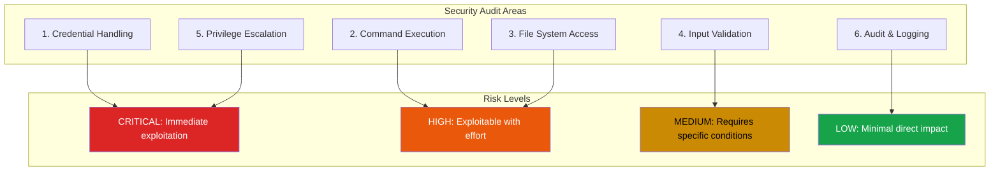

## Why AI Agents Need Security Audits

AI agents are gaining increasing access to our systems. They read our emails, execute commands, manage files, and interact with APIs on our behalf. This power comes with significant security implications.

During audits of production AI agent codebases, I discovered patterns both good and bad that deserve systematization. This checklist emerged from that work - a practical guide for anyone building or deploying AI agents.

## The Audit Framework



## 1. Credential Handling

Credentials are the crown jewels. If an attacker gets your API keys, game over.

### What to Check

| Issue | Risk | What to Look For |
|-------|------|------------------|
| `.env` files in repo | CRITICAL | API keys, secrets in plaintext |
| Environment variable injection | HIGH | `${VAR}` patterns in config files |
| Hardcoded credentials | CRITICAL | Grep for `password`, `secret`, `key`, `token` |
| Missing credential rotation | MEDIUM | Same secrets for months/years |

### The `.env` Trap

Many agents load configuration from `.env` files. The problem: these files often end up in version control, either directly or through backup systems.

```bash
# Check for secrets in git history
git log -p --all -S 'API_KEY' --
git log -p --all -S 'SECRET' --
```

Even if you've removed the file, it lives forever in git history unless you rewrite it.

### Environment Variable Injection

Config files with `${VAR}` syntax can be exploited if an attacker controls environment variables:

```json
{
  "api_endpoint": "${API_URL}",
  "auth_token": "${AUTH_TOKEN}"
}
```

If the agent runs in a shared environment where users can set environment variables, they can redirect API calls or inject credentials.

**Mitigation**: Validate environment variables against allowlists before use. Never trust user-controllable env vars for security-critical values.

## 2. Command Execution

AI agents often need to run shell commands. This is where injection attacks thrive.

### What to Check

| Issue | Risk | What to Look For |
|-------|------|------------------|
| `execSync()` with user input | HIGH | No shell escaping |
| Shell metacharacters | HIGH | `;`, `&&`, `\|`, backticks in input |
| `cwd` parameter without validation | HIGH | Path traversal in working directory |
| Incomplete blocklists | MEDIUM | Missing dangerous commands |

### Shell Injection Example

```javascript
// DANGEROUS: User input directly in command
execSync(`grep "${userQuery}" /var/log/app.log`);

// Attacker input: "; rm -rf / #
// Becomes: grep ""; rm -rf / #" /var/log/app.log
```

**Mitigation**: Use parameterized execution or escape all user input:

```javascript
// SAFER: Escape user input
const escaped = userQuery.replace(/[;&|`$()]/g, '\\$&');
execSync(`grep "${escaped}" /var/log/app.log`);

// SAFEST: Avoid shell entirely
execFileSync('grep', [userQuery, '/var/log/app.log']);
```

### Blocklist Limitations

Blocklists are inherently incomplete. If you block `rm`, attackers use `unlink`. Block `curl`? They use `wget` or `python -c "import urllib..."`.

**Better approach**: Allowlist permitted commands. Define exactly what the agent can run, deny everything else.

## 3. File System Access

File operations seem benign until path traversal enters the picture.

### What to Check

| Issue | Risk | What to Look For |
|-------|------|------------------|
| Path traversal (`..`) | HIGH | No validation before `resolve()` |
| Symlink attacks | HIGH | No `realpath` verification |
| Overly permissive path allowlists | MEDIUM | Patterns like `/home/*` |
| Insecure file permissions | HIGH | World-writable files after creation |

### Path Traversal Attack

```javascript
// DANGEROUS: Direct path concatenation
const filePath = `/uploads/${userFilename}`;
fs.readFileSync(filePath);

// Attacker input: ../../../etc/passwd
// Becomes: /uploads/../../../etc/passwd -> /etc/passwd
```

**Mitigation**: Resolve paths and verify they stay within allowed directories:

```javascript
const basePath = '/uploads';
const resolved = path.resolve(basePath, userFilename);

if (!resolved.startsWith(basePath + path.sep)) {
  throw new Error('Path traversal detected');
}
```

### Symlink Attacks

An attacker creates a symlink inside the allowed directory pointing outside:

```bash
# Attacker creates: /uploads/innocent.txt -> /etc/shadow
```

When the agent reads `/uploads/innocent.txt`, it actually reads `/etc/shadow`.

**Mitigation**: Use `fs.realpathSync()` to resolve symlinks before checking paths.

## 4. Input Validation

Every input is a potential attack vector. Validate everything.

### What to Check

| Issue | Risk | What to Look For |
|-------|------|------------------|
| Inconsistent sanitization | MEDIUM | Some paths validated, others not |
| URL validation gaps | HIGH | Missing checks for `file://`, private IPs |
| Extension allowlist bypass | MEDIUM | Double extensions like `.tar.gz.sh` |
| Missing rate limiting | MEDIUM | Enables brute force attacks |

### URL Validation Pitfalls

```javascript
// DANGEROUS: Only checks protocol
if (url.startsWith('https://')) {
  fetch(url); // Can access internal network!
}

// Attacker input: https://169.254.169.254/metadata
// This hits AWS metadata service from inside your network
```

**Mitigation**: Validate both protocol AND destination:

```javascript
const parsed = new URL(url);
const forbidden = ['127.0.0.1', 'localhost', '169.254.169.254'];
const privateRanges = [/^10\./, /^172\.(1[6-9]|2\d|3[01])\./, /^192\.168\./];

if (forbidden.includes(parsed.hostname) ||
    privateRanges.some(r => r.test(parsed.hostname))) {
  throw new Error('Forbidden destination');
}
```

## 5. Privilege Escalation

The most dangerous vulnerabilities let attackers gain elevated access.

### What to Check

| Issue | Risk | What to Look For |
|-------|------|------------------|
| Passwordless sudo | CRITICAL | `sudo -n` or NOPASSWD in sudoers |
| No binary verification | HIGH | Running unverified executables |
| Default bypass permissions | HIGH | `bypassPermissions: true` in configs |
| Missing sandbox isolation | MEDIUM | No container or VM separation |

### The `sudo -n` Problem

Some agents need root access for certain operations. The common pattern:

```bash
# In sudoers
agent ALL=(ALL) NOPASSWD: /usr/bin/systemctl restart myservice
```

This seems safe - limited to one command. But what if `systemctl` has vulnerabilities? Or the service unit file is writable?

**Mitigation**: Use capability-based systems instead of sudo. Grant only the specific Linux capabilities needed, not full root.

### Binary Integrity

If your agent downloads and executes tools, verify them:

```bash
# DANGEROUS: Trust whatever we download
curl -o tool https://example.com/tool && chmod +x tool && ./tool

# SAFER: Verify checksum
curl -o tool https://example.com/tool
echo "expected_sha256 tool" | sha256sum -c -
chmod +x tool && ./tool
```

## 6. Audit and Logging

When breaches happen, logs are your forensic evidence. Don't compromise them.

### What to Check

| Issue | Risk | What to Look For |
|-------|------|------------------|
| Insecure log location | LOW | World-writable directories like `/tmp` |
| Credentials in logs | MEDIUM | API keys, tokens in transcripts |
| No retention policy | LOW | Logs grow until disk exhaustion |
| Missing tamper detection | MEDIUM | No checksums or append-only storage |

### Credential Leakage in Logs

AI agents often log their conversations for debugging. Those conversations may contain:
- API keys the user shared
- Passwords mentioned in support requests
- Token values from error messages

**Mitigation**: Implement automatic redaction:

```javascript
const sensitivePatterns = [
  /api[_-]?key['":\s]*['"]?[\w-]{20,}/gi,
  /bearer\s+[\w-]+/gi,
  /password['":\s]*['"]?[^\s'"]+/gi,
];

function redactSensitive(text) {
  return sensitivePatterns.reduce(
    (t, p) => t.replace(p, '[REDACTED]'),
    text
  );
}
```

## The Audit Process

1. **Enumerate assets**: List all credentials, commands, and file paths the agent can access
2. **Map trust boundaries**: Where does user input enter? Where do privileged operations occur?
3. **Test each boundary**: Can you cross from untrusted to trusted with malicious input?
4. **Verify mitigations**: Are escaping functions actually applied consistently?
5. **Document findings**: Create actionable remediation tickets with severity ratings

## Key Takeaways

1. **Credentials are priority one** - If they leak, everything else is compromised
2. **Allowlists beat blocklists** - Define what's permitted, deny everything else
3. **Validate at trust boundaries** - Every transition from user input to system operation
4. **Log without leaking** - Audit trails are essential, but redact sensitive data
5. **Assume compromise** - Design systems that limit blast radius when (not if) breaches occur

Security isn't a feature you add at the end. It's a property that emerges from careful design decisions throughout the system. Audit early, audit often, and treat every finding as an opportunity to improve.

---

*This checklist emerged from auditing real AI agent deployments. Your specific setup may have additional attack surfaces - use this as a starting point, not a complete solution.*
