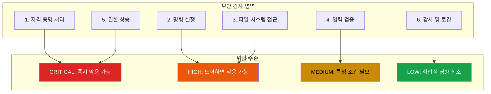

## AI 에이전트에 보안 감사가 필요한 이유

AI 에이전트가 우리 시스템에 접근하는 범위가 점점 넓어지고 있다. 이메일을 읽고, 명령을 실행하고, 파일을 관리하고, API와 상호작용한다. 이 능력에는 심각한 보안 문제가 따라온다.

프로덕션 AI 에이전트 코드베이스를 감사하면서 좋은 패턴과 나쁜 패턴 모두 발견했다. 이를 체계화할 필요가 있었다. 이 체크리스트는 그 작업의 결과물이다.

## 감사 프레임워크



## 1. 자격 증명 처리

자격 증명은 핵심 자산이다. 공격자가 API 키를 얻으면 게임 오버다.

### 확인 사항

| 문제 | 위험도 | 확인 포인트 |
|------|--------|-------------|
| 저장소 내 `.env` 파일 | CRITICAL | 평문 API 키, 시크릿 |
| 환경 변수 주입 | HIGH | 설정 파일 내 `${VAR}` 패턴 |
| 하드코딩된 자격 증명 | CRITICAL | `password`, `secret`, `key`, `token` grep |
| 자격 증명 미갱신 | MEDIUM | 수개월/수년간 동일한 시크릿 |

### `.env` 함정

많은 에이전트가 `.env` 파일에서 설정을 로드한다. 문제는 이 파일이 버전 관리에 들어가는 경우가 많다는 것이다. 직접 커밋하거나 백업 시스템을 통해서.

```bash
# git 히스토리에서 시크릿 검색
git log -p --all -S 'API_KEY' --
git log -p --all -S 'SECRET' --
```

파일을 삭제해도 히스토리를 다시 쓰지 않는 한 git 히스토리에 영원히 남는다.

### 환경 변수 주입

`${VAR}` 구문이 있는 설정 파일은 공격자가 환경 변수를 제어할 수 있으면 악용 가능하다:

```json
{
  "api_endpoint": "${API_URL}",
  "auth_token": "${AUTH_TOKEN}"
}
```

에이전트가 사용자가 환경 변수를 설정할 수 있는 공유 환경에서 실행되면, API 호출을 리다이렉트하거나 자격 증명을 주입할 수 있다.

**대응**: 사용 전 환경 변수를 허용 목록과 대조 검증한다. 보안에 중요한 값에는 사용자가 제어 가능한 환경 변수를 절대 신뢰하지 않는다.

## 2. 명령 실행

AI 에이전트는 종종 셸 명령을 실행해야 한다. 인젝션 공격이 가장 활발한 영역이다.

### 확인 사항

| 문제 | 위험도 | 확인 포인트 |
|------|--------|-------------|
| 사용자 입력과 `execSync()` | HIGH | 셸 이스케이프 없음 |
| 셸 메타문자 | HIGH | 입력 내 `;`, `&&`, `\|`, 백틱 |
| 검증 없는 `cwd` 매개변수 | HIGH | 작업 디렉토리 경로 순회 |
| 불완전한 차단 목록 | MEDIUM | 위험한 명령 누락 |

### 셸 인젝션 예시

```javascript
// 위험: 명령에 사용자 입력 직접 사용
execSync(`grep "${userQuery}" /var/log/app.log`);

// 공격자 입력: "; rm -rf / #
// 결과: grep ""; rm -rf / #" /var/log/app.log
```

**대응**: 매개변수화된 실행을 사용하거나 모든 사용자 입력을 이스케이프한다:

```javascript
// 더 안전: 사용자 입력 이스케이프
const escaped = userQuery.replace(/[;&|`$()]/g, '\\$&');
execSync(`grep "${escaped}" /var/log/app.log`);

// 가장 안전: 셸 완전 회피
execFileSync('grep', [userQuery, '/var/log/app.log']);
```

### 차단 목록의 한계

차단 목록은 본질적으로 불완전하다. `rm`을 막으면 공격자는 `unlink`를 쓴다. `curl`을 막으면 `wget`이나 `python -c "import urllib..."`를 쓴다.

**더 나은 접근**: 허용된 명령을 허용 목록으로 정의한다. 에이전트가 실행할 수 있는 것을 정확히 정의하고 나머지는 모두 거부한다.

## 3. 파일 시스템 접근

파일 작업은 경로 순회가 개입하기 전까지는 무해해 보인다.

### 확인 사항

| 문제 | 위험도 | 확인 포인트 |
|------|--------|-------------|
| 경로 순회 (`..`) | HIGH | `resolve()` 전 검증 없음 |
| 심볼릭 링크 공격 | HIGH | `realpath` 검증 없음 |
| 과도하게 허용적인 경로 허용 목록 | MEDIUM | `/home/*` 같은 패턴 |
| 안전하지 않은 파일 권한 | HIGH | 생성 후 누구나 쓰기 가능 |

### 경로 순회 공격

```javascript
// 위험: 직접 경로 연결
const filePath = `/uploads/${userFilename}`;
fs.readFileSync(filePath);

// 공격자 입력: ../../../etc/passwd
// 결과: /uploads/../../../etc/passwd -> /etc/passwd
```

**대응**: 경로를 확인(resolve)하고 허용된 디렉토리 내에 있는지 검증한다:

```javascript
const basePath = '/uploads';
const resolved = path.resolve(basePath, userFilename);

if (!resolved.startsWith(basePath + path.sep)) {
  throw new Error('경로 순회 탐지됨');
}
```

### 심볼릭 링크 공격

공격자가 허용된 디렉토리 내에 외부를 가리키는 심볼릭 링크를 생성한다:

```bash
# 공격자가 생성: /uploads/innocent.txt -> /etc/shadow
```

에이전트가 `/uploads/innocent.txt`를 읽으면 실제로는 `/etc/shadow`를 읽는다.

**대응**: 경로 확인 전 `fs.realpathSync()`를 사용하여 심볼릭 링크를 해결한다.

## 4. 입력 검증

모든 입력은 잠재적 공격 벡터다. 전부 검증해야 한다.

### 확인 사항

| 문제 | 위험도 | 확인 포인트 |
|------|--------|-------------|
| 일관성 없는 정제 | MEDIUM | 일부 경로만 검증 |
| URL 검증 공백 | HIGH | `file://`, 사설 IP 체크 누락 |
| 확장자 허용 목록 우회 | MEDIUM | `.tar.gz.sh` 같은 이중 확장자 |
| 속도 제한 누락 | MEDIUM | 무차별 대입 공격 허용 |

### URL 검증 함정

```javascript
// 위험: 프로토콜만 확인
if (url.startsWith('https://')) {
  fetch(url); // 내부 네트워크 접근 가능!
}

// 공격자 입력: https://169.254.169.254/metadata
// AWS 메타데이터 서비스에 네트워크 내부에서 접근
```

**대응**: 프로토콜과 목적지 둘 다 검증한다:

```javascript
const parsed = new URL(url);
const forbidden = ['127.0.0.1', 'localhost', '169.254.169.254'];
const privateRanges = [/^10\./, /^172\.(1[6-9]|2\d|3[01])\./, /^192\.168\./];

if (forbidden.includes(parsed.hostname) ||
    privateRanges.some(r => r.test(parsed.hostname))) {
  throw new Error('금지된 목적지');
}
```

## 5. 권한 상승

가장 위험한 취약점은 공격자가 상승된 접근 권한을 얻게 하는 것이다.

### 확인 사항

| 문제 | 위험도 | 확인 포인트 |
|------|--------|-------------|
| 비밀번호 없는 sudo | CRITICAL | `sudo -n` 또는 sudoers의 NOPASSWD |
| 바이너리 미검증 | HIGH | 검증되지 않은 실행 파일 실행 |
| 기본 권한 우회 | HIGH | 설정의 `bypassPermissions: true` |
| 샌드박스 격리 누락 | MEDIUM | 컨테이너나 VM 분리 없음 |

### `sudo -n` 문제

일부 에이전트는 특정 작업에 root 접근이 필요하다. 일반적인 패턴:

```bash
# sudoers에서
agent ALL=(ALL) NOPASSWD: /usr/bin/systemctl restart myservice
```

안전해 보인다 - 하나의 명령으로 제한됐다. 하지만 `systemctl`에 취약점이 있으면? 서비스 유닛 파일이 쓰기 가능하면?

**대응**: sudo 대신 capability 기반 시스템을 사용한다. 전체 root가 아닌 필요한 특정 Linux capability만 부여한다.

### 바이너리 무결성

에이전트가 도구를 다운로드하고 실행하면 검증해야 한다:

```bash
# 위험: 다운로드한 것을 그대로 신뢰
curl -o tool https://example.com/tool && chmod +x tool && ./tool

# 더 안전: 체크섬 검증
curl -o tool https://example.com/tool
echo "expected_sha256 tool" | sha256sum -c -
chmod +x tool && ./tool
```

## 6. 감사 및 로깅

침해가 발생하면 로그가 포렌식 증거다. 훼손하지 않아야 한다.

### 확인 사항

| 문제 | 위험도 | 확인 포인트 |
|------|--------|-------------|
| 안전하지 않은 로그 위치 | LOW | `/tmp` 같은 누구나 쓰기 가능한 디렉토리 |
| 로그 내 자격 증명 | MEDIUM | 트랜스크립트 내 API 키, 토큰 |
| 보존 정책 없음 | LOW | 디스크 소진까지 로그 증가 |
| 변조 탐지 누락 | MEDIUM | 체크섬이나 추가 전용 저장소 없음 |

### 로그의 자격 증명 유출

AI 에이전트는 디버깅을 위해 대화를 자주 로깅한다. 그 대화에는 다음이 포함될 수 있다:
- 사용자가 공유한 API 키
- 지원 요청에서 언급된 비밀번호
- 오류 메시지의 토큰 값

**대응**: 자동 수정을 구현한다:

```javascript
const sensitivePatterns = [
  /api[_-]?key['":\s]*['"]?[\w-]{20,}/gi,
  /bearer\s+[\w-]+/gi,
  /password['":\s]*['"]?[^\s'"]+/gi,
];

function redactSensitive(text) {
  return sensitivePatterns.reduce(
    (t, p) => t.replace(p, '[REDACTED]'),
    text
  );
}
```

## 감사 프로세스

1. **자산 열거**: 에이전트가 접근할 수 있는 모든 자격 증명, 명령, 파일 경로를 나열한다
2. **신뢰 경계 매핑**: 사용자 입력이 어디서 들어오나? 권한 있는 작업이 어디서 발생하나?
3. **각 경계 테스트**: 악의적 입력으로 신뢰되지 않은 곳에서 신뢰된 곳으로 넘어갈 수 있나?
4. **대응책 검증**: 이스케이프 함수가 실제로 일관되게 적용되는가?
5. **발견 사항 문서화**: 심각도 등급과 함께 실행 가능한 개선 티켓을 생성한다

## 핵심 정리

1. **자격 증명이 1순위다** - 유출되면 다른 모든 것이 손상된다
2. **허용 목록이 차단 목록을 이긴다** - 허용된 것을 정의하고 나머지는 모두 거부한다
3. **신뢰 경계에서 검증한다** - 사용자 입력에서 시스템 작업으로의 모든 전환
4. **유출 없이 로깅한다** - 감사 추적은 필수지만 민감한 데이터는 수정한다
5. **침해를 가정한다** - 침해가 발생할 때(만약이 아니라) 피해 범위를 제한하는 시스템을 설계한다

보안은 끝에 추가하는 기능이 아니다. 시스템 전체에 걸친 신중한 설계 결정에서 나타나는 속성이다. 일찍 감사하고, 자주 감사하고, 모든 발견을 개선의 기회로 삼아라.

---

*이 체크리스트는 실제 AI 에이전트 배포 감사에서 나왔다. 특정 설정에는 추가 공격 표면이 있을 수 있다 - 이것을 완전한 솔루션이 아닌 출발점으로 사용하라.*
