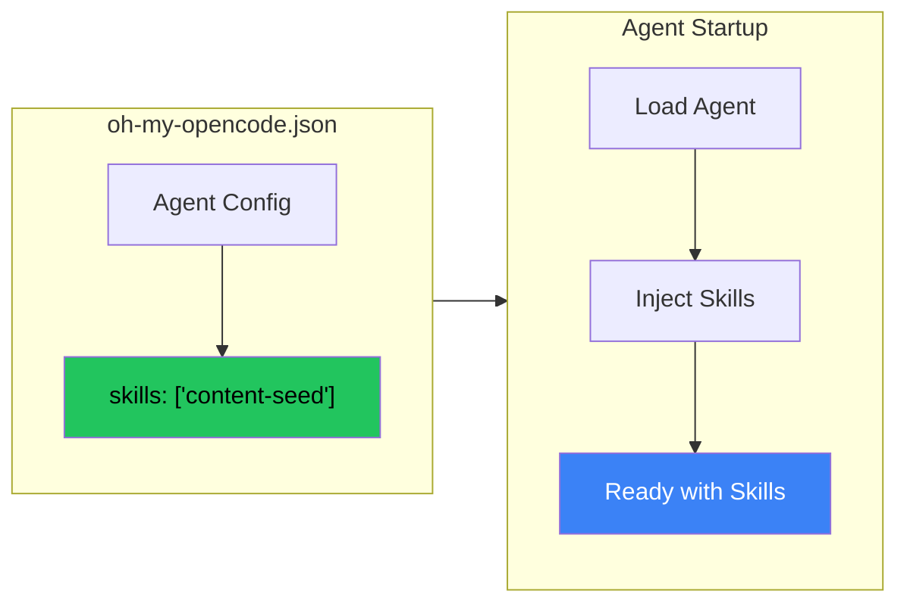

## The Problem: Manual Skill Invocation

Every session, you type `/content-seed` to activate the harvesting skill. Every session, you forget at least once. The skill exists, but it's not part of your workflow - it's an interruption to it.

What if skills could be always-on? Loaded automatically when the agent starts, running passively in the background?

## The Solution: Skill Injection via Config



In OpenCode (and similar agent frameworks), you can specify skills that auto-load for specific agents:

```json
// ~/.config/opencode/oh-my-opencode.json
{
  "agents": {
    "sisyphus": {
      "model": "anthropic/claude-sonnet-4-20250514",
      "skills": ["content-seed", "git-workflow"]
    },
    "oracle": {
      "model": "anthropic/claude-opus-4-20250514",
      "skills": ["deep-analysis"]
    }
  }
}
```

Now when `sisyphus` agent starts, it automatically has the `content-seed` and `git-workflow` skills active. No manual `/skill` commands needed.

## Why This Matters

### Before: Manual Invocation
```
User: starts session
User: /content-seed
Agent: Content seed skill loaded
User: actually does work
... forgets to harvest seeds at end ...
```

### After: Always-On
```
User: starts session
Agent: (content-seed already active, harvesting passively)
User: does work
Agent: (automatically captures content seeds)
```

The skill becomes a **behavior**, not a **command**.

## Use Cases

### 1. Passive Harvesters

Skills that watch for interesting patterns and capture them:

```json
{
  "skills": ["content-seed", "error-collector", "pattern-detector"]
}
```

These run in the background, noting things worth saving without interrupting your flow.

### 2. Workflow Enforcers

Skills that ensure certain practices are followed:

```json
{
  "skills": ["git-workflow", "test-reminder", "doc-checker"]
}
```

The agent always checks for tests, always follows git conventions, always reminds about documentation.

### 3. Context Providers

Skills that provide specialized knowledge:

```json
{
  "skills": ["project-context", "api-reference", "style-guide"]
}
```

The agent always knows your project's conventions, API patterns, and style preferences.

## Configuration Patterns

### Per-Agent Skills

Different agents need different skills:

```json
{
  "agents": {
    "sisyphus": {
      "skills": ["content-seed", "git-workflow"]
    },
    "oracle": {
      "skills": ["deep-analysis", "architecture-patterns"]
    },
    "explore": {
      "skills": ["codebase-mapping"]
    }
  }
}
```

### Skill with Parameters

Some frameworks support skill configuration:

```json
{
  "agents": {
    "sisyphus": {
      "skills": [
        "content-seed",
        {
          "name": "git-workflow",
          "config": {
            "requireIssue": true,
            "maxCommitsPerBranch": 7
          }
        }
      ]
    }
  }
}
```

### Skill Sources

Skills can come from multiple locations:

```json
{
  "skills": {
    "sources": [
      { "path": "~/.config/opencode/skills", "recursive": true },
      { "path": "~/Dev/my-skills/skills", "recursive": true },
      { "path": "./project-skills", "recursive": false }
    ]
  }
}
```

## Implementation Tips

### 1. Start Small

Don't load 10 skills at once. Start with one, verify it works, add more gradually.

### 2. Monitor Performance

Always-on skills consume context. Watch for:
- Slower response times
- Hitting context limits
- Skills conflicting with each other

### 3. Document Skill Behaviors

When skills are always-on, users may not know they're active. Document what each skill does:

```markdown
## Active Skills for Sisyphus Agent

- **content-seed**: Automatically captures interesting patterns, code snippets, and insights during conversation. Seeds are saved to ~/Dev/BrainFucked/seeds/
- **git-workflow**: Enforces issue-driven development. Commits must reference issues.
```

### 4. Provide Escape Hatches

Sometimes you need to disable a skill temporarily:

```bash
# Start with skill disabled
opencode --disable-skill content-seed

# Or in session
/skill disable content-seed
```

## Key Takeaways

1. **Skills as behaviors, not commands** - Auto-loading makes skills part of the agent's personality
2. **Per-agent configuration** - Different agents need different capabilities
3. **Passive > active** - The best skills work without being invoked
4. **Start small, scale up** - Add skills gradually to avoid overload
5. **Document what's active** - Users should know what behaviors are running

The shift from manual skill invocation to always-on injection is subtle but powerful. It transforms skills from tools you use into behaviors your agent has.

---

*This pattern emerged from wanting content-seed harvesting to be automatic. The same approach works for any passive skill that should always be active.*
