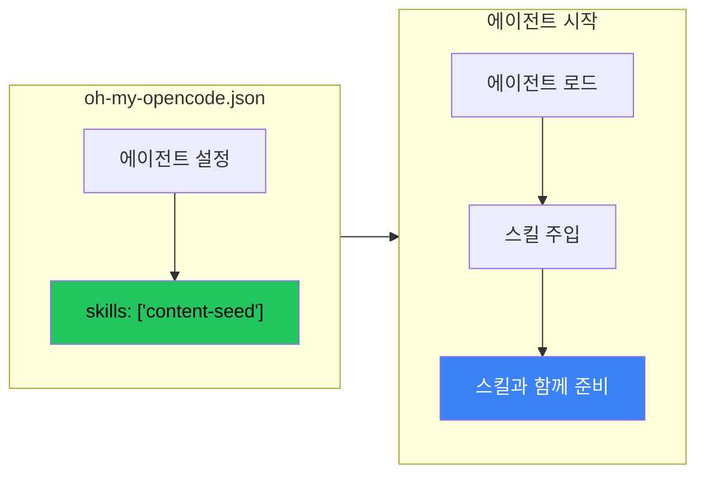

## 문제: 수동 스킬 호출

매 세션마다 `/content-seed`를 입력해서 수확 스킬을 활성화한다. 매 세션마다 적어도 한 번은 잊어버린다. 스킬은 존재하지만 워크플로우의 일부가 아니다 - 워크플로우에 대한 방해다.

스킬이 항상 켜져 있을 수 있다면? 에이전트가 시작할 때 자동으로 로드되고 백그라운드에서 수동적으로 실행된다면?

## 해결책: 설정을 통한 스킬 주입



OpenCode(및 유사한 에이전트 프레임워크)에서 특정 에이전트에 대해 자동 로드되는 스킬을 지정할 수 있다:

```json
// ~/.config/opencode/oh-my-opencode.json
{
  "agents": {
    "sisyphus": {
      "model": "anthropic/claude-sonnet-4-20250514",
      "skills": ["content-seed", "git-workflow"]
    },
    "oracle": {
      "model": "anthropic/claude-opus-4-20250514",
      "skills": ["deep-analysis"]
    }
  }
}
```

이제 `sisyphus` 에이전트가 시작되면 `content-seed`와 `git-workflow` 스킬이 자동으로 활성화된다. 수동 `/skill` 명령이 필요 없다.

## 왜 중요한가

### 이전: 수동 호출
```
사용자: 세션 시작
사용자: /content-seed
에이전트: Content seed 스킬 로드됨
사용자: 실제 작업 수행
... 끝에 시드 수확 잊어버림 ...
```

### 이후: 항상 켜짐
```
사용자: 세션 시작
에이전트: (content-seed 이미 활성, 수동적으로 수확 중)
사용자: 작업 수행
에이전트: (자동으로 콘텐츠 시드 캡처)
```

스킬이 **명령**이 아닌 **행동**이 된다.

## 사용 사례

### 1. 수동 수확자

흥미로운 패턴을 관찰하고 캡처하는 스킬:

```json
{
  "skills": ["content-seed", "error-collector", "pattern-detector"]
}
```

플로우를 방해하지 않고 백그라운드에서 실행되며 저장할 가치가 있는 것을 기록한다.

### 2. 워크플로우 강제자

특정 관행이 준수되도록 하는 스킬:

```json
{
  "skills": ["git-workflow", "test-reminder", "doc-checker"]
}
```

에이전트가 항상 테스트를 확인하고, 항상 git 규칙을 따르고, 항상 문서화를 상기시킨다.

### 3. 컨텍스트 제공자

전문 지식을 제공하는 스킬:

```json
{
  "skills": ["project-context", "api-reference", "style-guide"]
}
```

에이전트가 항상 프로젝트의 규칙, API 패턴, 스타일 선호도를 안다.

## 설정 패턴

### 에이전트별 스킬

다른 에이전트는 다른 스킬이 필요하다:

```json
{
  "agents": {
    "sisyphus": {
      "skills": ["content-seed", "git-workflow"]
    },
    "oracle": {
      "skills": ["deep-analysis", "architecture-patterns"]
    },
    "explore": {
      "skills": ["codebase-mapping"]
    }
  }
}
```

### 매개변수가 있는 스킬

일부 프레임워크는 스킬 설정을 지원한다:

```json
{
  "agents": {
    "sisyphus": {
      "skills": [
        "content-seed",
        {
          "name": "git-workflow",
          "config": {
            "requireIssue": true,
            "maxCommitsPerBranch": 7
          }
        }
      ]
    }
  }
}
```

### 스킬 소스

스킬은 여러 위치에서 올 수 있다:

```json
{
  "skills": {
    "sources": [
      { "path": "~/.config/opencode/skills", "recursive": true },
      { "path": "~/Dev/my-skills/skills", "recursive": true },
      { "path": "./project-skills", "recursive": false }
    ]
  }
}
```

## 구현 팁

### 1. 작게 시작

한 번에 10개 스킬을 로드하지 않는다. 하나로 시작하고, 작동 확인 후, 점진적으로 추가한다.

### 2. 성능 모니터링

항상 켜진 스킬은 컨텍스트를 소비한다. 다음을 주시한다:
- 느려진 응답 시간
- 컨텍스트 한도 도달
- 스킬 간 충돌

### 3. 스킬 행동 문서화

스킬이 항상 켜져 있으면 사용자가 활성화된 것을 모를 수 있다. 각 스킬이 무엇을 하는지 문서화한다:

```markdown
## Sisyphus 에이전트의 활성 스킬

- **content-seed**: 대화 중 흥미로운 패턴, 코드 스니펫, 인사이트를 자동으로 캡처한다. 시드는 ~/Dev/BrainFucked/seeds/에 저장된다.
- **git-workflow**: 이슈 기반 개발을 강제한다. 커밋은 이슈를 참조해야 한다.
```

### 4. 탈출구 제공

때로는 스킬을 일시적으로 비활성화해야 한다:

```bash
# 스킬 비활성화 상태로 시작
opencode --disable-skill content-seed

# 또는 세션 중
/skill disable content-seed
```

## 핵심 정리

1. **명령이 아닌 행동으로서의 스킬** - 자동 로딩이 스킬을 에이전트의 성격 일부로 만든다
2. **에이전트별 설정** - 다른 에이전트는 다른 능력이 필요하다
3. **능동보다 수동** - 최고의 스킬은 호출 없이 작동한다
4. **작게 시작, 확장** - 과부하를 피하기 위해 점진적으로 스킬 추가
5. **활성화된 것 문서화** - 사용자가 어떤 행동이 실행 중인지 알아야 한다

수동 스킬 호출에서 항상 켜진 주입으로의 전환은 미묘하지만 강력하다. 스킬을 사용하는 도구에서 에이전트가 가진 행동으로 변환한다.

---

*이 패턴은 content-seed 수확이 자동화되기를 원하면서 나타났다. 같은 접근법이 항상 활성화되어야 하는 모든 수동 스킬에 적용된다.*
