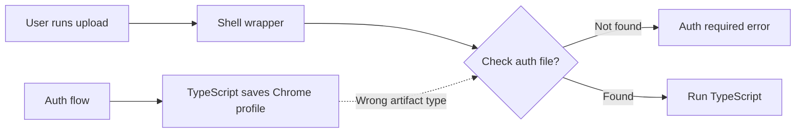

## The Problem

A NotebookLM upload skill kept failing with "Auth required" even after the user had successfully completed the browser authentication flow.

The auth worked. The upload didn't know it.



## The Investigation

The shell wrapper (`notebook.sh`) checked for authentication like this:

```bash
AUTH_FILE="$AUTH_DIR/notebook-lm-auth.json"
if [[ ! -f "$AUTH_FILE" ]]; then
    echo "Auth required..."
    exit 1
fi
```

But the TypeScript implementation (`upload.ts`) used a completely different approach:

```typescript
const AUTH_DIR = join(homedir(), ".config", "moltbot", "notebook-lm-chrome");

const browser = await chromium.launchPersistentContext(AUTH_DIR, {
    headless: false,
    // ... browser config
});
```

The auth flow saved a **Chrome profile directory** with cookies and session data. The shell script checked for a **JSON file** that never existed.

```mermaid
flowchart TD
    subgraph "What Shell Expected"
        A[notebook-lm-auth.json]
        B[{"token": "...", "expiry": "..."}]
    end
    
    subgraph "What TypeScript Created"
        C[notebook-lm-chrome/]
        D[Default/]
        E[Cookies]
        F[Local Storage]
        G[Session Storage]
    end
    
    A --> B
    C --> D --> E & F & G
    
    H[Mismatch!] --> I[Permanent "Auth required"]
```

## The Root Cause

This is a classic cross-language integration bug:

1. **Shell wrapper** was written with assumptions about how auth would work
2. **TypeScript implementation** evolved to use browser profiles (better UX)
3. **Nobody updated the wrapper** to match the new auth mechanism

The auth check became a fossil - code that reflected an old design that no longer existed.

## The Resolution

Fixed the shell script to check for the actual artifact:

```bash
# Before: checked for nonexistent JSON
AUTH_FILE="$AUTH_DIR/notebook-lm-auth.json"
if [[ ! -f "$AUTH_FILE" ]]; then

# After: check for Chrome profile directory
CHROME_PROFILE="$AUTH_DIR/notebook-lm-chrome/Default"
if [[ ! -d "$CHROME_PROFILE" ]]; then
```

## The Debugging Technique

When auth "doesn't work" after completing auth flow:

```bash
# Step 1: See what actually exists
ls -la ~/.config/moltbot/notebook-lm*

# Output revealed the truth:
# drwxr-xr-x  notebook-lm-chrome/    <- This exists!
# (no notebook-lm-auth.json)         <- This doesn't!
```

The filesystem never lies. The code might.

## Prevention Pattern

For multi-language integrations, create a shared contract:

```yaml
# auth-contract.yaml
authentication:
  mechanism: chrome-profile
  location: ~/.config/moltbot/notebook-lm-chrome
  validation:
    type: directory
    check: Default/Cookies exists
  
# Both shell and TypeScript read this contract
```

Or at minimum, add comments that cross-reference:

```bash
# NOTE: Auth mechanism is Chrome profile, managed by upload.ts
# See: src/upload.ts:AUTH_DIR for actual path
CHROME_PROFILE="$AUTH_DIR/notebook-lm-chrome/Default"
```

## Key Takeaways

1. **Trace actual artifacts** - Don't assume what other components create; verify
2. **Shell wrappers rot** - They're written once and forgotten while implementations evolve
3. **Cross-language = cross-assumption** - Each language tends to handle auth differently
4. **Filesystem debugging** - `ls -la` on expected paths reveals mismatches instantly
5. **Document the contract** - When components share state, document what that state looks like

The most insidious bugs aren't in the code - they're in the assumptions between code.
