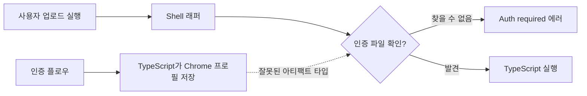

## 문제 상황

NotebookLM 업로드 스킬이 사용자가 브라우저 인증 플로우를 성공적으로 완료한 후에도 계속 "Auth required" 에러로 실패했다.

인증은 작동했다. 업로드가 그걸 몰랐을 뿐이다.



## 조사 과정

Shell 래퍼(`notebook.sh`)는 다음과 같이 인증을 확인했다:

```bash
AUTH_FILE="$AUTH_DIR/notebook-lm-auth.json"
if [[ ! -f "$AUTH_FILE" ]]; then
    echo "Auth required..."
    exit 1
fi
```

하지만 TypeScript 구현(`upload.ts`)은 완전히 다른 방식을 사용했다:

```typescript
const AUTH_DIR = join(homedir(), ".config", "moltbot", "notebook-lm-chrome");

const browser = await chromium.launchPersistentContext(AUTH_DIR, {
    headless: false,
    // ... 브라우저 설정
});
```

인증 플로우는 쿠키와 세션 데이터가 있는 **Chrome 프로필 디렉토리**를 저장했다. Shell 스크립트는 존재하지 않는 **JSON 파일**을 확인했다.

```mermaid
flowchart TD
    subgraph "Shell이 기대한 것"
        A[notebook-lm-auth.json]
        B[{"token": "...", "expiry": "..."}]
    end
    
    subgraph "TypeScript가 생성한 것"
        C[notebook-lm-chrome/]
        D[Default/]
        E[Cookies]
        F[Local Storage]
        G[Session Storage]
    end
    
    A --> B
    C --> D --> E & F & G
    
    H[불일치!] --> I[영구적 "Auth required"]
```

## 근본 원인

전형적인 크로스 언어 통합 버그다:

1. **Shell 래퍼**가 인증이 어떻게 작동할지에 대한 가정으로 작성됨
2. **TypeScript 구현**이 브라우저 프로필 사용으로 진화함 (더 나은 UX)
3. **아무도 래퍼를 업데이트하지 않음** - 새로운 인증 메커니즘에 맞추지 않음

인증 확인 코드가 화석이 되었다 - 더 이상 존재하지 않는 옛 설계를 반영하는 코드.

## 해결 방법

Shell 스크립트가 실제 아티팩트를 확인하도록 수정했다:

```bash
# 이전: 존재하지 않는 JSON 확인
AUTH_FILE="$AUTH_DIR/notebook-lm-auth.json"
if [[ ! -f "$AUTH_FILE" ]]; then

# 이후: Chrome 프로필 디렉토리 확인
CHROME_PROFILE="$AUTH_DIR/notebook-lm-chrome/Default"
if [[ ! -d "$CHROME_PROFILE" ]]; then
```

## 디버깅 기법

인증 플로우 완료 후 인증이 "작동하지 않을" 때:

```bash
# 1단계: 실제로 무엇이 존재하는지 확인
ls -la ~/.config/moltbot/notebook-lm*

# 출력이 진실을 드러냈다:
# drwxr-xr-x  notebook-lm-chrome/    <- 이건 존재한다!
# (no notebook-lm-auth.json)         <- 이건 없다!
```

파일시스템은 거짓말하지 않는다. 코드는 할 수 있지만.

## 예방 패턴

다중 언어 통합에서는 공유 계약을 만든다:

```yaml
# auth-contract.yaml
authentication:
  mechanism: chrome-profile
  location: ~/.config/moltbot/notebook-lm-chrome
  validation:
    type: directory
    check: Default/Cookies exists
  
# Shell과 TypeScript 모두 이 계약을 읽는다
```

또는 최소한 상호 참조하는 주석을 추가한다:

```bash
# NOTE: 인증 메커니즘은 Chrome 프로필, upload.ts에서 관리
# 참고: src/upload.ts:AUTH_DIR에서 실제 경로 확인
CHROME_PROFILE="$AUTH_DIR/notebook-lm-chrome/Default"
```

## 핵심 교훈

1. **실제 아티팩트를 추적하라** - 다른 컴포넌트가 무엇을 생성하는지 가정하지 말고 확인하라
2. **Shell 래퍼는 부패한다** - 한 번 작성되고 구현이 진화하는 동안 잊힌다
3. **크로스 언어 = 크로스 가정** - 각 언어는 인증을 다르게 처리하는 경향이 있다
4. **파일시스템 디버깅** - 예상 경로에 `ls -la`하면 불일치가 즉시 드러난다
5. **계약을 문서화하라** - 컴포넌트들이 상태를 공유할 때, 그 상태가 어떻게 생겼는지 문서화하라

가장 교활한 버그는 코드 안에 있지 않다 - 코드 사이의 가정 속에 있다.
