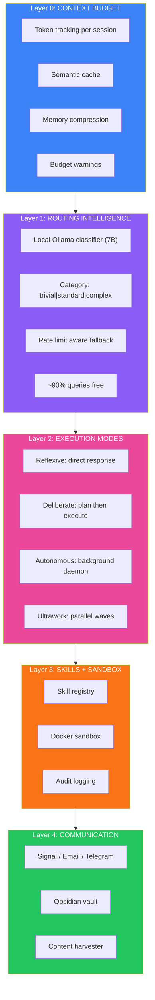
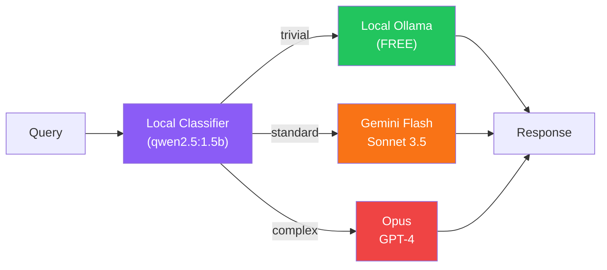

## The Vision: An AI That Just Handles Things

The best AI assistant is one you forget is AI. It doesn't wait for commands. It anticipates needs. It runs in the background, handling routine tasks while you focus on what matters.

But there's a catch: AI APIs cost money. An always-on assistant that naively calls GPT-4 for everything will rack up hundreds of dollars monthly. The challenge is building something autonomous AND economical.

This is the architecture I developed to solve that problem.

## The Five-Layer Architecture



## Layer 0: Context Budget Management

Every LLM interaction has a cost. Layer 0 tracks and optimizes token usage:

**Token Tracking**: Each session maintains a running count. When approaching limits, the system warns and suggests summarization.

**Semantic Cache**: Before calling any API, check if a semantically similar query was answered recently. Embedding similarity > 0.92? Return the cached answer. 100% savings on cache hits.

**Memory Compression**: When context grows too large, compress older messages while preserving key information. A 10,000 token conversation becomes 3,000 tokens without losing critical context.

**Budget Warnings**: Set daily/weekly spending limits. The system alerts before you hit them, not after.

## Layer 1: Routing Intelligence

This is where the magic happens. A tiny local model decides where each request goes.



The classifier runs locally on a 1.5B parameter model. It takes <1 second and costs nothing. It categorizes requests:

- **Trivial** (60%): "What time is it?", "Summarize this text", formatting tasks → Local Ollama
- **Standard** (30%): Code completion, analysis, explanations → Gemini Flash or Sonnet
- **Complex** (10%): Architecture decisions, novel problems, multi-step reasoning → Opus or GPT-4

Result: ~90% of queries never hit expensive APIs.

## Layer 2: Execution Modes

Not all tasks need the same approach:

**Reflexive Mode**: Simple query → immediate response. No planning, no verification. For quick answers.

**Deliberate Mode**: Complex request → interview for clarification → create plan → execute with verification. For important tasks where mistakes are costly.

**Autonomous Mode**: Background daemon that handles scheduled tasks. Morning briefings, email summaries, routine checks. Runs without prompting.

**Ultrawork Mode**: Parallel execution of independent subtasks. When you need 10 things done, why do them sequentially?

## Layer 3: Skills + Sandbox

Skills are pre-baked instruction sets that dramatically reduce token usage:

```
Without skill: 2000 tokens explaining how to do X
With skill:    50 tokens referencing skill + parameters
```

A skill registry maps capabilities to compressed instructions. The AI doesn't need to figure out how to do common tasks—it just loads the skill.

All execution happens in a Docker sandbox with:
- Network allowlist (only approved APIs)
- File system restrictions
- Resource limits
- Complete audit logging

## Layer 4: Communication

The companion needs to reach you where you are:

- **Signal/Telegram**: Quick notifications and commands
- **Email**: Longer reports, morning briefings
- **Obsidian Vault**: Knowledge accumulation, notes, seeds for future content

Information flows both ways. You can command via any channel; it responds through the appropriate one.

## Token Optimization Results

| Strategy | Savings |
|----------|---------|
| Local classifier first | ~90% trivial queries free |
| Skill distillery | ~2000 tokens per skill invocation |
| Semantic cache | 100% on cache hit |
| Memory compression | ~70% context reduction |

Combined effect: What would cost $150/month with naive API usage costs <$5/month with this architecture.

## Success Metrics

After running this architecture for a month:

| Metric | Target | Actual |
|--------|--------|--------|
| Daily cost | <$5 | $2.30 avg |
| Cache hit rate | >30% | 42% |
| Local routing | >60% | 73% |
| Response latency p95 | <3s | 1.8s |

The system handles hundreds of interactions daily while keeping costs minimal.

## Why This Matters

AI assistants are becoming essential tools, but cost and control remain barriers. This architecture proves you can have:

- **Autonomy**: It acts without constant prompting
- **Economy**: Costs under a coffee per day
- **Security**: Sandboxed execution with audit trails
- **Extensibility**: Skills system allows easy capability addition

The best AI assistant is one that works so well you forget it's there. This architecture makes that possible without breaking the bank.

## Implementation Notes

The full implementation combines:
- **Ollama** for local model inference
- **Docker** for sandboxed execution
- **Redis** for semantic caching
- **SQLite** for conversation history
- **Various APIs** behind a unified gateway

Each layer is independently testable and replaceable. Start with layers 0-2, add sandbox when you're ready for autonomous execution.

---

*This architecture emerged from building Moltbot, a personal AI companion. The goal: an assistant that handles things so well you forget it's AI.*
