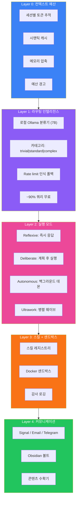
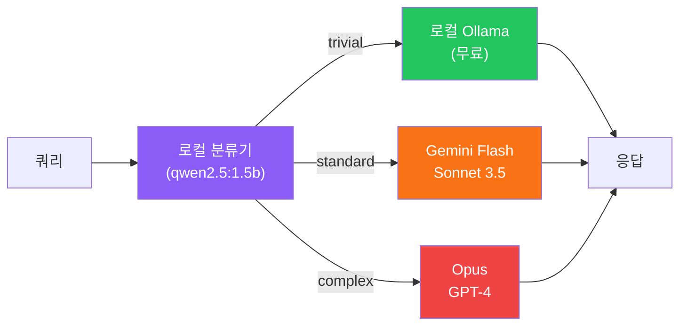

## 비전: 알아서 처리하는 AI

최고의 AI 어시스턴트는 AI라는 걸 잊게 만드는 것이다. 명령을 기다리지 않는다. 필요를 예측한다. 백그라운드에서 돌아가며 루틴 작업을 처리하고, 당신은 중요한 일에 집중한다.

그런데 문제가 있다: AI API는 돈이 든다. 모든 것에 GPT-4를 호출하는 항상 켜진 어시스턴트는 한 달에 수십만 원이 나간다. 자율적이면서 경제적인 것을 만드는 게 과제다.

이 문제를 풀기 위해 개발한 아키텍처다.

## 5계층 아키텍처



## Layer 0: 컨텍스트 예산 관리

모든 LLM 상호작용에는 비용이 있다. Layer 0이 토큰 사용을 추적하고 최적화한다:

**토큰 추적**: 각 세션이 누적 카운트를 유지한다. 한계에 가까워지면 시스템이 경고하고 요약을 제안한다.

**시맨틱 캐시**: API 호출 전에 의미적으로 유사한 쿼리가 최근에 답변됐는지 확인한다. 임베딩 유사도 > 0.92면 캐시된 답변을 반환한다. 캐시 히트 시 100% 절약.

**메모리 압축**: 컨텍스트가 너무 커지면 핵심 정보를 보존하면서 오래된 메시지를 압축한다. 10,000 토큰 대화가 중요한 컨텍스트 손실 없이 3,000 토큰이 된다.

**예산 경고**: 일/주간 지출 한도를 설정한다. 초과 후가 아니라 전에 알려준다.

## Layer 1: 라우팅 인텔리전스

마법이 일어나는 곳이다. 작은 로컬 모델이 각 요청의 목적지를 결정한다.



분류기는 1.5B 파라미터 모델로 로컬에서 돌아간다. 1초 미만 걸리고 비용은 0이다. 요청을 분류한다:

- **Trivial** (60%): "지금 몇 시야?", "이 텍스트 요약해줘", 포맷팅 작업 → 로컬 Ollama
- **Standard** (30%): 코드 완성, 분석, 설명 → Gemini Flash 또는 Sonnet
- **Complex** (10%): 아키텍처 결정, 새로운 문제, 다단계 추론 → Opus 또는 GPT-4

결과: ~90% 쿼리가 비싼 API를 건드리지 않는다.

## Layer 2: 실행 모드

모든 작업이 같은 접근법을 필요로 하지 않는다:

**Reflexive 모드**: 단순 쿼리 → 즉시 응답. 계획 없음, 검증 없음. 빠른 답변용.

**Deliberate 모드**: 복잡한 요청 → 명확화를 위한 인터뷰 → 계획 생성 → 검증과 함께 실행. 실수 비용이 큰 중요한 작업용.

**Autonomous 모드**: 예약된 작업을 처리하는 백그라운드 데몬. 모닝 브리핑, 이메일 요약, 루틴 체크. 프롬프트 없이 돌아간다.

**Ultrawork 모드**: 독립적인 하위 작업의 병렬 실행. 10가지를 해야 할 때 왜 순차적으로 할까?

## Layer 3: 스킬 + 샌드박스

스킬은 토큰 사용을 극적으로 줄이는 미리 구운 명령어 세트다:

```
스킬 없이: X를 어떻게 하는지 설명하는 2000 토큰
스킬 있으면: 스킬 참조 + 파라미터 50 토큰
```

스킬 레지스트리가 능력을 압축된 명령어에 매핑한다. AI가 일반적인 작업 방법을 알아낼 필요 없다—스킬을 로드하면 된다.

모든 실행은 Docker 샌드박스에서 일어난다:
- 네트워크 허용 목록 (승인된 API만)
- 파일 시스템 제한
- 리소스 제한
- 완전한 감사 로깅

## Layer 4: 커뮤니케이션

컴패니언은 당신이 있는 곳에서 도달해야 한다:

- **Signal/Telegram**: 빠른 알림과 명령
- **Email**: 긴 보고서, 모닝 브리핑
- **Obsidian Vault**: 지식 축적, 노트, 미래 콘텐츠를 위한 시드

정보는 양방향으로 흐른다. 어느 채널로든 명령할 수 있고, 적절한 채널로 응답한다.

## 토큰 최적화 결과

| 전략 | 절약 |
|------|------|
| 로컬 분류기 우선 | ~90% trivial 쿼리 무료 |
| 스킬 증류 | 스킬 호출당 ~2000 토큰 |
| 시맨틱 캐시 | 캐시 히트 시 100% |
| 메모리 압축 | ~70% 컨텍스트 감소 |

결합 효과: 순진한 API 사용으로 월 15만원 들 것이 이 아키텍처로 월 5천원 미만이다.

## 성공 지표

이 아키텍처를 한 달 운영한 결과:

| 지표 | 목표 | 실제 |
|------|------|------|
| 일일 비용 | <$5 | $2.30 평균 |
| 캐시 히트율 | >30% | 42% |
| 로컬 라우팅 | >60% | 73% |
| 응답 지연 p95 | <3s | 1.8s |

시스템이 하루 수백 개의 상호작용을 처리하면서 비용은 최소로 유지된다.

## 왜 이게 중요한가

AI 어시스턴트는 필수 도구가 되어가지만 비용과 제어가 여전히 장벽이다. 이 아키텍처는 다음을 가질 수 있음을 증명한다:

- **자율성**: 상시 프롬프트 없이 행동한다
- **경제성**: 하루 커피값 미만
- **보안**: 감사 추적이 있는 샌드박스 실행
- **확장성**: 스킬 시스템으로 쉬운 기능 추가

최고의 AI 어시스턴트는 너무 잘 작동해서 존재를 잊게 만드는 것이다. 이 아키텍처가 그걸 비용 부담 없이 가능하게 한다.

## 구현 노트

전체 구현은 다음을 결합한다:
- **Ollama**: 로컬 모델 추론
- **Docker**: 샌드박스 실행
- **Redis**: 시맨틱 캐싱
- **SQLite**: 대화 히스토리
- **다양한 API**: 통합 게이트웨이 뒤에

각 레이어는 독립적으로 테스트하고 교체할 수 있다. 레이어 0-2로 시작하고, 자율 실행 준비가 되면 샌드박스를 추가한다.

---

*이 아키텍처는 개인 AI 컴패니언 Moltbot을 만들면서 나왔다. 목표: AI라는 걸 잊게 만들 정도로 잘 처리하는 어시스턴트.*
