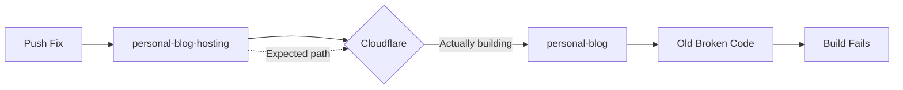
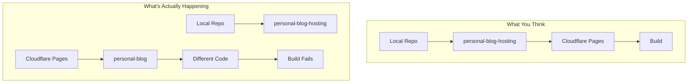
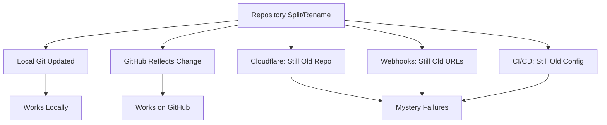

## The Problem

Cloudflare Pages builds kept failing. The same error. Every time.

Fixes were pushed. Commits verified. Local tests passed. But the build log showed the same broken commit being built, again and again.



## The Investigation

The build log revealed commit `9bfa76a` being built - a commit that existed, but not with the recent fixes.

Checking the local repository:

```bash
$ git remote -v
origin  git@github.com:user/personal-blog-hosting.git (fetch)

$ git log --oneline -1
a1b2c3d (HEAD -> main) Fix Hugo config for Cloudflare
```

But Cloudflare's build log showed:

```
Cloning repository: personal-blog
Fetching commit: 9bfa76a
```

The CI/CD was connected to `personal-blog` (the old monorepo), not `personal-blog-hosting` (the new Hugo infrastructure repo).



## The Root Cause

A repo separation had occurred:

1. **Before**: `personal-blog` contained everything (content + infrastructure)
2. **After**: Split into `personal-blog` (content) and `personal-blog-hosting` (Hugo/deployment)
3. **Forgot**: Update Cloudflare's Git connection

The webhook and build trigger were still pointing to the original repository.

## The Resolution

In Cloudflare Pages dashboard:
1. Settings → Builds & deployments
2. Git repository: Changed from `personal-blog` to `personal-blog-hosting`
3. Save and redeploy

Build immediately succeeded with the correct code.

## Why This Is Easy to Miss

When you split or rename repositories, everything **local** updates automatically:

- Your `.git/config` points to the new repo
- Your branches work correctly
- Your pushes succeed

But **external services** have no idea:

| Service | Has Its Own Connection |
|---------|----------------------|
| Cloudflare Pages | Git repository setting |
| Vercel | GitHub/GitLab integration |
| Netlify | Repository link |
| GitHub Actions | Runs in the repo it's in |
| CircleCI | Project settings |
| External webhooks | Hard-coded URLs |

They keep pointing to wherever you configured them, forever.



## Prevention Checklist

After any repository split, rename, or reorganization:

```markdown
## External Services Audit

### Build/Deploy Services
- [ ] Cloudflare Pages - Check Git repository setting
- [ ] Vercel - Check connected repository
- [ ] Netlify - Check repository link
- [ ] AWS Amplify - Check source repository

### CI/CD
- [ ] GitHub Actions - Verify workflow locations
- [ ] CircleCI - Check project settings
- [ ] Travis CI - Check repository access
- [ ] GitLab CI - Check pipeline source

### Webhooks & Integrations
- [ ] Slack notifications - Check webhook URLs
- [ ] Discord bots - Check repository connections
- [ ] Issue trackers - Check linked repos
- [ ] Monitoring services - Check source repos
```

## Debugging Tips

When builds use "old" code despite pushes:

1. **Check build log for repo name** - Is it the repo you think it is?
2. **Verify commit hash** - Does it exist in your current repo?
3. **Compare remotes** - `git remote -v` locally vs. what CI shows
4. **Check dashboard settings** - The "connected repository" field

```bash
# Quick verification
echo "Local repo:"
git remote -v | grep origin

echo "Expected commit:"
git log --oneline -1

# Compare with CI build log
```

## Key Takeaways

1. **External services don't follow renames** - They remember what you told them, forever
2. **Check the repo name in build logs** - It's usually right there
3. **Create a migration checklist** - For every external service connection
4. **Builds "ignoring" fixes = wrong source** - The code isn't wrong; the connection is
5. **Dashboard settings outlive repos** - Always verify after reorganization

The most frustrating debugging sessions are when you're fixing the right code in the wrong place.
