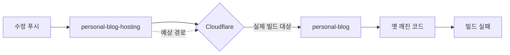
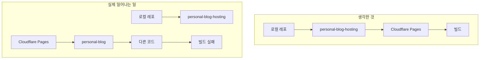
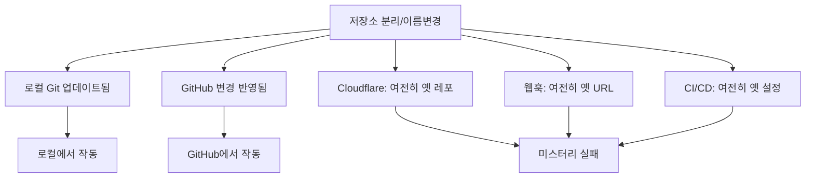

## 문제 상황

Cloudflare Pages 빌드가 계속 실패했다. 같은 에러. 매번.

수정사항을 푸시했다. 커밋 확인 완료. 로컬 테스트 통과. 하지만 빌드 로그는 같은 깨진 커밋을 반복해서 빌드하고 있었다.



## 조사 과정

빌드 로그가 커밋 `9bfa76a`를 빌드한다고 보여줬다 - 존재하는 커밋이지만, 최근 수정사항이 없는.

로컬 저장소 확인:

```bash
$ git remote -v
origin  git@github.com:user/personal-blog-hosting.git (fetch)

$ git log --oneline -1
a1b2c3d (HEAD -> main) Fix Hugo config for Cloudflare
```

하지만 Cloudflare의 빌드 로그는:

```
Cloning repository: personal-blog
Fetching commit: 9bfa76a
```

CI/CD가 `personal-blog-hosting` (새 Hugo 인프라 레포)가 아닌 `personal-blog` (옛 모노레포)에 연결되어 있었다.



## 근본 원인

레포 분리가 발생했었다:

1. **이전**: `personal-blog`가 모든 것을 포함 (콘텐츠 + 인프라)
2. **이후**: `personal-blog` (콘텐츠)와 `personal-blog-hosting` (Hugo/배포)로 분리
3. **잊음**: Cloudflare의 Git 연결 업데이트

웹훅과 빌드 트리거가 여전히 원래 저장소를 가리키고 있었다.

## 해결 방법

Cloudflare Pages 대시보드에서:
1. Settings → Builds & deployments
2. Git repository: `personal-blog`에서 `personal-blog-hosting`으로 변경
3. 저장 후 재배포

빌드가 즉시 올바른 코드로 성공했다.

## 왜 놓치기 쉬운가

저장소를 분리하거나 이름을 변경할 때, **로컬**의 모든 것은 자동으로 업데이트된다:

- `.git/config`가 새 레포를 가리킴
- 브랜치가 정상 작동
- 푸시 성공

하지만 **외부 서비스**는 전혀 모른다:

| 서비스 | 자체 연결 설정 보유 |
|--------|-------------------|
| Cloudflare Pages | Git repository 설정 |
| Vercel | GitHub/GitLab 통합 |
| Netlify | Repository 링크 |
| GitHub Actions | 해당 레포 내에서 실행 |
| CircleCI | 프로젝트 설정 |
| 외부 웹훅 | 하드코딩된 URL |

설정한 곳을 영원히 계속 가리킨다.



## 예방 체크리스트

저장소 분리, 이름 변경, 재구성 후:

```markdown
## 외부 서비스 감사

### 빌드/배포 서비스
- [ ] Cloudflare Pages - Git repository 설정 확인
- [ ] Vercel - 연결된 저장소 확인
- [ ] Netlify - repository 링크 확인
- [ ] AWS Amplify - source repository 확인

### CI/CD
- [ ] GitHub Actions - 워크플로우 위치 확인
- [ ] CircleCI - 프로젝트 설정 확인
- [ ] Travis CI - repository 접근 확인
- [ ] GitLab CI - 파이프라인 소스 확인

### 웹훅 & 통합
- [ ] Slack 알림 - 웹훅 URL 확인
- [ ] Discord 봇 - repository 연결 확인
- [ ] 이슈 트래커 - 연결된 레포 확인
- [ ] 모니터링 서비스 - 소스 레포 확인
```

## 디버깅 팁

푸시에도 불구하고 빌드가 "옛" 코드를 사용할 때:

1. **빌드 로그에서 레포 이름 확인** - 생각하는 레포가 맞는가?
2. **커밋 해시 검증** - 현재 레포에 존재하는가?
3. **remote 비교** - 로컬 `git remote -v` vs. CI가 보여주는 것
4. **대시보드 설정 확인** - "connected repository" 필드

```bash
# 빠른 검증
echo "로컬 레포:"
git remote -v | grep origin

echo "예상 커밋:"
git log --oneline -1

# CI 빌드 로그와 비교
```

## 핵심 교훈

1. **외부 서비스는 이름 변경을 따라가지 않는다** - 설정한 것을 영원히 기억한다
2. **빌드 로그의 레포 이름 확인** - 보통 바로 거기 있다
3. **마이그레이션 체크리스트 만들기** - 모든 외부 서비스 연결에 대해
4. **수정을 "무시하는" 빌드 = 잘못된 소스** - 코드가 틀린 게 아니라 연결이 틀렸다
5. **대시보드 설정은 레포보다 오래 산다** - 재구성 후 항상 검증하라

가장 답답한 디버깅 세션은 올바른 코드를 잘못된 곳에서 고칠 때다.
