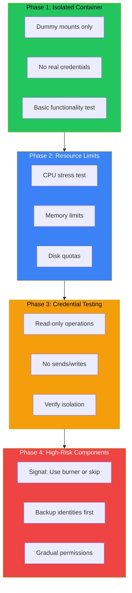

## The Risk: Real Data, Real Consequences

Your AI bot has access to:
- Signal (can brick your phone identity if misconfigured)
- Email credentials
- Obsidian vault with personal notes
- System resources (CPU, memory, disk)

One misconfiguration in your Docker sandbox could expose this data or cause permanent damage. Testing in production is not an option.

## The Four-Phase Testing Approach



## Phase 1: Isolated Container Test

Start with zero real data. Use dummy mounts and fake credentials.

```bash
# Create dummy directories
mkdir -p /tmp/test-sandbox/{downloads,obsidian,config}

# Run container with dummy mounts
docker run --rm -it \
  --read-only \
  --cpus="2.0" \
  --memory="2g" \
  -v /tmp/test-sandbox/downloads:/mnt/downloads:rw \
  -v /tmp/test-sandbox/obsidian:/mnt/obsidian:rw \
  moltbot-sandbox:custom /bin/sh
```

**What to verify:**
- Container starts successfully
- Read-only filesystem prevents writes to unexpected locations
- Mounted directories are accessible
- Basic commands work inside container

```bash
# Inside container
touch /test.txt  # Should fail (read-only)
touch /mnt/downloads/test.txt  # Should succeed
ls -la /mnt/  # Verify mounts
```

## Phase 2: Resource Limit Validation

Your sandbox claims to limit CPU and memory. Does it actually?

### CPU Limit Test

```bash
docker run --rm -it \
  --cpus="2" \
  --memory="2g" \
  moltbot-sandbox:custom sh -c "
    # Install stress tool if not present
    apk add --no-cache stress-ng 2>/dev/null || apt-get install -y stress-ng 2>/dev/null
    
    # Try to use 8 CPUs (should be throttled to 2)
    stress-ng --cpu 8 --timeout 10s
    echo 'CPU test completed'
  "
```

**Expected**: Process runs but is throttled. Host CPU usage stays reasonable.

### Memory Limit Test

```bash
docker run --rm -it \
  --memory="512m" \
  --memory-swap="512m" \
  moltbot-sandbox:custom sh -c "
    # Try to allocate more than limit
    python3 -c 'x = \"A\" * (1024 * 1024 * 600)' 2>&1 || echo 'OOM killed as expected'
  "
```

**Expected**: Container is killed when exceeding memory limit, not the host.

### Disk Quota Test

```bash
# Create a volume with size limit
docker volume create --opt o=size=100m test-volume

docker run --rm -it \
  -v test-volume:/data \
  moltbot-sandbox:custom sh -c "
    dd if=/dev/zero of=/data/bigfile bs=1M count=150 2>&1 || echo 'Disk limit hit'
  "
```

## Phase 3: Credential Testing (Read-Only First)

Now introduce real credentials, but only for read-only operations.

### Email: Read-Only Test

```bash
# Test email listing (read-only, safe)
docker run --rm -it \
  -v ~/.config/himalaya:/home/moltbot/.config/himalaya:ro \
  moltbot-sandbox:custom sh -c "
    himalaya list --folder INBOX -s 3
  "
```

**Safe operations:**
- `himalaya list` - Lists emails
- `himalaya read` - Reads specific email

**NEVER in testing:**
- `himalaya send` - Sends email
- `himalaya delete` - Deletes email
- `himalaya move` - Moves email

### Obsidian: Read-Only Test

```bash
docker run --rm -it \
  -v ~/Obsidian/Vault:/mnt/obsidian:ro \  # Note: read-only mount
  moltbot-sandbox:custom sh -c "
    ls /mnt/obsidian/Daily/
    cat /mnt/obsidian/Daily/2026-02-03.md
  "
```

The `:ro` flag prevents any writes, even if the bot tries.

## Phase 4: High-Risk Components

Some components can cause permanent damage. Handle with extra care.

### Signal-CLI: The Nuclear Option

Signal's identity is tied to your phone number. Misconfiguration can:
- Invalidate your existing Signal sessions
- Require re-registration (losing message history)
- Lock you out of your account

**Safest approach**: Skip Signal in testing entirely, or use a burner number.

If you must test:

```bash
# BACKUP FIRST
cp -r ~/.signal-cli ~/.signal-cli.backup.$(date +%Y%m%d)

# Verify backup
diff -r ~/.signal-cli ~/.signal-cli.backup.$(date +%Y%m%d)

# Test with read-only mount
docker run --rm -it \
  -v ~/.signal-cli:/home/moltbot/.signal-cli:ro \
  moltbot-sandbox:custom sh -c "
    signal-cli -u +1234567890 listGroups
  "
```

### Gradual Permission Escalation

Once read-only tests pass, gradually add write permissions:

```bash
# Stage 1: Read-only everything
-v /path:/mnt:ro

# Stage 2: Write to specific directories only
-v /path/downloads:/mnt/downloads:rw
-v /path/obsidian:/mnt/obsidian:ro  # Still read-only

# Stage 3: Full write (after all tests pass)
-v /path/obsidian:/mnt/obsidian:rw
```

## Testing Checklist

Before deploying your AI bot sandbox:

- [ ] **Phase 1 Complete**
  - [ ] Container starts with dummy data
  - [ ] Read-only filesystem works
  - [ ] Mount points accessible

- [ ] **Phase 2 Complete**
  - [ ] CPU limits enforced
  - [ ] Memory limits enforced
  - [ ] Disk quotas work

- [ ] **Phase 3 Complete**
  - [ ] Email: list/read works
  - [ ] Obsidian: read works
  - [ ] No write operations tested yet

- [ ] **Phase 4 Complete**
  - [ ] High-risk components backed up
  - [ ] Read-only tests pass
  - [ ] Gradual write permission verified

## Key Takeaways

1. **Never test with real data first** - Always start with dummy mounts
2. **Verify resource limits actually work** - Don't trust documentation
3. **Read-only before read-write** - Credentials should be tested read-only first
4. **Backup before touching high-risk components** - Signal, auth tokens, etc.
5. **Gradual escalation** - Add permissions one at a time, verify each step

The time invested in proper sandbox testing prevents the panic of realizing your AI bot just sent emails to your entire contact list or bricked your Signal identity.

---

*This testing approach was developed for Moltbot, a personal AI companion with access to email, Signal, and Obsidian. Each phase catches different failure modes before they become disasters.*
