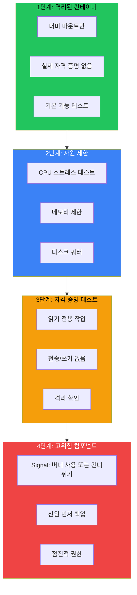

## 위험: 실제 데이터, 실제 결과

AI 봇이 접근하는 것들:
- Signal (잘못 설정하면 휴대폰 신원을 망가뜨릴 수 있음)
- 이메일 자격 증명
- 개인 노트가 있는 Obsidian 볼트
- 시스템 자원 (CPU, 메모리, 디스크)

Docker 샌드박스의 하나의 잘못된 설정이 이 데이터를 노출하거나 영구적 손상을 일으킬 수 있다. 프로덕션에서 테스트하는 것은 옵션이 아니다.

## 4단계 테스팅 접근법



## 1단계: 격리된 컨테이너 테스트

실제 데이터 없이 시작한다. 더미 마운트와 가짜 자격 증명을 사용한다.

```bash
# 더미 디렉토리 생성
mkdir -p /tmp/test-sandbox/{downloads,obsidian,config}

# 더미 마운트로 컨테이너 실행
docker run --rm -it \
  --read-only \
  --cpus="2.0" \
  --memory="2g" \
  -v /tmp/test-sandbox/downloads:/mnt/downloads:rw \
  -v /tmp/test-sandbox/obsidian:/mnt/obsidian:rw \
  moltbot-sandbox:custom /bin/sh
```

**확인할 것:**
- 컨테이너가 성공적으로 시작됨
- 읽기 전용 파일시스템이 예상치 못한 위치에 쓰기 방지
- 마운트된 디렉토리 접근 가능
- 컨테이너 내부에서 기본 명령 작동

```bash
# 컨테이너 내부에서
touch /test.txt  # 실패해야 함 (읽기 전용)
touch /mnt/downloads/test.txt  # 성공해야 함
ls -la /mnt/  # 마운트 확인
```

## 2단계: 자원 제한 검증

샌드박스가 CPU와 메모리를 제한한다고 주장한다. 실제로 그런가?

### CPU 제한 테스트

```bash
docker run --rm -it \
  --cpus="2" \
  --memory="2g" \
  moltbot-sandbox:custom sh -c "
    # stress 도구 없으면 설치
    apk add --no-cache stress-ng 2>/dev/null || apt-get install -y stress-ng 2>/dev/null
    
    # 8 CPU 사용 시도 (2로 제한되어야 함)
    stress-ng --cpu 8 --timeout 10s
    echo 'CPU 테스트 완료'
  "
```

**예상**: 프로세스가 실행되지만 제한됨. 호스트 CPU 사용량이 합리적으로 유지됨.

### 메모리 제한 테스트

```bash
docker run --rm -it \
  --memory="512m" \
  --memory-swap="512m" \
  moltbot-sandbox:custom sh -c "
    # 제한보다 많이 할당 시도
    python3 -c 'x = \"A\" * (1024 * 1024 * 600)' 2>&1 || echo '예상대로 OOM 종료됨'
  "
```

**예상**: 호스트가 아닌 컨테이너가 메모리 제한 초과 시 종료됨.

### 디스크 쿼터 테스트

```bash
# 크기 제한이 있는 볼륨 생성
docker volume create --opt o=size=100m test-volume

docker run --rm -it \
  -v test-volume:/data \
  moltbot-sandbox:custom sh -c "
    dd if=/dev/zero of=/data/bigfile bs=1M count=150 2>&1 || echo '디스크 제한 도달'
  "
```

## 3단계: 자격 증명 테스트 (읽기 전용 먼저)

이제 실제 자격 증명을 도입하지만, 읽기 전용 작업만.

### 이메일: 읽기 전용 테스트

```bash
# 이메일 목록 테스트 (읽기 전용, 안전)
docker run --rm -it \
  -v ~/.config/himalaya:/home/moltbot/.config/himalaya:ro \
  moltbot-sandbox:custom sh -c "
    himalaya list --folder INBOX -s 3
  "
```

**안전한 작업:**
- `himalaya list` - 이메일 나열
- `himalaya read` - 특정 이메일 읽기

**테스트에서 절대 안됨:**
- `himalaya send` - 이메일 전송
- `himalaya delete` - 이메일 삭제
- `himalaya move` - 이메일 이동

### Obsidian: 읽기 전용 테스트

```bash
docker run --rm -it \
  -v ~/Obsidian/Vault:/mnt/obsidian:ro \  # 주의: 읽기 전용 마운트
  moltbot-sandbox:custom sh -c "
    ls /mnt/obsidian/Daily/
    cat /mnt/obsidian/Daily/2026-02-03.md
  "
```

`:ro` 플래그가 봇이 시도해도 모든 쓰기를 방지한다.

## 4단계: 고위험 컴포넌트

일부 컴포넌트는 영구적 손상을 일으킬 수 있다. 특별히 조심해서 다룬다.

### Signal-CLI: 핵 옵션

Signal의 신원은 전화번호에 연결되어 있다. 잘못된 설정은:
- 기존 Signal 세션 무효화
- 재등록 필요 (메시지 기록 손실)
- 계정에서 잠김

**가장 안전한 접근**: 테스트에서 Signal을 완전히 건너뛰거나 버너 번호 사용.

테스트해야 한다면:

```bash
# 먼저 백업
cp -r ~/.signal-cli ~/.signal-cli.backup.$(date +%Y%m%d)

# 백업 확인
diff -r ~/.signal-cli ~/.signal-cli.backup.$(date +%Y%m%d)

# 읽기 전용 마운트로 테스트
docker run --rm -it \
  -v ~/.signal-cli:/home/moltbot/.signal-cli:ro \
  moltbot-sandbox:custom sh -c "
    signal-cli -u +1234567890 listGroups
  "
```

### 점진적 권한 상승

읽기 전용 테스트가 통과되면, 점진적으로 쓰기 권한을 추가한다:

```bash
# 1단계: 모두 읽기 전용
-v /path:/mnt:ro

# 2단계: 특정 디렉토리에만 쓰기
-v /path/downloads:/mnt/downloads:rw
-v /path/obsidian:/mnt/obsidian:ro  # 아직 읽기 전용

# 3단계: 전체 쓰기 (모든 테스트 통과 후)
-v /path/obsidian:/mnt/obsidian:rw
```

## 테스팅 체크리스트

AI 봇 샌드박스 배포 전:

- [ ] **1단계 완료**
  - [ ] 더미 데이터로 컨테이너 시작됨
  - [ ] 읽기 전용 파일시스템 작동
  - [ ] 마운트 포인트 접근 가능

- [ ] **2단계 완료**
  - [ ] CPU 제한 적용됨
  - [ ] 메모리 제한 적용됨
  - [ ] 디스크 쿼터 작동

- [ ] **3단계 완료**
  - [ ] 이메일: 목록/읽기 작동
  - [ ] Obsidian: 읽기 작동
  - [ ] 아직 쓰기 작업 테스트 안함

- [ ] **4단계 완료**
  - [ ] 고위험 컴포넌트 백업됨
  - [ ] 읽기 전용 테스트 통과
  - [ ] 점진적 쓰기 권한 확인됨

## 핵심 정리

1. **실제 데이터로 먼저 테스트하지 않는다** - 항상 더미 마운트로 시작
2. **자원 제한이 실제로 작동하는지 확인** - 문서를 신뢰하지 않는다
3. **읽기-쓰기 전에 읽기 전용** - 자격 증명은 읽기 전용으로 먼저 테스트
4. **고위험 컴포넌트 건드리기 전 백업** - Signal, 인증 토큰 등
5. **점진적 상승** - 한 번에 하나씩 권한 추가, 각 단계 확인

적절한 샌드박스 테스팅에 투자한 시간이 AI 봇이 전체 연락처 목록에 이메일을 보내거나 Signal 신원을 망가뜨렸다는 것을 깨닫는 패닉을 방지한다.

---

*이 테스팅 접근법은 이메일, Signal, Obsidian에 접근하는 개인 AI 컴패니언 Moltbot을 위해 개발되었다. 각 단계가 재앙이 되기 전에 다른 실패 모드를 잡아낸다.*
