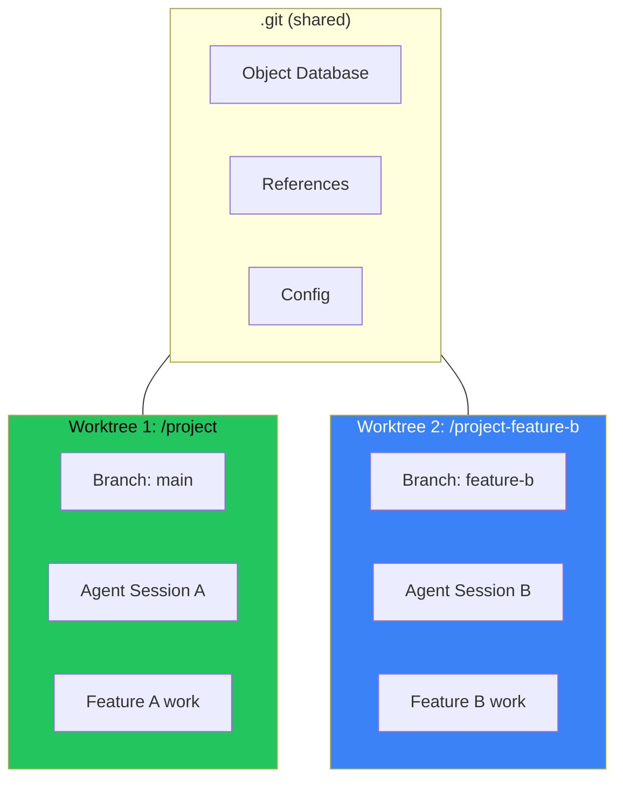

## The Problem: One Repo, Multiple Agents

You're working with an AI coding assistant on Feature A. Midway through, you realize Feature B needs attention too. But your current session has uncommitted changes, half-finished code, and context the agent has built up.

Starting a new session means:
- Stashing or committing incomplete work
- Losing the mental context of Feature A
- Risk of merge conflicts when both features land

There's a better way: git worktrees.

## What Are Git Worktrees?

A worktree is an additional working directory linked to your repository. Each worktree can have a different branch checked out, but they all share the same `.git` directory.



Think of it as having multiple checkouts of the same repository, each in its own directory, each on its own branch.

## Setting Up Parallel Agent Sessions

### Step 1: Create a Worktree

From your main project directory:

```bash
# Create worktree for Feature B on a new branch
git worktree add ../project-feature-b -b feature-b

# Or checkout an existing branch
git worktree add ../project-feature-b feature-b
```

This creates:
- A new directory `../project-feature-b`
- A new branch `feature-b` (or checks out existing)
- A link back to the main `.git` directory

### Step 2: Start Your Second Agent Session

```bash
# Navigate to the new worktree
cd ../project-feature-b

# Start a new AI agent session
opencode  # or claude, cursor, etc.
```

Now you have:
- **Session A** in `/project` working on `main` or `feature-a`
- **Session B** in `/project-feature-b` working on `feature-b`

Both agents can commit, push, and work independently.

### Step 3: Work in Parallel

Each agent session is completely isolated:

```bash
# In Session A (/project)
git status  # Shows Feature A changes
git commit -m "feat: implement feature A"

# In Session B (/project-feature-b)  
git status  # Shows Feature B changes
git commit -m "feat: implement feature B"
```

No conflicts during development. Each branch evolves independently.

### Step 4: Clean Up When Done

```bash
# Remove the worktree (keeps the branch)
git worktree remove ../project-feature-b

# Or force remove if there are uncommitted changes
git worktree remove --force ../project-feature-b

# List all worktrees
git worktree list
```

## Why This Works Better Than Branch Switching

| Approach | Context Preserved | Parallel Work | Merge Risk |
|----------|-------------------|---------------|------------|
| Branch switching | No | No | High |
| Stash + switch | Partial | No | Medium |
| Separate clones | Yes | Yes | Low (but disk heavy) |
| **Worktrees** | Yes | Yes | Low |

Worktrees give you the isolation of separate clones without duplicating the entire repository. The `.git` directory is shared, so you're not wasting disk space on duplicate object databases.

## Practical Patterns

### Pattern 1: Feature + Hotfix

Main session working on a feature when urgent bug report comes in:

```bash
# Create hotfix worktree from main
git worktree add ../project-hotfix -b hotfix/critical-bug main

# Fix the bug in new session, merge, delete worktree
cd ../project-hotfix
# ... fix and commit ...
git push origin hotfix/critical-bug
git worktree remove ../project-hotfix
```

Your feature work remains untouched.

### Pattern 2: Multiple AI Agents on Different Features

Orchestrating several AI agents simultaneously:

```bash
# Agent 1: Backend API
git worktree add ../project-api -b feature/api-endpoints

# Agent 2: Frontend UI
git worktree add ../project-ui -b feature/ui-components

# Agent 3: Documentation
git worktree add ../project-docs -b docs/api-reference

# Each agent works in isolation
# Merge when all complete
```

### Pattern 3: Code Review While Developing

Review a PR without disrupting your current work:

```bash
# Create worktree for the PR branch
git fetch origin pull/123/head:pr-123
git worktree add ../project-pr-review pr-123

# Review in separate session
cd ../project-pr-review
# ... review, test, comment ...

# Clean up
git worktree remove ../project-pr-review
```

## Common Gotchas

### 1. Can't Check Out Same Branch Twice

Git prevents checking out the same branch in multiple worktrees:

```bash
$ git worktree add ../other main
fatal: 'main' is already checked out at '/project'
```

**Solution**: Create a new branch or use `--detach` for read-only inspection.

### 2. Worktree Paths Are Absolute

If you move the main repository, worktree links break.

**Solution**: Use relative paths or recreate worktrees after moving.

### 3. Submodules Need Extra Steps

Worktrees don't automatically initialize submodules:

```bash
cd ../project-feature-b
git submodule update --init --recursive
```

### 4. IDE/Editor Confusion

Some IDEs get confused with multiple worktrees of the same project.

**Solution**: Open each worktree as a separate project/workspace.

## Integration with AI Coding Assistants

Most AI coding tools work seamlessly with worktrees because they just see a normal git repository. Some tips:

1. **Clear session boundaries**: Start fresh sessions in each worktree to avoid context confusion
2. **Explicit paths**: When referencing files, use absolute paths or be clear about which worktree you mean
3. **Commit frequently**: Smaller commits make merging easier later
4. **Communicate branch purpose**: Tell the AI agent which branch/feature it's working on at session start

## Recovery Commands Cheat Sheet

```bash
# List all worktrees
git worktree list

# Remove a worktree
git worktree remove <path>

# Prune stale worktree references
git worktree prune

# Lock a worktree (prevent accidental removal)
git worktree lock <path>

# Unlock a worktree
git worktree unlock <path>

# Move a worktree
git worktree move <old-path> <new-path>
```

## Key Takeaways

1. **Worktrees enable true parallel development** - Multiple branches, multiple directories, one repository
2. **Perfect for AI agent orchestration** - Each agent gets isolated workspace
3. **Shared .git saves space** - Unlike full clones
4. **Clean merge workflow** - No stashing, no context switching, no half-done commits
5. **Simple cleanup** - Remove worktree when done, branch stays

Next time you need to context-switch or run multiple AI sessions, reach for `git worktree add` instead of `git stash`. Your future self will thank you.

---

*This workflow emerged from running multiple AI coding sessions simultaneously. The same pattern works for human developers juggling multiple features or reviews.*
