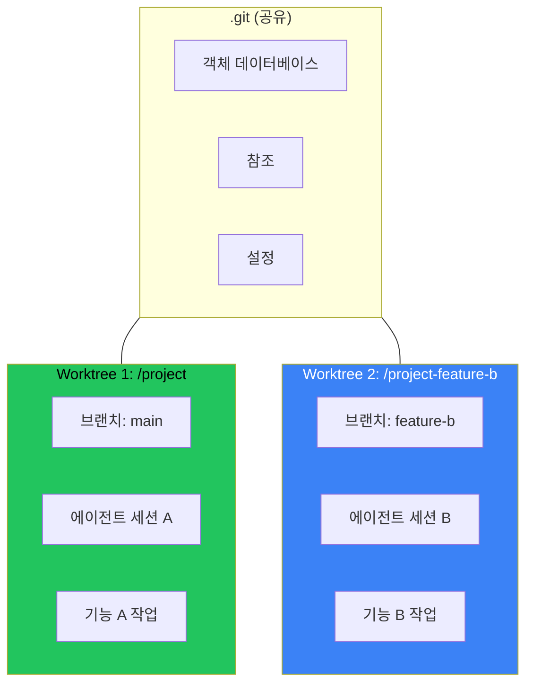

## 문제: 하나의 저장소, 여러 에이전트

AI 코딩 어시스턴트와 기능 A를 작업 중이다. 중간에 기능 B도 주의가 필요하다는 것을 깨달았다. 하지만 현재 세션에는 커밋하지 않은 변경사항, 반쯤 완성된 코드, 에이전트가 쌓아온 컨텍스트가 있다.

새 세션을 시작하면:
- 불완전한 작업을 stash하거나 커밋해야 한다
- 기능 A의 정신적 컨텍스트를 잃는다
- 두 기능이 합쳐질 때 머지 충돌 위험이 있다

더 좋은 방법이 있다: git worktree.

## Git Worktree란?

Worktree는 저장소에 연결된 추가 작업 디렉토리다. 각 worktree는 다른 브랜치를 체크아웃할 수 있지만, 모두 같은 `.git` 디렉토리를 공유한다.



같은 저장소의 여러 체크아웃을 가지는 것으로 생각하면 된다. 각각 고유한 디렉토리에, 각각 고유한 브랜치에.

## 병렬 에이전트 세션 설정

### 1단계: Worktree 생성

메인 프로젝트 디렉토리에서:

```bash
# 새 브랜치에 기능 B용 worktree 생성
git worktree add ../project-feature-b -b feature-b

# 또는 기존 브랜치 체크아웃
git worktree add ../project-feature-b feature-b
```

이것이 생성하는 것:
- 새 디렉토리 `../project-feature-b`
- 새 브랜치 `feature-b` (또는 기존 브랜치 체크아웃)
- 메인 `.git` 디렉토리로의 링크

### 2단계: 두 번째 에이전트 세션 시작

```bash
# 새 worktree로 이동
cd ../project-feature-b

# 새 AI 에이전트 세션 시작
opencode  # 또는 claude, cursor 등
```

이제 다음을 가진다:
- **세션 A**는 `/project`에서 `main` 또는 `feature-a` 작업
- **세션 B**는 `/project-feature-b`에서 `feature-b` 작업

두 에이전트 모두 독립적으로 커밋하고 푸시하고 작업할 수 있다.

### 3단계: 병렬 작업

각 에이전트 세션은 완전히 격리된다:

```bash
# 세션 A에서 (/project)
git status  # 기능 A 변경사항 표시
git commit -m "feat: implement feature A"

# 세션 B에서 (/project-feature-b)  
git status  # 기능 B 변경사항 표시
git commit -m "feat: implement feature B"
```

개발 중 충돌 없음. 각 브랜치가 독립적으로 진화한다.

### 4단계: 완료 후 정리

```bash
# worktree 제거 (브랜치는 유지)
git worktree remove ../project-feature-b

# 커밋하지 않은 변경이 있으면 강제 제거
git worktree remove --force ../project-feature-b

# 모든 worktree 나열
git worktree list
```

## 브랜치 전환보다 나은 이유

| 접근법 | 컨텍스트 보존 | 병렬 작업 | 머지 위험 |
|--------|--------------|----------|----------|
| 브랜치 전환 | 안됨 | 안됨 | 높음 |
| Stash + 전환 | 부분적 | 안됨 | 중간 |
| 별도 클론 | 됨 | 됨 | 낮음 (디스크 무거움) |
| **Worktree** | 됨 | 됨 | 낮음 |

Worktree는 전체 저장소를 복제하지 않고 별도 클론의 격리를 제공한다. `.git` 디렉토리가 공유되므로 중복 객체 데이터베이스에 디스크 공간을 낭비하지 않는다.

## 실용적 패턴

### 패턴 1: 기능 + 핫픽스

긴급 버그 리포트가 들어왔을 때 메인 세션이 기능 작업 중:

```bash
# main에서 핫픽스 worktree 생성
git worktree add ../project-hotfix -b hotfix/critical-bug main

# 새 세션에서 버그 수정, 머지, worktree 삭제
cd ../project-hotfix
# ... 수정하고 커밋 ...
git push origin hotfix/critical-bug
git worktree remove ../project-hotfix
```

기능 작업은 손대지 않은 채로 유지된다.

### 패턴 2: 다른 기능에 여러 AI 에이전트

여러 AI 에이전트를 동시에 오케스트레이션:

```bash
# 에이전트 1: 백엔드 API
git worktree add ../project-api -b feature/api-endpoints

# 에이전트 2: 프론트엔드 UI
git worktree add ../project-ui -b feature/ui-components

# 에이전트 3: 문서화
git worktree add ../project-docs -b docs/api-reference

# 각 에이전트가 격리되어 작업
# 모두 완료되면 머지
```

### 패턴 3: 개발 중 코드 리뷰

현재 작업을 방해하지 않고 PR 리뷰:

```bash
# PR 브랜치용 worktree 생성
git fetch origin pull/123/head:pr-123
git worktree add ../project-pr-review pr-123

# 별도 세션에서 리뷰
cd ../project-pr-review
# ... 리뷰, 테스트, 코멘트 ...

# 정리
git worktree remove ../project-pr-review
```

## 흔한 함정

### 1. 같은 브랜치를 두 번 체크아웃할 수 없음

Git은 여러 worktree에서 같은 브랜치 체크아웃을 방지한다:

```bash
$ git worktree add ../other main
fatal: 'main' is already checked out at '/project'
```

**해결책**: 새 브랜치를 만들거나 읽기 전용 검사를 위해 `--detach` 사용.

### 2. Worktree 경로는 절대 경로

메인 저장소를 이동하면 worktree 링크가 깨진다.

**해결책**: 상대 경로를 사용하거나 이동 후 worktree를 다시 생성.

### 3. 서브모듈은 추가 단계 필요

Worktree는 자동으로 서브모듈을 초기화하지 않는다:

```bash
cd ../project-feature-b
git submodule update --init --recursive
```

### 4. IDE/편집기 혼란

일부 IDE는 같은 프로젝트의 여러 worktree에서 혼란스러워한다.

**해결책**: 각 worktree를 별도 프로젝트/워크스페이스로 연다.

## AI 코딩 어시스턴트와의 통합

대부분의 AI 코딩 도구는 worktree와 매끄럽게 작동한다. 그냥 일반 git 저장소로 보기 때문이다. 몇 가지 팁:

1. **명확한 세션 경계**: 컨텍스트 혼란을 피하기 위해 각 worktree에서 새 세션 시작
2. **명시적 경로**: 파일 참조 시 절대 경로 사용 또는 어떤 worktree를 의미하는지 명확히
3. **자주 커밋**: 작은 커밋이 나중에 머지를 쉽게 한다
4. **브랜치 목적 전달**: 세션 시작 시 AI 에이전트에게 어떤 브랜치/기능을 작업하는지 알림

## 복구 명령어 치트시트

```bash
# 모든 worktree 나열
git worktree list

# worktree 제거
git worktree remove <path>

# 오래된 worktree 참조 정리
git worktree prune

# worktree 잠금 (실수로 제거 방지)
git worktree lock <path>

# worktree 잠금 해제
git worktree unlock <path>

# worktree 이동
git worktree move <old-path> <new-path>
```

## 핵심 정리

1. **Worktree는 진정한 병렬 개발을 가능하게 한다** - 여러 브랜치, 여러 디렉토리, 하나의 저장소
2. **AI 에이전트 오케스트레이션에 완벽** - 각 에이전트가 격리된 작업공간을 얻는다
3. **공유 .git으로 공간 절약** - 전체 클론과 달리
4. **깔끔한 머지 워크플로우** - stash 없음, 컨텍스트 전환 없음, 반쯤 완료된 커밋 없음
5. **간단한 정리** - 완료되면 worktree 제거, 브랜치는 유지

다음에 컨텍스트 전환이 필요하거나 여러 AI 세션을 실행해야 할 때, `git stash` 대신 `git worktree add`를 사용하라. 미래의 자신이 고마워할 것이다.

---

*이 워크플로우는 여러 AI 코딩 세션을 동시에 실행하면서 나타났다. 같은 패턴이 여러 기능이나 리뷰를 저글링하는 인간 개발자에게도 적용된다.*
