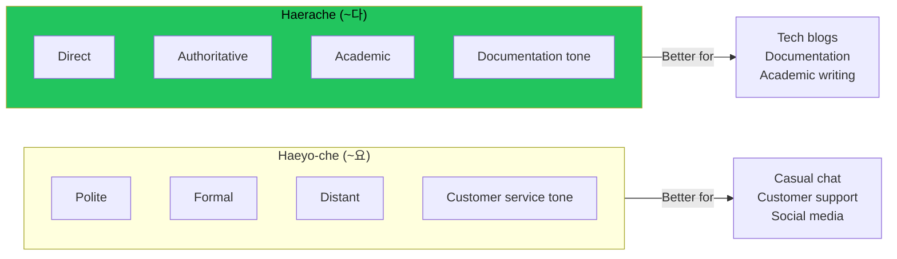

## Korean Speech Levels: A Quick Primer

Korean has multiple speech levels that encode formality and social relationship. Two common ones in writing:

**Haeyo-che (polite)**: Ends in ~요
- "이것은 중요합니다" (This is important)
- Feels: Polite, formal, distant

**Haerache (plain/declarative)**: Ends in ~다/~이다
- "이것은 중요하다" (This is important)
- Feels: Direct, authoritative, academic

## The Problem with Haeyo-che in Tech Blogs

When AI generates Korean translations, it defaults to haeyo-che (polite form). Every sentence ends in ~요:

```
이 함수는 문자열을 반환해요.
설정 파일을 수정해야 해요.
결과를 확인해 보세요.
```

This feels wrong for technical writing. Here's why:

### Too Much Distance

Haeyo-che creates emotional distance. It's the style you use with strangers, customers, or senior colleagues. Technical content shouldn't feel like customer service.

### Inconsistent Tone

Korean tech documentation, academic papers, and serious blogs use haerache. Haeyo-che creates a tonal mismatch with the broader ecosystem.

### Unnecessary Length

Haeyo-che adds syllables to every sentence. In dense technical writing, this overhead compounds.

## The Haerache Solution

The same content in haerache:

```
이 함수는 문자열을 반환한다.
설정 파일을 수정해야 한다.
결과를 확인해 보라.
```



This feels like:
- Wikipedia articles
- Technical documentation
- Academic papers
- Authoritative blog posts

## Examples in Context

### Haeyo-che (Too Polite)

```markdown
## 설치 방법

먼저 저장소를 클론해요.

```bash
git clone https://github.com/example/repo.git
```

다음으로 의존성을 설치해요.
```

### Haerache (Appropriate)

```markdown
## 설치 방법

먼저 저장소를 클론한다.

```bash
git clone https://github.com/example/repo.git
```

다음으로 의존성을 설치한다.
```

The second version reads like documentation should read: clear, direct, informative.

## When to Use Each Style

| Context | Recommended Style |
|---------|-------------------|
| Tech blog posts | Haerache (~다) |
| Documentation | Haerache (~다) |
| Academic writing | Haerache (~다) |
| Casual blog | Either |
| Social media | Haeyo-che (~요) |
| Customer support | Haeyo-che (~요) |
| Chat messages | Haeyo-che (~요) |

## Configuring AI for Haerache

When generating Korean content, be explicit:

```
Write in Korean using haerache style (해라체).
Use ~다/~이다 endings, NOT ~요 endings.

Examples of correct style:
- "함수를 호출한다" (O)
- "함수를 호출해요" (X)
```

Most AI models default to haeyo-che because it's "safer" (more polite). You need to explicitly request haerache.

## Key Takeaways

1. **Korean has multiple speech levels** - Choice affects perceived tone
2. **Haeyo-che feels too polite for tech writing** - Creates unnecessary distance
3. **Haerache matches documentation conventions** - Reads like Wikipedia, not customer service
4. **Be explicit with AI** - Default is haeyo-che; you must request haerache
5. **Consistency matters** - Pick one style and stick with it throughout

The difference seems subtle to non-Korean speakers, but native readers immediately notice. Wrong speech level is like writing a technical manual in the style of a text message - technically comprehensible but tonally jarring.

---

*This style guide emerged from reviewing AI-generated Korean translations that consistently used overly polite haeyo-che. Switching to haerache made the content feel native rather than translated.*
