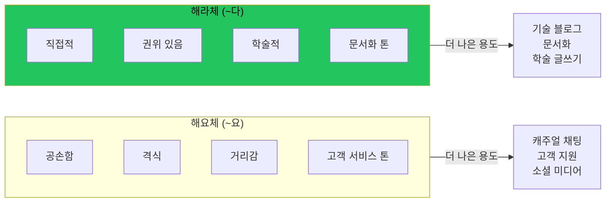

## 한국어 높임법: 간단한 설명

한국어에는 격식과 사회적 관계를 인코딩하는 여러 높임법이 있다. 글쓰기에서 흔한 두 가지:

**해요체 (공손체)**: ~요로 끝남
- "이것은 중요해요"
- 느낌: 공손함, 격식 있음, 거리감

**해라체 (평서체)**: ~다/~이다로 끝남
- "이것은 중요하다"
- 느낌: 직접적, 권위 있음, 학술적

## 기술 블로그에서 해요체의 문제

AI가 한국어 번역을 생성하면 해요체(공손체)로 기본 설정된다. 모든 문장이 ~요로 끝난다:

```
이 함수는 문자열을 반환해요.
설정 파일을 수정해야 해요.
결과를 확인해 보세요.
```

이것은 기술 글쓰기에서 잘못된 느낌이다. 이유는:

### 과도한 거리감

해요체는 감정적 거리를 만든다. 낯선 사람, 고객, 상사에게 쓰는 스타일이다. 기술 콘텐츠가 고객 서비스처럼 느껴지면 안 된다.

### 일관성 없는 톤

한국어 기술 문서, 학술 논문, 진지한 블로그는 해라체를 쓴다. 해요체는 더 넓은 생태계와 톤 불일치를 만든다.

### 불필요한 길이

해요체는 모든 문장에 음절을 추가한다. 밀도 높은 기술 글쓰기에서 이 오버헤드가 누적된다.

## 해라체 해결책

같은 내용을 해라체로:

```
이 함수는 문자열을 반환한다.
설정 파일을 수정해야 한다.
결과를 확인해 보라.
```



이것은 다음처럼 느껴진다:
- 위키피디아 기사
- 기술 문서
- 학술 논문
- 권위 있는 블로그 포스트

## 맥락에서의 예시

### 해요체 (너무 공손함)

```markdown
## 설치 방법

먼저 저장소를 클론해요.

```bash
git clone https://github.com/example/repo.git
```

다음으로 의존성을 설치해요.
```

### 해라체 (적절함)

```markdown
## 설치 방법

먼저 저장소를 클론한다.

```bash
git clone https://github.com/example/repo.git
```

다음으로 의존성을 설치한다.
```

두 번째 버전이 문서가 읽혀야 하는 방식으로 읽힌다: 명확하고, 직접적이고, 정보적이다.

## 각 스타일 사용 시점

| 맥락 | 권장 스타일 |
|------|-------------|
| 기술 블로그 포스트 | 해라체 (~다) |
| 문서화 | 해라체 (~다) |
| 학술 글쓰기 | 해라체 (~다) |
| 캐주얼 블로그 | 둘 다 가능 |
| 소셜 미디어 | 해요체 (~요) |
| 고객 지원 | 해요체 (~요) |
| 채팅 메시지 | 해요체 (~요) |

## AI를 해라체로 설정하기

한국어 콘텐츠 생성 시 명시적으로:

```
한국어로 해라체 스타일로 작성하라.
~다/~이다 어미를 사용하고, ~요 어미는 사용하지 않는다.

올바른 스타일 예시:
- "함수를 호출한다" (O)
- "함수를 호출해요" (X)
```

대부분의 AI 모델은 해요체로 기본 설정된다. "더 안전"(더 공손)하기 때문이다. 해라체를 명시적으로 요청해야 한다.

## 핵심 정리

1. **한국어에는 여러 높임법이 있다** - 선택이 인지된 톤에 영향을 준다
2. **해요체는 기술 글쓰기에 너무 공손하다** - 불필요한 거리감을 만든다
3. **해라체가 문서화 관례와 맞는다** - 고객 서비스가 아닌 위키피디아처럼 읽힌다
4. **AI에 명시하라** - 기본값이 해요체다; 해라체를 요청해야 한다
5. **일관성이 중요하다** - 하나의 스타일을 선택하고 전체에서 유지하라

차이가 한국어 비원어민에게는 미묘해 보이지만 원어민 독자는 즉시 알아챈다. 잘못된 높임법은 기술 매뉴얼을 문자 메시지 스타일로 쓰는 것과 같다 - 기술적으로는 이해 가능하지만 톤이 어긋난다.

---

*이 스타일 가이드는 일관되게 과도하게 공손한 해요체를 사용한 AI 생성 한국어 번역을 검토하면서 나타났다. 해라체로 전환하니 콘텐츠가 번역이 아닌 원어민처럼 느껴졌다.*
