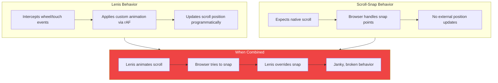

## The Setup

Wedding invitation site. Beautiful full-page sections. Two requirements:
1. Smooth parallax scrolling (Lenis)
2. Section-by-section navigation (CSS scroll-snap)

Both seemed simple. Neither worked.

## The Symptom

Scrolling felt janky. Sometimes sections would snap, sometimes they wouldn't. Mobile was completely broken - touch scrolling felt like fighting the page.

## The Investigation



The research confirmed it:

> "CRITICAL: Lenis and CSS scroll-snap are INCOMPATIBLE - Lenis hijacks native scrolling"

## Why They Fight

**Lenis** works by:
1. Intercepting wheel and touch events
2. Preventing default scroll behavior
3. Animating scroll position via `requestAnimationFrame`
4. Updating `window.scrollY` programmatically

**CSS scroll-snap** expects:
1. Native browser scroll events
2. No interference with scroll position
3. Browser control over snap point calculations

When combined:
- Lenis starts animating toward user's intended scroll position
- Browser detects scroll and tries to snap to nearest point
- Lenis sees the snap as interference, overrides it
- Browser tries again
- Result: jittery, unpredictable scrolling

Mobile is worse because touch events are more complex, and Lenis's touch handling conflicts even more with native snap behavior.

## The Solution

Remove Lenis. Use CSS scroll-snap with native smooth scroll.

### Before (Broken)

```javascript
// Layout.astro
import Lenis from 'lenis';

const lenis = new Lenis({
  duration: 1.2,
  easing: (t) => Math.min(1, 1.001 - Math.pow(2, -10 * t)),
  smoothWheel: true,
});

lenis.on('scroll', ScrollTrigger.update);

gsap.ticker.add((time) => {
  lenis.raf(time * 1000);
});
```

```css
html {
  scroll-snap-type: y mandatory;
}

section {
  scroll-snap-align: start;
}
```

### After (Working)

```javascript
// Layout.astro
// No Lenis - just GSAP ScrollTrigger
gsap.registerPlugin(ScrollTrigger);

// ScrollTrigger works with native scroll
ScrollTrigger.defaults({
  toggleActions: 'play none none reverse',
});
```

```css
html {
  scroll-behavior: smooth;
  scroll-snap-type: y proximity;  /* proximity instead of mandatory */
}

section {
  scroll-snap-align: start;
  min-height: 100vh;
}
```

Key changes:
1. **Removed Lenis entirely** - No more scroll hijacking
2. **Native `scroll-behavior: smooth`** - Browser handles smoothing
3. **`proximity` instead of `mandatory`** - Less aggressive snapping, better UX
4. **GSAP ScrollTrigger still works** - It observes scroll, doesn't control it

## When to Use Each

| Want This? | Use This |
|------------|----------|
| Complex custom scroll animations | Lenis or Locomotive (no snap) |
| Parallax effects with snapping | CSS scroll-snap + ScrollTrigger |
| Section-based navigation | CSS scroll-snap only |
| Buttery smooth custom scrollbar | Lenis (no snap) |
| Mobile-friendly section snapping | CSS scroll-snap only |

## The Decision Framework

```
Do you need scroll-snap?
├── YES
│   └── Do you need custom scroll physics?
│       ├── YES → Reconsider. They don't mix.
│       └── NO → Use CSS scroll-snap + native smooth scroll
└── NO
    └── Do you need custom scroll physics?
        ├── YES → Use Lenis or Locomotive
        └── NO → Use native scroll (nothing needed)
```

## Alternative: GSAP ScrollTrigger Snap

If you need both smooth animations AND snapping, GSAP's ScrollTrigger has a `snap` option that works with native scroll:

```javascript
ScrollTrigger.create({
  snap: {
    snapTo: 1 / (sections.length - 1),
    duration: { min: 0.2, max: 0.3 },
    ease: "power1.inOut",
  },
});
```

This provides snap-like behavior without hijacking scroll events.

## Key Takeaways

1. **Lenis hijacks scroll, snap expects native** - Fundamental incompatibility
2. **Mobile breaks first** - Touch events are more sensitive to this conflict
3. **Native smooth scroll exists** - `scroll-behavior: smooth` is often enough
4. **Proximity > mandatory** - Less aggressive snapping improves UX
5. **Test on mobile early** - Scroll behavior differences show there first

Don't mix scroll-hijacking libraries with CSS scroll-snap. Choose one approach:
- Complex custom scroll → Lenis, no snap
- Section-based navigation → CSS scroll-snap, no Lenis

---

*This debugging session cost 4 hours until the librarian agent found the incompatibility documented in Lenis issues. Check library compatibility before combining scroll behaviors.*
