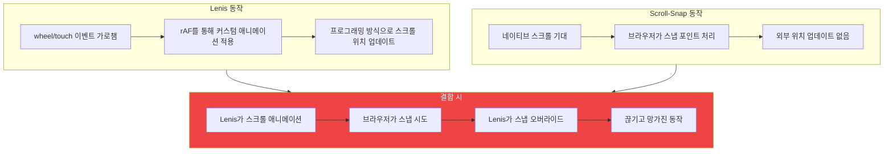

## 설정

청첩장 사이트. 아름다운 전체 페이지 섹션. 두 가지 요구사항:
1. 부드러운 패럴랙스 스크롤링 (Lenis)
2. 섹션별 내비게이션 (CSS scroll-snap)

둘 다 단순해 보였다. 둘 다 작동하지 않았다.

## 증상

스크롤링이 끊겼다. 때로는 섹션이 스냅되고, 때로는 안 됐다. 모바일은 완전히 망가졌다 - 터치 스크롤링이 페이지와 싸우는 느낌이었다.

## 조사



조사 결과 확인됐다:

> "중요: Lenis와 CSS scroll-snap은 호환되지 않음 - Lenis가 네이티브 스크롤링을 가로챔"

## 왜 충돌하는가

**Lenis** 작동 방식:
1. wheel과 touch 이벤트 가로챔
2. 기본 스크롤 동작 방지
3. `requestAnimationFrame`을 통해 스크롤 위치 애니메이션
4. `window.scrollY`를 프로그래밍 방식으로 업데이트

**CSS scroll-snap** 기대 사항:
1. 네이티브 브라우저 스크롤 이벤트
2. 스크롤 위치에 대한 간섭 없음
3. 스냅 포인트 계산에 대한 브라우저 제어

결합 시:
- Lenis가 사용자의 의도한 스크롤 위치로 애니메이션 시작
- 브라우저가 스크롤 감지하고 가장 가까운 포인트로 스냅 시도
- Lenis가 스냅을 간섭으로 보고 오버라이드
- 브라우저가 다시 시도
- 결과: 떨리고 예측 불가능한 스크롤링

모바일이 더 심하다. 터치 이벤트가 더 복잡하고 Lenis의 터치 처리가 네이티브 스냅 동작과 더 많이 충돌한다.

## 해결책

Lenis를 제거한다. 네이티브 스무스 스크롤과 CSS scroll-snap을 사용한다.

### 이전 (망가짐)

```javascript
// Layout.astro
import Lenis from 'lenis';

const lenis = new Lenis({
  duration: 1.2,
  easing: (t) => Math.min(1, 1.001 - Math.pow(2, -10 * t)),
  smoothWheel: true,
});

lenis.on('scroll', ScrollTrigger.update);

gsap.ticker.add((time) => {
  lenis.raf(time * 1000);
});
```

```css
html {
  scroll-snap-type: y mandatory;
}

section {
  scroll-snap-align: start;
}
```

### 이후 (작동)

```javascript
// Layout.astro
// Lenis 없음 - GSAP ScrollTrigger만
gsap.registerPlugin(ScrollTrigger);

// ScrollTrigger는 네이티브 스크롤과 작동
ScrollTrigger.defaults({
  toggleActions: 'play none none reverse',
});
```

```css
html {
  scroll-behavior: smooth;
  scroll-snap-type: y proximity;  /* mandatory 대신 proximity */
}

section {
  scroll-snap-align: start;
  min-height: 100vh;
}
```

주요 변경:
1. **Lenis 완전 제거** - 스크롤 가로채기 없음
2. **네이티브 `scroll-behavior: smooth`** - 브라우저가 스무딩 처리
3. **`mandatory` 대신 `proximity`** - 덜 공격적인 스냅, 더 나은 UX
4. **GSAP ScrollTrigger는 여전히 작동** - 스크롤을 관찰하지 제어하지 않음

## 각각 사용 시점

| 이것을 원하면? | 이것을 사용 |
|---------------|------------|
| 복잡한 커스텀 스크롤 애니메이션 | Lenis 또는 Locomotive (스냅 없이) |
| 스냅과 패럴랙스 효과 | CSS scroll-snap + ScrollTrigger |
| 섹션 기반 내비게이션 | CSS scroll-snap만 |
| 버터처럼 부드러운 커스텀 스크롤바 | Lenis (스냅 없이) |
| 모바일 친화적 섹션 스냅 | CSS scroll-snap만 |

## 결정 프레임워크

```
scroll-snap이 필요한가?
├── 예
│   └── 커스텀 스크롤 물리가 필요한가?
│       ├── 예 → 재고하라. 섞이지 않는다.
│       └── 아니오 → CSS scroll-snap + 네이티브 스무스 스크롤 사용
└── 아니오
    └── 커스텀 스크롤 물리가 필요한가?
        ├── 예 → Lenis 또는 Locomotive 사용
        └── 아니오 → 네이티브 스크롤 사용 (아무것도 필요 없음)
```

## 대안: GSAP ScrollTrigger Snap

부드러운 애니메이션과 스냅 둘 다 필요하면, GSAP의 ScrollTrigger에 네이티브 스크롤과 작동하는 `snap` 옵션이 있다:

```javascript
ScrollTrigger.create({
  snap: {
    snapTo: 1 / (sections.length - 1),
    duration: { min: 0.2, max: 0.3 },
    ease: "power1.inOut",
  },
});
```

스크롤 이벤트를 가로채지 않고 스냅과 유사한 동작을 제공한다.

## 핵심 정리

1. **Lenis는 스크롤을 가로채고, 스냅은 네이티브를 기대** - 근본적 비호환성
2. **모바일이 먼저 망가진다** - 터치 이벤트가 이 충돌에 더 민감
3. **네이티브 스무스 스크롤이 존재한다** - `scroll-behavior: smooth`로 충분한 경우가 많음
4. **proximity > mandatory** - 덜 공격적인 스냅이 UX 개선
5. **모바일 테스트를 일찍** - 스크롤 동작 차이가 거기서 먼저 나타남

스크롤 가로채기 라이브러리와 CSS scroll-snap을 섞지 않는다. 하나의 접근법을 선택한다:
- 복잡한 커스텀 스크롤 → Lenis, 스냅 없음
- 섹션 기반 내비게이션 → CSS scroll-snap, Lenis 없음

---

*이 디버깅 세션은 librarian 에이전트가 Lenis 이슈에 문서화된 비호환성을 찾을 때까지 4시간이 걸렸다. 스크롤 동작을 결합하기 전 라이브러리 호환성을 확인하라.*
