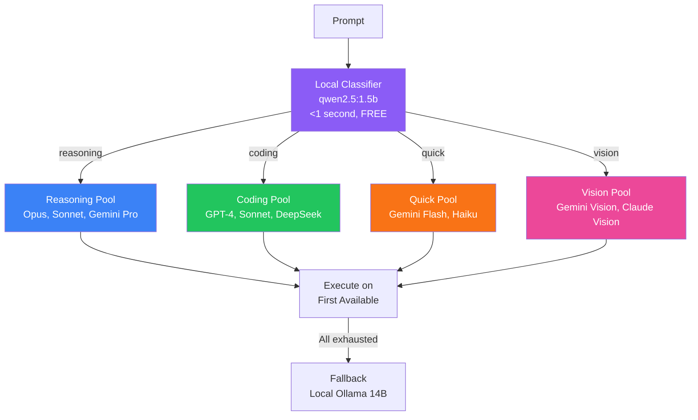

## The Problem: Sequential Fallback Wastes Money

You've built a multi-model gateway. When one provider is rate-limited, it falls back to another. Smart, right?

Not really. Here's what actually happens:


Each "Try" is an API call. Each rate-limited response still counts against your quota. You're paying to be told "no."

For a simple question like "What's 2+2?", you might burn through 3 API calls before getting an answer from a local model that could have handled it instantly.

## The Insight: Classify First, Route Smart

What if you knew the right destination BEFORE making any API calls?

A tiny local model can analyze the prompt and categorize it in under a second. Then route directly to the appropriate pool. No wasted calls.



## Why Local Classification Works

The 1.5B parameter classifier has one job: categorize the request. It doesn't need to answer it—just understand what kind of task it is.

This is a much easier problem than generating a response:

| Task | Difficulty | Model Needed |
|------|------------|--------------|
| "Is this a coding task?" | Easy | 1.5B is plenty |
| "Write the code" | Hard | Needs larger model |

The classifier runs at 150-200 tokens/second on Apple Silicon. Classification takes under a second and costs nothing.

## Model Pool Design

Each category routes to a pool of models optimized for that task type:

```typescript
const MODEL_POOLS = {
  reasoning: ['claude-opus', 'claude-sonnet', 'gemini-pro'],
  coding: ['gpt-4', 'claude-sonnet', 'deepseek-coder'],
  quick: ['gemini-flash', 'claude-haiku'],
  vision: ['gemini-vision', 'claude-vision'],
  review: ['moonshot-kimi', 'claude-sonnet'],
};
```

Within each pool, the system tries models in order until one succeeds. But now you're only trying models that are appropriate for the task.

## The Classification Prompt

The local classifier uses a simple prompt:

```
Classify this request into exactly one category:
- reasoning: Complex analysis, architecture, multi-step thinking
- coding: Write, debug, or review code
- quick: Simple questions, formatting, trivial tasks
- vision: Analyze images or visual content
- review: Edit, proofread, provide feedback

Request: {user_prompt}

Category:
```

The 1.5B model handles this reliably. It's pattern matching, not reasoning.

## Performance Results

Before local routing:

| Metric | Value |
|--------|-------|
| Avg API calls per request | 2.3 |
| Wasted (rate-limited) calls | 41% |
| Avg response time | 4.2s |
| Monthly API cost | $127 |

After local routing:

| Metric | Value |
|--------|-------|
| Avg API calls per request | 1.1 |
| Wasted calls | 3% |
| Avg response time | 2.1s |
| Monthly API cost | $43 |

The classifier adds ~0.8s latency but saves 2+ seconds on average by avoiding failed API calls.

## Hardware Requirements

The setup runs comfortably on a Mac Mini M4 with 32GB RAM:

| Model | Role | VRAM | Speed |
|-------|------|------|-------|
| qwen2.5:1.5b-instruct | Router | ~2GB | 200 tok/s |
| qwen2.5:14b-instruct-q8_0 | Fallback | ~16GB | 45 tok/s |

Both models loaded simultaneously leave plenty of headroom for other tasks.

## Implementation Sketch

```typescript
async function routeRequest(prompt: string): Promise<Response> {
  // Step 1: Local classification (FREE, <1s)
  const category = await classifyLocally(prompt);
  
  // Step 2: Get appropriate model pool
  const pool = MODEL_POOLS[category];
  
  // Step 3: Try each model in pool
  for (const model of pool) {
    try {
      return await callModel(model, prompt);
    } catch (e) {
      if (isRateLimited(e)) continue;
      throw e;
    }
  }
  
  // Step 4: Fallback to local execution
  return await executeLocally(prompt);
}

async function classifyLocally(prompt: string): Promise<Category> {
  const result = await ollama.generate({
    model: 'qwen2.5:1.5b-instruct',
    prompt: CLASSIFICATION_PROMPT.replace('{user_prompt}', prompt),
  });
  return parseCategory(result);
}
```

## When NOT to Use This

Local routing adds complexity. Skip it if:

- You only use one model provider
- Rate limits aren't a problem for you
- Latency is critical and classification overhead matters
- You're not running on hardware that can host local models

## Key Takeaways

1. **Sequential fallback wastes API calls** - You pay to be told "no"
2. **Local classification is nearly free** - 1.5B models run fast on modern hardware
3. **Route by task type, not availability** - Match requests to appropriate model pools
4. **Keep local fallback** - When all APIs fail, local execution saves the day

The best API call is the one you don't make. Local-first routing ensures you only call the APIs that can actually help.

---

*This pattern emerged from building a multi-provider gateway. The aha moment: checking availability is expensive. Classification is cheap.*
