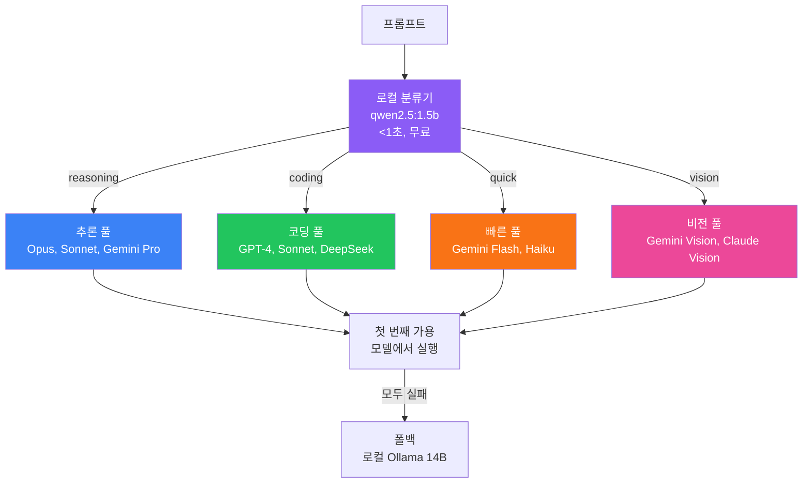

## 문제: 순차적 폴백은 돈을 낭비한다

멀티 모델 게이트웨이를 만들었다. 한 프로바이더가 rate limit에 걸리면 다른 곳으로 폴백한다. 똑똑하지?

별로다. 실제로 일어나는 일이다:


각 "시도"는 API 호출이다. 각 rate limit 응답도 여전히 할당량에 포함된다. "안 돼"라는 말을 듣는 데 돈을 쓰고 있다.

"2+2는?"처럼 단순한 질문에 로컬 모델이 즉시 처리할 수 있는 걸 3번의 API 호출을 태운 후에야 답을 얻을 수 있다.

## 통찰: 먼저 분류하고, 똑똑하게 라우팅

API 호출 전에 올바른 목적지를 안다면?

작은 로컬 모델이 1초 안에 프롬프트를 분석하고 분류할 수 있다. 그러면 적절한 풀로 직접 라우팅한다. 낭비되는 호출이 없다.



## 왜 로컬 분류가 작동하는가

1.5B 파라미터 분류기는 하나의 일만 한다: 요청 분류. 답을 내릴 필요 없다—어떤 종류의 작업인지만 이해하면 된다.

이건 응답을 생성하는 것보다 훨씬 쉬운 문제다:

| 작업 | 난이도 | 필요한 모델 |
|------|--------|-------------|
| "이게 코딩 작업인가?" | 쉬움 | 1.5B면 충분 |
| "코드 작성해" | 어려움 | 더 큰 모델 필요 |

분류기는 Apple Silicon에서 150-200 토큰/초로 돌아간다. 분류는 1초 미만 걸리고 비용은 0이다.

## 모델 풀 설계

각 카테고리는 해당 작업 유형에 최적화된 모델 풀로 라우팅된다:

```typescript
const MODEL_POOLS = {
  reasoning: ['claude-opus', 'claude-sonnet', 'gemini-pro'],
  coding: ['gpt-4', 'claude-sonnet', 'deepseek-coder'],
  quick: ['gemini-flash', 'claude-haiku'],
  vision: ['gemini-vision', 'claude-vision'],
  review: ['moonshot-kimi', 'claude-sonnet'],
};
```

각 풀 내에서 시스템은 하나가 성공할 때까지 순서대로 모델을 시도한다. 하지만 이제 작업에 적합한 모델만 시도한다.

## 분류 프롬프트

로컬 분류기는 간단한 프롬프트를 사용한다:

```
이 요청을 정확히 하나의 카테고리로 분류하라:
- reasoning: 복잡한 분석, 아키텍처, 다단계 사고
- coding: 코드 작성, 디버그, 리뷰
- quick: 간단한 질문, 포맷팅, 사소한 작업
- vision: 이미지나 시각적 콘텐츠 분석
- review: 편집, 교정, 피드백 제공

요청: {user_prompt}

카테고리:
```

1.5B 모델이 이걸 안정적으로 처리한다. 추론이 아니라 패턴 매칭이다.

## 성능 결과

로컬 라우팅 전:

| 지표 | 값 |
|------|-----|
| 요청당 평균 API 호출 | 2.3 |
| 낭비된 (rate limited) 호출 | 41% |
| 평균 응답 시간 | 4.2s |
| 월간 API 비용 | $127 |

로컬 라우팅 후:

| 지표 | 값 |
|------|-----|
| 요청당 평균 API 호출 | 1.1 |
| 낭비된 호출 | 3% |
| 평균 응답 시간 | 2.1s |
| 월간 API 비용 | $43 |

분류기가 ~0.8초 지연을 추가하지만 실패한 API 호출을 피해 평균 2초 이상을 절약한다.

## 하드웨어 요구사항

이 설정은 32GB RAM Mac Mini M4에서 편하게 돌아간다:

| 모델 | 역할 | VRAM | 속도 |
|------|------|------|------|
| qwen2.5:1.5b-instruct | 라우터 | ~2GB | 200 tok/s |
| qwen2.5:14b-instruct-q8_0 | 폴백 | ~16GB | 45 tok/s |

두 모델을 동시에 로드해도 다른 작업을 위한 여유가 충분하다.

## 구현 스케치

```typescript
async function routeRequest(prompt: string): Promise<Response> {
  // 1단계: 로컬 분류 (무료, <1초)
  const category = await classifyLocally(prompt);
  
  // 2단계: 적절한 모델 풀 가져오기
  const pool = MODEL_POOLS[category];
  
  // 3단계: 풀의 각 모델 시도
  for (const model of pool) {
    try {
      return await callModel(model, prompt);
    } catch (e) {
      if (isRateLimited(e)) continue;
      throw e;
    }
  }
  
  // 4단계: 로컬 실행으로 폴백
  return await executeLocally(prompt);
}

async function classifyLocally(prompt: string): Promise<Category> {
  const result = await ollama.generate({
    model: 'qwen2.5:1.5b-instruct',
    prompt: CLASSIFICATION_PROMPT.replace('{user_prompt}', prompt),
  });
  return parseCategory(result);
}
```

## 쓰지 말아야 할 때

로컬 라우팅은 복잡성을 추가한다. 다음 경우 건너뛰어라:

- 하나의 모델 프로바이더만 쓸 때
- Rate limit이 문제가 아닐 때
- 지연이 중요하고 분류 오버헤드가 문제일 때
- 로컬 모델을 호스팅할 하드웨어가 없을 때

## 핵심 요약

1. **순차적 폴백은 API 호출을 낭비한다** - "안 돼"라는 말에 돈을 쓴다
2. **로컬 분류는 거의 무료다** - 1.5B 모델은 현대 하드웨어에서 빠르게 돈다
3. **가용성이 아닌 작업 유형으로 라우팅** - 요청을 적절한 모델 풀에 매칭
4. **로컬 폴백 유지** - 모든 API가 실패하면 로컬 실행이 구해준다

최고의 API 호출은 하지 않는 것이다. 로컬 우선 라우팅은 실제로 도움이 될 API만 호출하도록 보장한다.

---

*이 패턴은 멀티 프로바이더 게이트웨이를 만들면서 나왔다. 깨달음의 순간: 가용성 확인은 비싸다. 분류는 싸다.*
