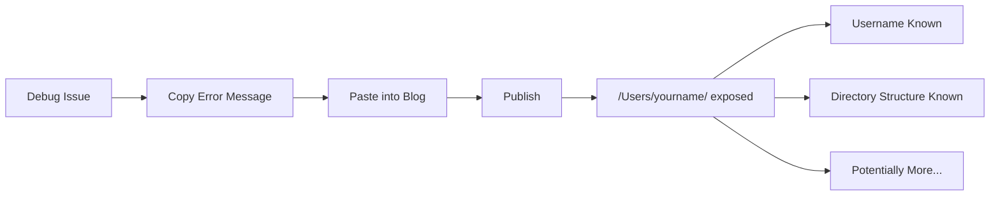
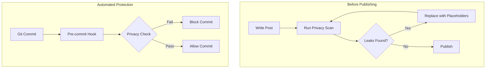

## The Problem

A technical blog post about debugging symlink issues contained something unintended:

```
/Users/deok/Dev/projects/...
/Users/koed/Dev/projects/...
```

Real local usernames. Real directory structures. Published for the world to see.



## Why This Matters

Local paths reveal:

| Leaked Data | What It Reveals |
|-------------|-----------------|
| `/Users/realname/` | Your actual name or username |
| `/Users/work-laptop/` | Machine naming conventions |
| `/home/company-sso/` | Company SSO username |
| `/Users/name/Company/` | Employer information |
| `/Users/name/secret-project/` | Projects you're working on |

Combined with other public information, this can enable:
- Social engineering attacks
- Targeted phishing
- Identity correlation across platforms

## The Investigation

Running a privacy scanner on the blog revealed:

```bash
$ ./scripts/privacy-scan.sh content/posts/

Found patterns in content/posts/2026-02-03-debugging-symlinks.md
  line 45: /Users/deok/Dev/...
  line 67: /Users/koed/Dev/...
  line 112: error in /Users/deok/.config/...

Found patterns in content/posts/2026-02-03-debugging-symlinks-ko.md
  line 47: /Users/deok/Dev/...
  line 69: /Users/koed/Dev/...
```

Multiple posts, multiple languages, same leaked information.

## The Resolution

### 1. Fix Existing Content

Replace real usernames with placeholders:

```diff
- /Users/deok/Dev/projects/
+ /Users/olduser/Dev/projects/

- /Users/koed/Dev/projects/
+ /Users/newuser/Dev/projects/
```

### 2. Create a Privacy Scanner

```bash
#!/bin/bash
# privacy-scan.sh

PATTERNS=(
    "/Users/[a-zA-Z0-9_-]+/"    # macOS home dirs
    "/home/[a-zA-Z0-9_-]+/"     # Linux home dirs
    "C:\\\\Users\\\\[^\\\\]+"   # Windows paths
    "@[a-zA-Z0-9_-]+\\.local"   # Local hostnames
)

for pattern in "${PATTERNS[@]}"; do
    grep -rn -E "$pattern" content/posts/ --include="*.md"
done
```

### 3. Add Pre-commit Hook

```yaml
# .pre-commit-config.yaml
repos:
  - repo: local
    hooks:
      - id: privacy-scan
        name: Scan for privacy leaks
        entry: ./scripts/privacy-scan.sh
        language: script
        files: '\.md$'
        pass_filenames: false
```

### 4. Create Consistent Placeholders

```markdown
## Standard Placeholder Guide

| Context | Placeholder |
|---------|-------------|
| Generic user | `/Users/user/` |
| Before/after | `/Users/olduser/`, `/Users/newuser/` |
| Example | `/Users/example/` |
| Your machine | `/Users/you/` |
```



## Common Leak Sources

Watch for these in technical blog posts:

| Source | Example Leak |
|--------|--------------|
| Error messages | `FileNotFoundError: /Users/real/...` |
| Stack traces | `at /Users/real/project/file.js:42` |
| Config examples | `home_dir: /Users/real/` |
| Screenshots | Terminal with visible `$USER` |
| Debug output | Full path in logs |
| Build output | Absolute paths in warnings |

## Key Takeaways

1. **Copy-paste is dangerous** - Error messages contain your paths
2. **Automate the check** - Humans miss things; scripts don't
3. **Use consistent placeholders** - Makes content cleaner and safer
4. **Check all languages** - Translations copy the same leaks
5. **Review before publish** - Pre-commit hooks are your last defense

Your debugging blog posts help others. Just make sure they don't help attackers identify you.
