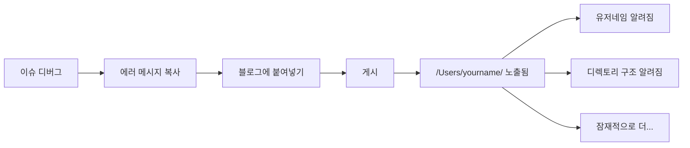
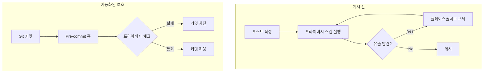

## 문제 상황

심볼릭 링크 디버깅에 관한 기술 블로그 포스트에 의도하지 않은 것이 포함되어 있었다:

```
/Users/deok/Dev/projects/...
/Users/koed/Dev/projects/...
```

실제 로컬 유저네임. 실제 디렉토리 구조. 세상에 공개됨.



## 왜 중요한가

로컬 경로가 드러내는 것:

| 유출된 데이터 | 드러나는 것 |
|--------------|------------|
| `/Users/realname/` | 실제 이름 또는 유저네임 |
| `/Users/work-laptop/` | 머신 명명 규칙 |
| `/home/company-sso/` | 회사 SSO 유저네임 |
| `/Users/name/Company/` | 고용주 정보 |
| `/Users/name/secret-project/` | 작업 중인 프로젝트 |

다른 공개 정보와 결합하면 다음이 가능해진다:
- 소셜 엔지니어링 공격
- 표적 피싱
- 플랫폼 간 신원 연관

## 조사 과정

블로그에 프라이버시 스캐너를 실행하니:

```bash
$ ./scripts/privacy-scan.sh content/posts/

Found patterns in content/posts/2026-02-03-debugging-symlinks.md
  line 45: /Users/deok/Dev/...
  line 67: /Users/koed/Dev/...
  line 112: error in /Users/deok/.config/...

Found patterns in content/posts/2026-02-03-debugging-symlinks-ko.md
  line 47: /Users/deok/Dev/...
  line 69: /Users/koed/Dev/...
```

여러 포스트, 여러 언어, 같은 유출 정보.

## 해결 방법

### 1. 기존 콘텐츠 수정

실제 유저네임을 플레이스홀더로 교체:

```diff
- /Users/deok/Dev/projects/
+ /Users/olduser/Dev/projects/

- /Users/koed/Dev/projects/
+ /Users/newuser/Dev/projects/
```

### 2. 프라이버시 스캐너 만들기

```bash
#!/bin/bash
# privacy-scan.sh

PATTERNS=(
    "/Users/[a-zA-Z0-9_-]+/"    # macOS 홈 디렉토리
    "/home/[a-zA-Z0-9_-]+/"     # Linux 홈 디렉토리
    "C:\\\\Users\\\\[^\\\\]+"   # Windows 경로
    "@[a-zA-Z0-9_-]+\\.local"   # 로컬 호스트네임
)

for pattern in "${PATTERNS[@]}"; do
    grep -rn -E "$pattern" content/posts/ --include="*.md"
done
```

### 3. Pre-commit 훅 추가

```yaml
# .pre-commit-config.yaml
repos:
  - repo: local
    hooks:
      - id: privacy-scan
        name: Scan for privacy leaks
        entry: ./scripts/privacy-scan.sh
        language: script
        files: '\.md$'
        pass_filenames: false
```

### 4. 일관된 플레이스홀더 만들기

```markdown
## 표준 플레이스홀더 가이드

| 컨텍스트 | 플레이스홀더 |
|---------|-------------|
| 일반 사용자 | `/Users/user/` |
| 이전/이후 | `/Users/olduser/`, `/Users/newuser/` |
| 예시 | `/Users/example/` |
| 내 머신 | `/Users/you/` |
```



## 일반적인 유출 소스

기술 블로그 포스트에서 주의해야 할 것들:

| 소스 | 유출 예시 |
|------|---------|
| 에러 메시지 | `FileNotFoundError: /Users/real/...` |
| 스택 트레이스 | `at /Users/real/project/file.js:42` |
| 설정 예시 | `home_dir: /Users/real/` |
| 스크린샷 | `$USER`가 보이는 터미널 |
| 디버그 출력 | 로그의 전체 경로 |
| 빌드 출력 | 경고의 절대 경로 |

## 핵심 교훈

1. **복사-붙여넣기는 위험하다** - 에러 메시지에 내 경로가 들어있다
2. **체크를 자동화하라** - 사람은 놓치지만 스크립트는 안 놓친다
3. **일관된 플레이스홀더 사용** - 콘텐츠를 더 깔끔하고 안전하게 만든다
4. **모든 언어 확인** - 번역본도 같은 유출을 복사한다
5. **게시 전 검토** - Pre-commit 훅이 마지막 방어선이다

디버깅 블로그 포스트는 다른 사람들을 돕는다. 다만 공격자가 당신을 식별하는 것까지 돕지 않도록 하라.
