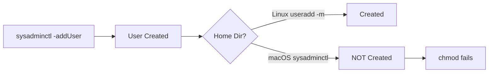
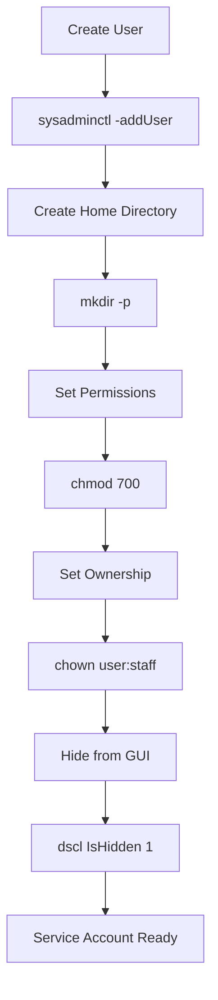

## The Problem

Creating a macOS service account:

```bash
sudo sysadminctl -addUser moltbot -fullName "Moltbot Service" \
  -password "$(openssl rand -base64 32)" \
  -home /Users/moltbot -shell /usr/bin/false
```

Output buried a crucial detail:

```
2026-02-03 16:44:14.812 sysadminctl[24897:5812811] 
Home directory is assigned (not created!) at /Users/moltbot
```

The next command failed:

```bash
sudo chmod 700 /Users/moltbot
# chmod: /Users/moltbot: No such file or directory
```



## The Gotcha

| Platform | Command | Home Directory |
|----------|---------|----------------|
| Linux | `useradd -m username` | Created automatically |
| macOS | `sysadminctl -addUser username -home /path` | **Only assigned, not created** |

If you're coming from Linux, this catches you off guard. The `-home` flag doesn't mean "create home directory here." It means "record this path as the home directory."

## The Output Warning

The warning is there - but easy to miss in verbose output:

```
Home directory is assigned (not created!) at /Users/moltbot
                           ^^^^^^^^^^^^^^
                           This is the critical part
```

## The Resolution

After creating the user, manually create the home directory:

```bash
# Create directory
sudo mkdir -p /Users/moltbot

# Set secure permissions (owner only)
sudo chmod 700 /Users/moltbot

# Set ownership to the new user
sudo chown -R moltbot:staff /Users/moltbot
```

## Complete Service Account Pattern

For a proper macOS service account:

```bash
# 1. Create user (no interactive login possible)
sudo sysadminctl -addUser SERVICE_USER \
  -fullName "Service Description" \
  -password "$(openssl rand -base64 32)" \
  -home /Users/SERVICE_USER \
  -shell /usr/bin/false

# 2. Create home directory
sudo mkdir -p /Users/SERVICE_USER
sudo chmod 700 /Users/SERVICE_USER
sudo chown -R SERVICE_USER:staff /Users/SERVICE_USER

# 3. Hide from GUI login screen
sudo dscl . -create /Users/SERVICE_USER IsHidden 1

# 4. Verify
id SERVICE_USER
stat -f "%OLp" /Users/SERVICE_USER  # Should show 700
```



## Security Considerations

### Shell Selection

```bash
-shell /usr/bin/false    # Prevents all interactive login
-shell /sbin/nologin     # Alternative, same effect
```

### Password

```bash
# Generate a random password you'll never need
-password "$(openssl rand -base64 32)"
```

Since the shell is `/usr/bin/false`, the password is only used if something tries to authenticate as this user via other means.

### Permissions

```bash
chmod 700 /Users/SERVICE_USER  # Owner only: rwx------
```

700 means:
- Owner (service): Full access
- Group: No access
- Others: No access

### Hide from Login Window

```bash
sudo dscl . -create /Users/SERVICE_USER IsHidden 1
```

Without this, the service account appears on the macOS login screen.

## Verification Script

```bash
#!/bin/bash
USER="moltbot"

echo "User info:"
id $USER

echo -e "\nHome directory:"
ls -la /Users/ | grep $USER

echo -e "\nPermissions:"
stat -f "Mode: %OLp, Owner: %Su:%Sg" /Users/$USER

echo -e "\nHidden status:"
dscl . -read /Users/$USER IsHidden 2>/dev/null || echo "Not hidden"
```

## Key Takeaways

1. **macOS ≠ Linux** - `sysadminctl` doesn't create home directories
2. **Read the output** - The "(not created!)" warning is there, just buried
3. **Two-step process** - Create user, then create home directory
4. **Security defaults** - `/usr/bin/false` shell, 700 permissions, hidden from GUI
5. **Verify everything** - Check user exists, home dir exists, permissions correct

Coming from Linux, the assumption that "create user = create home" is deeply ingrained. macOS doesn't share that assumption.
