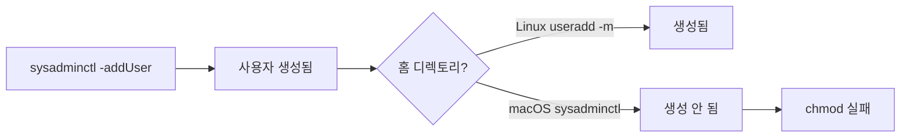
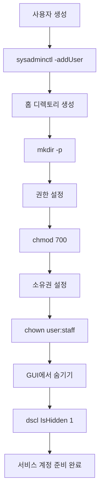

## 문제 상황

macOS 서비스 계정 생성:

```bash
sudo sysadminctl -addUser moltbot -fullName "Moltbot Service" \
  -password "$(openssl rand -base64 32)" \
  -home /Users/moltbot -shell /usr/bin/false
```

출력에 중요한 세부사항이 묻혀 있었다:

```
2026-02-03 16:44:14.812 sysadminctl[24897:5812811] 
Home directory is assigned (not created!) at /Users/moltbot
```

다음 명령이 실패했다:

```bash
sudo chmod 700 /Users/moltbot
# chmod: /Users/moltbot: No such file or directory
```



## 함정

| 플랫폼 | 명령 | 홈 디렉토리 |
|--------|------|------------|
| Linux | `useradd -m username` | 자동 생성 |
| macOS | `sysadminctl -addUser username -home /path` | **할당만, 생성 안 함** |

Linux에서 왔다면 이것이 당황스럽다. `-home` 플래그는 "여기에 홈 디렉토리 생성"을 의미하지 않는다. "이 경로를 홈 디렉토리로 기록"을 의미한다.

## 출력 경고

경고가 있다 - 하지만 장황한 출력에서 놓치기 쉽다:

```
Home directory is assigned (not created!) at /Users/moltbot
                           ^^^^^^^^^^^^^^
                           이게 중요한 부분
```

## 해결 방법

사용자 생성 후, 홈 디렉토리를 수동으로 만든다:

```bash
# 디렉토리 생성
sudo mkdir -p /Users/moltbot

# 보안 권한 설정 (소유자만)
sudo chmod 700 /Users/moltbot

# 새 사용자에게 소유권 설정
sudo chown -R moltbot:staff /Users/moltbot
```

## 완전한 서비스 계정 패턴

적절한 macOS 서비스 계정을 위해:

```bash
# 1. 사용자 생성 (대화형 로그인 불가)
sudo sysadminctl -addUser SERVICE_USER \
  -fullName "Service Description" \
  -password "$(openssl rand -base64 32)" \
  -home /Users/SERVICE_USER \
  -shell /usr/bin/false

# 2. 홈 디렉토리 생성
sudo mkdir -p /Users/SERVICE_USER
sudo chmod 700 /Users/SERVICE_USER
sudo chown -R SERVICE_USER:staff /Users/SERVICE_USER

# 3. GUI 로그인 화면에서 숨기기
sudo dscl . -create /Users/SERVICE_USER IsHidden 1

# 4. 검증
id SERVICE_USER
stat -f "%OLp" /Users/SERVICE_USER  # 700이어야 함
```



## 보안 고려사항

### Shell 선택

```bash
-shell /usr/bin/false    # 모든 대화형 로그인 방지
-shell /sbin/nologin     # 대안, 같은 효과
```

### 비밀번호

```bash
# 절대 필요 없을 랜덤 비밀번호 생성
-password "$(openssl rand -base64 32)"
```

Shell이 `/usr/bin/false`이므로, 비밀번호는 다른 수단으로 이 사용자로 인증하려 할 때만 사용된다.

### 권한

```bash
chmod 700 /Users/SERVICE_USER  # 소유자만: rwx------
```

700의 의미:
- 소유자 (서비스): 전체 접근
- 그룹: 접근 불가
- 기타: 접근 불가

### 로그인 창에서 숨기기

```bash
sudo dscl . -create /Users/SERVICE_USER IsHidden 1
```

이것 없이는 서비스 계정이 macOS 로그인 화면에 나타난다.

## 검증 스크립트

```bash
#!/bin/bash
USER="moltbot"

echo "사용자 정보:"
id $USER

echo -e "\n홈 디렉토리:"
ls -la /Users/ | grep $USER

echo -e "\n권한:"
stat -f "Mode: %OLp, Owner: %Su:%Sg" /Users/$USER

echo -e "\n숨김 상태:"
dscl . -read /Users/$USER IsHidden 2>/dev/null || echo "숨겨지지 않음"
```

## 핵심 교훈

1. **macOS ≠ Linux** - `sysadminctl`은 홈 디렉토리를 생성하지 않는다
2. **출력을 읽어라** - "(not created!)" 경고가 있다, 묻혀있을 뿐
3. **2단계 프로세스** - 사용자 생성, 그 다음 홈 디렉토리 생성
4. **보안 기본값** - `/usr/bin/false` shell, 700 권한, GUI에서 숨김
5. **모든 것 검증** - 사용자 존재, 홈 디렉토리 존재, 권한 올바른지 확인

Linux에서 오면 "사용자 생성 = 홈 생성"이라는 가정이 깊이 박혀있다. macOS는 그 가정을 공유하지 않는다.
