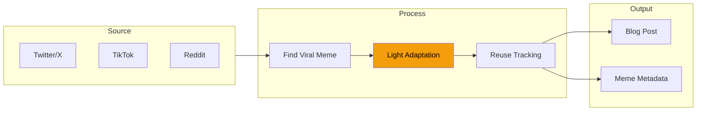

## The Temptation of AI Image Generation

You need a visual for your blog post. Modern AI can generate anything: infographics, diagrams, even memes. Just describe what you want and wait 30 seconds.

But there's a problem. AI-generated memes feel... off. They're technically correct but culturally hollow.

## The Meme Sourcing Pipeline



Instead of generating, I:
1. Find viral memes that match my topic
2. Make light adaptations (text overlays, context shifts)
3. Track which posts used which memes

## Why Adapted Beats Generated

### The Format IS the Communication

A meme isn't just an image with text. It's a **format** that carries meaning:

- "Distracted Boyfriend" = comparing two things, one clearly better
- "Drake Rejecting/Approving" = preference between options
- "This is Fine" = pretending everything's okay when it's not

When you use "Distracted Boyfriend" to compare two programming languages, readers instantly understand the structure. The format does half the communication work.

AI can generate an image of a distracted boyfriend, but it can't generate the cultural weight that format carries.

### Authenticity Over Perfection

AI-generated images are too clean. They lack:
- The JPEG artifacts of viral spreading
- The slightly-off crop from reposting
- The text that's been overlaid multiple times

These "imperfections" signal authenticity. A pristine AI image screams "trying too hard."

### Humor Requires Context

AI doesn't know that "Is this a pigeon?" is funnier when applied to obviously-not-a-pigeon things. It doesn't understand why "Surprised Pikachu" works for predictable outcomes.

Humor comes from shared context. AI has data; it doesn't have the lived experience of seeing a meme evolve over months.

## The Adaptation Process

I don't just screenshot and paste. Light adaptation makes the meme fit:

### Text Overlay Changes

Original: "Me explaining why we need microservices"
Adapted: "Me explaining why we need AI agents for everything"

Same format, different context.

### Context Shifts

Taking a meme about relationships and applying it to code:

Original context: Dating
Adapted context: Debugging production

The format carries, the content changes.

### Quality Preservation

- Keep the original resolution if possible
- Don't over-compress
- Preserve the visual style that made it viral

## Tracking and Attribution

Memes are creative works. Track usage:

```markdown
## Meme Usage Log

| Meme | Source | Used In | Date |
|------|--------|---------|------|
| Distracted Boyfriend | Twitter @user | ai-agent-post.md | 2026-02-03 |
| This is Fine | Reddit r/ProgrammerHumor | debugging-post.md | 2026-02-02 |
```

This prevents:
- Reusing the same meme too often
- Forgetting where you got something
- Potential attribution issues

## When AI Generation Does Work

AI-generated images are better for:
- **Diagrams**: Architecture diagrams, flowcharts
- **Illustrations**: Abstract concepts, technical processes
- **Custom graphics**: When you need something specific that doesn't exist

They're worse for:
- Humor
- Cultural references
- Anything meant to feel "human"

## Key Takeaways

1. **Meme formats carry meaning** - The structure communicates as much as the content
2. **Imperfection signals authenticity** - Too clean = too corporate
3. **Humor needs context** - AI has data, not cultural experience
4. **Light adaptation > heavy generation** - Small changes preserve the format's power
5. **Track your sources** - Attribution matters, and prevents overuse

The best visual content for a blog isn't always the most polished. Sometimes it's a slightly-compressed meme that your readers have seen before - because that familiarity is exactly what makes it work.

---

*This approach emerged from trying AI-generated memes and watching them fall flat. Real memes, lightly adapted, consistently outperformed pristine AI generations in engagement.*
