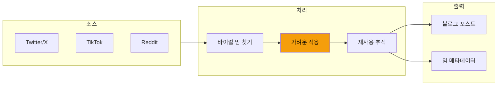

## AI 이미지 생성의 유혹

블로그 포스트에 비주얼이 필요하다. 현대 AI는 무엇이든 생성할 수 있다: 인포그래픽, 다이어그램, 심지어 밈도. 원하는 것을 설명하고 30초 기다리면 된다.

하지만 문제가 있다. AI 생성 밈은... 뭔가 이상하다. 기술적으로는 맞지만 문화적으로 공허하다.

## 밈 소싱 파이프라인



생성하는 대신:
1. 주제에 맞는 바이럴 밈을 찾는다
2. 가벼운 적응을 한다 (텍스트 오버레이, 맥락 전환)
3. 어떤 포스트가 어떤 밈을 사용했는지 추적한다

## 왜 적응이 생성보다 나은가

### 포맷 자체가 커뮤니케이션이다

밈은 단순히 텍스트가 있는 이미지가 아니다. 의미를 전달하는 **포맷**이다:

- "산만한 남자친구" = 두 가지 비교, 하나가 명확히 나음
- "드레이크 거부/승인" = 옵션 간 선호
- "이건 괜찮아" = 상황이 안 좋은데 괜찮은 척

"산만한 남자친구"를 사용해 두 프로그래밍 언어를 비교하면 독자가 즉시 구조를 이해한다. 포맷이 커뮤니케이션의 절반을 한다.

AI는 산만한 남자친구 이미지를 생성할 수 있지만, 그 포맷이 가진 문화적 무게를 생성할 수는 없다.

### 완벽함보다 진정성

AI 생성 이미지는 너무 깨끗하다. 다음이 없다:
- 바이럴 확산의 JPEG 아티팩트
- 재포스팅에서 온 살짝 어긋난 크롭
- 여러 번 오버레이된 텍스트

이런 "불완전함"이 진정성을 신호한다. 깨끗한 AI 이미지는 "너무 애쓴다"고 소리친다.

### 유머는 맥락이 필요하다

AI는 "이게 비둘기야?"가 명백히-비둘기가-아닌 것에 적용될 때 더 웃긴다는 것을 모른다. "놀란 피카츄"가 예측 가능한 결과에 왜 작동하는지 이해하지 못한다.

유머는 공유된 맥락에서 온다. AI는 데이터가 있다; 밈이 수개월에 걸쳐 진화하는 것을 본 삶의 경험은 없다.

## 적응 과정

그냥 스크린샷 찍어서 붙이지 않는다. 가벼운 적응이 밈을 맞춘다:

### 텍스트 오버레이 변경

원본: "마이크로서비스가 왜 필요한지 설명하는 나"
적응: "모든 것에 AI 에이전트가 왜 필요한지 설명하는 나"

같은 포맷, 다른 맥락.

### 맥락 전환

관계에 대한 밈을 코드에 적용:

원본 맥락: 연애
적응 맥락: 프로덕션 디버깅

포맷은 유지되고, 콘텐츠가 바뀐다.

### 품질 보존

- 가능하면 원본 해상도 유지
- 과도한 압축 안함
- 바이럴하게 만든 비주얼 스타일 보존

## 추적과 출처

밈은 창작물이다. 사용을 추적한다:

```markdown
## 밈 사용 로그

| 밈 | 소스 | 사용처 | 날짜 |
|------|--------|---------|------|
| 산만한 남자친구 | Twitter @user | ai-agent-post.md | 2026-02-03 |
| 이건 괜찮아 | Reddit r/ProgrammerHumor | debugging-post.md | 2026-02-02 |
```

이것이 방지하는 것:
- 같은 밈 너무 자주 재사용
- 어디서 가져왔는지 잊어버림
- 잠재적 출처 문제

## AI 생성이 잘 작동하는 경우

AI 생성 이미지가 더 나은 경우:
- **다이어그램**: 아키텍처 다이어그램, 플로우차트
- **일러스트레이션**: 추상적 개념, 기술적 프로세스
- **커스텀 그래픽**: 존재하지 않는 특정한 것이 필요할 때

더 안 좋은 경우:
- 유머
- 문화적 참조
- "인간적"으로 느껴져야 하는 모든 것

## 핵심 정리

1. **밈 포맷이 의미를 전달한다** - 구조가 콘텐츠만큼 커뮤니케이션한다
2. **불완전함이 진정성을 신호한다** - 너무 깨끗함 = 너무 기업적
3. **유머는 맥락이 필요하다** - AI는 데이터가 있고 문화적 경험은 없다
4. **가벼운 적응 > 과도한 생성** - 작은 변경이 포맷의 힘을 보존한다
5. **소스를 추적하라** - 출처가 중요하고 과다 사용을 방지한다

블로그에 가장 좋은 비주얼 콘텐츠가 항상 가장 다듬어진 것은 아니다. 때로는 독자가 전에 본 약간 압축된 밈이다 - 그 친숙함이 바로 그것을 작동하게 하는 것이기 때문이다.

---

*이 접근법은 AI 생성 밈을 시도하고 그것이 맥 빠지는 것을 보면서 나타났다. 가볍게 적응된 실제 밈이 참여도에서 깨끗한 AI 생성물을 일관되게 앞질렀다.*
