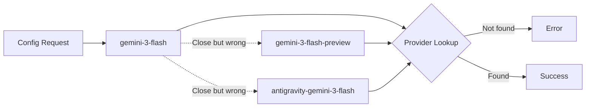
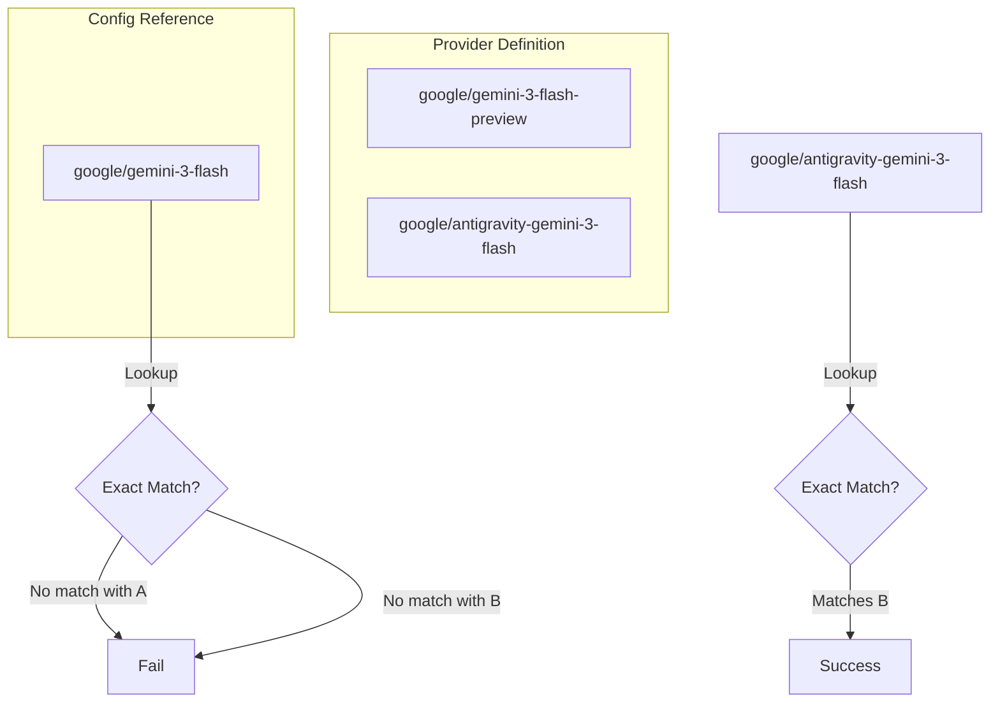

## The Problem

OpenCode refused to start with a `ProviderModelNotFoundError`:

```
ProviderModelNotFoundError
providerID: "google"
modelID: "gemini-3-flash"
suggestions: ["gemini-3-flash-preview", "antigravity-gemini-3-flash"]
```

The model name looked right. It was a real Google model. But the provider didn't recognize it.



## The Investigation

The error helpfully provided suggestions. This meant:

1. The provider config had models with similar names
2. My config was using a name that didn't exist in that list
3. Somewhere, a model ID was slightly wrong

Searching the config file for `gemini-3-flash`:

```bash
grep -n "gemini-3-flash" ~/.config/opencode/oh-my-opencode.json
```

Found four occurrences across different agent configurations:
- Line 19: `multimodal-looker` agent
- Line 39: `visual-engineering` category
- Line 46: `artistry` category
- Line 60: `writing` category

All referenced `google/gemini-3-flash` - a model ID that didn't exist.

## The Root Cause

The provider config defined models with specific ID patterns:

```json
{
  "providers": {
    "google": {
      "models": {
        "gemini-3-flash-preview": { ... },
        "antigravity-gemini-3-flash": { ... }
      }
    }
  }
}
```

The agent config referenced:

```json
{
  "model": "google/gemini-3-flash"  // This doesn't exist!
}
```

The model ID must be an **exact match** to what's defined in the provider. Not "similar." Not "the base name." Exact.



## The Resolution

Updated all model references to use valid IDs:

```json
// Before (invalid - partial name)
"model": "google/gemini-3-flash"
"model": "google/gemini-3-pro"

// After (valid - full provider model ID)
"model": "google/antigravity-gemini-3-flash"
"model": "google/antigravity-gemini-3-pro"
```

## Why This Happens

LLM providers often have multiple model variants:

| Base Model | Actual Variants |
|------------|-----------------|
| `gemini-3-flash` | `gemini-3-flash-preview`, `gemini-3-flash-8b`, `antigravity-gemini-3-flash` |
| `claude-4` | `claude-4-sonnet`, `claude-4-opus`, `claude-4-haiku` |
| `gpt-5` | `gpt-5-turbo`, `gpt-5-preview`, `gpt-5o` |

You can't reference the "base" name - you must pick a specific variant.

## Prevention

### 1. Trust the Suggestions

When you see `suggestions: [...]`, use one of those exact strings:

```
ProviderModelNotFoundError
suggestions: ["gemini-3-flash-preview", "antigravity-gemini-3-flash"]
                 ↑                          ↑
                 Use one of these exactly
```

### 2. List Available Models

Before configuring, check what's actually available:

```bash
# If your tool provides a models list command
opencode models list --provider google

# Or check the provider config directly
jq '.providers.google.models | keys' ~/.config/opencode/opencode.json
```

### 3. Copy-Paste Model IDs

Never type model IDs from memory. Copy from:
- Provider documentation
- Error suggestions
- Config file model definitions

## Key Takeaways

1. **Exact match required** - Model IDs aren't fuzzy matched; `gemini-3-flash` ≠ `gemini-3-flash-preview`
2. **Read the suggestions** - Error messages often contain the exact valid alternatives
3. **Providers define reality** - The model ID must exist in your provider config, not just in the vendor's API
4. **Base names don't work** - You must specify the complete variant name
5. **When in doubt, list** - Check available models before configuring

The model might exist in Google's API. It might even work if you call it directly. But if it's not in your provider config with that exact ID, it doesn't exist to your tool.
