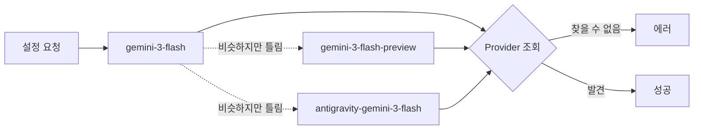
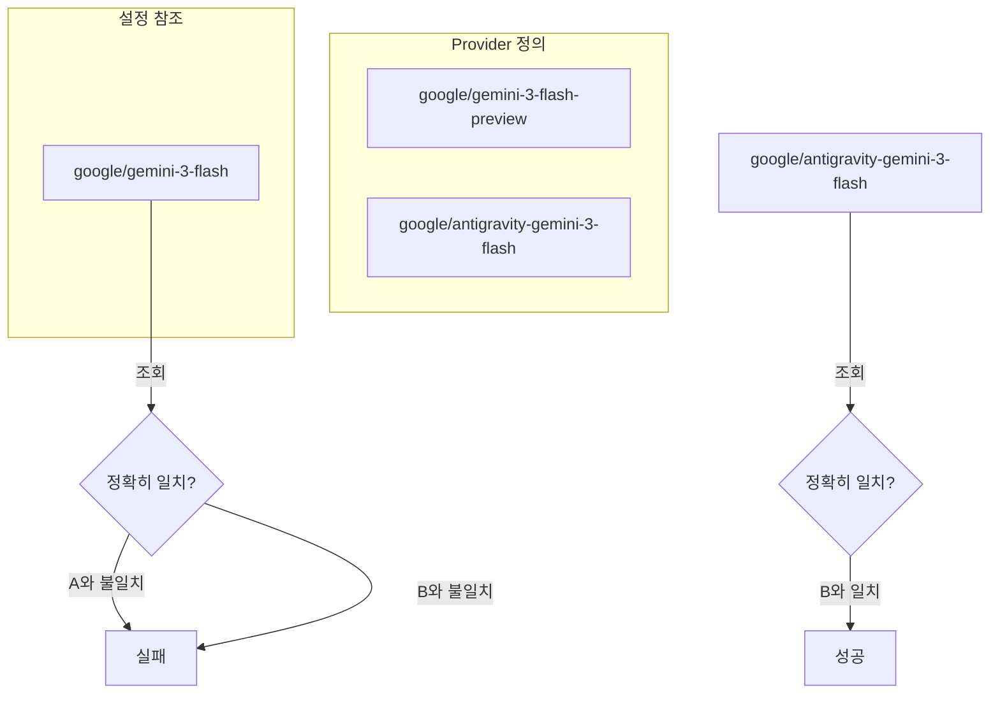

## 문제 상황

OpenCode가 `ProviderModelNotFoundError`와 함께 시작을 거부했다:

```
ProviderModelNotFoundError
providerID: "google"
modelID: "gemini-3-flash"
suggestions: ["gemini-3-flash-preview", "antigravity-gemini-3-flash"]
```

모델 이름이 맞아 보였다. 실제 Google 모델이다. 하지만 provider가 인식하지 못했다.



## 조사 과정

에러가 친절하게 suggestions를 제공했다. 이것이 의미하는 바:

1. Provider 설정에 비슷한 이름의 모델들이 있다
2. 내 설정이 그 목록에 없는 이름을 사용하고 있다
3. 어딘가에서 모델 ID가 살짝 틀렸다

설정 파일에서 `gemini-3-flash` 검색:

```bash
grep -n "gemini-3-flash" ~/.config/opencode/oh-my-opencode.json
```

다양한 에이전트 설정에서 네 군데 발견:
- 19번 줄: `multimodal-looker` 에이전트
- 39번 줄: `visual-engineering` 카테고리
- 46번 줄: `artistry` 카테고리
- 60번 줄: `writing` 카테고리

모두 `google/gemini-3-flash`를 참조했다 - 존재하지 않는 모델 ID.

## 근본 원인

Provider 설정이 특정 ID 패턴으로 모델을 정의했다:

```json
{
  "providers": {
    "google": {
      "models": {
        "gemini-3-flash-preview": { ... },
        "antigravity-gemini-3-flash": { ... }
      }
    }
  }
}
```

에이전트 설정이 참조한 것:

```json
{
  "model": "google/gemini-3-flash"  // 이건 존재하지 않는다!
}
```

모델 ID는 provider에 정의된 것과 **정확히 일치**해야 한다. "비슷한" 것도 안 된다. "기본 이름"도 안 된다. 정확해야 한다.



## 해결 방법

모든 모델 참조를 유효한 ID로 업데이트했다:

```json
// 이전 (유효하지 않음 - 부분 이름)
"model": "google/gemini-3-flash"
"model": "google/gemini-3-pro"

// 이후 (유효 - 전체 provider 모델 ID)
"model": "google/antigravity-gemini-3-flash"
"model": "google/antigravity-gemini-3-pro"
```

## 왜 이런 일이 발생하는가

LLM provider들은 종종 여러 모델 변형을 가지고 있다:

| 기본 모델 | 실제 변형들 |
|----------|------------|
| `gemini-3-flash` | `gemini-3-flash-preview`, `gemini-3-flash-8b`, `antigravity-gemini-3-flash` |
| `claude-4` | `claude-4-sonnet`, `claude-4-opus`, `claude-4-haiku` |
| `gpt-5` | `gpt-5-turbo`, `gpt-5-preview`, `gpt-5o` |

"기본" 이름을 참조할 수 없다 - 특정 변형을 선택해야 한다.

## 예방 방법

### 1. Suggestions를 신뢰하라

`suggestions: [...]`가 보이면, 그 문자열 중 하나를 정확히 사용하라:

```
ProviderModelNotFoundError
suggestions: ["gemini-3-flash-preview", "antigravity-gemini-3-flash"]
                 ↑                          ↑
                 이 중 하나를 정확히 사용
```

### 2. 사용 가능한 모델 목록 확인

설정 전에 실제로 무엇이 사용 가능한지 확인하라:

```bash
# 도구가 모델 목록 명령을 제공하는 경우
opencode models list --provider google

# 또는 provider 설정을 직접 확인
jq '.providers.google.models | keys' ~/.config/opencode/opencode.json
```

### 3. 모델 ID 복사-붙여넣기

절대 기억으로 모델 ID를 입력하지 마라. 다음에서 복사하라:
- Provider 문서
- 에러 suggestions
- 설정 파일 모델 정의

## 핵심 교훈

1. **정확한 일치 필요** - 모델 ID는 퍼지 매칭되지 않는다; `gemini-3-flash` ≠ `gemini-3-flash-preview`
2. **suggestions를 읽어라** - 에러 메시지가 종종 정확한 유효 대안을 포함한다
3. **Provider가 현실을 정의한다** - 모델 ID는 벤더 API가 아닌 provider 설정에 존재해야 한다
4. **기본 이름은 작동하지 않는다** - 완전한 변형 이름을 지정해야 한다
5. **의심스러우면 목록 확인** - 설정 전에 사용 가능한 모델을 확인하라

모델이 Google API에 존재할 수도 있다. 직접 호출하면 작동할 수도 있다. 하지만 정확한 ID로 provider 설정에 없다면, 도구에게는 존재하지 않는 것이다.
