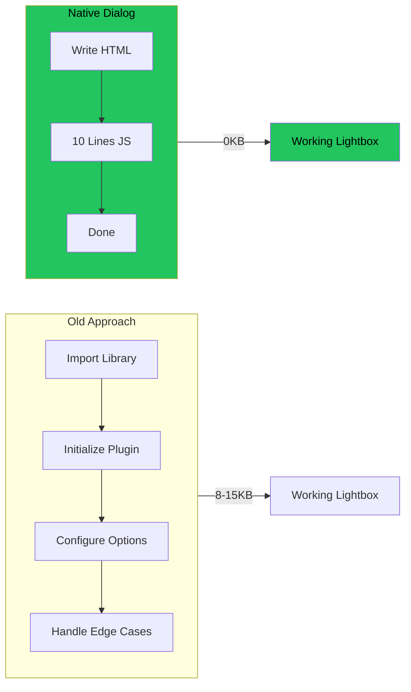

## The Old Way: Library Bloat

Every lightbox library adds weight:
- **Lightbox2**: 8KB + jQuery dependency
- **GLightbox**: 12KB
- **Fancybox**: 15KB

For showing images in a modal. In 2026.

## The New Way: Native Dialog

HTML5 gave us `<dialog>`. It's built into every modern browser. It does 90% of what lightbox libraries do, with zero dependencies.



## The Complete Implementation

### HTML

```html
<dialog id="lightbox" class="lightbox">
  <button class="lightbox-close" aria-label="Close">&times;</button>
  
</dialog>

<!-- Thumbnails that open the lightbox -->


```

### JavaScript (10 Lines)

```javascript
const lightbox = document.getElementById('lightbox');
const lightboxImg = document.getElementById('lightbox-image');

document.querySelectorAll('.thumbnail').forEach(img => {
  img.addEventListener('click', () => {
    lightboxImg.src = img.dataset.full;
    lightbox.showModal();
  });
});

lightbox.addEventListener('click', (e) => {
  if (e.target === lightbox) lightbox.close();
});
```

### CSS

```css
.lightbox {
  border: none;
  padding: 0;
  max-width: 95vw;
  max-height: 95vh;
  background: transparent;
}

.lightbox::backdrop {
  background: rgba(0, 0, 0, 0.95);
}

.lightbox img {
  max-width: 100%;
  max-height: 90vh;
  object-fit: contain;
}

.lightbox-close {
  position: absolute;
  top: 10px;
  right: 10px;
  background: none;
  border: none;
  color: white;
  font-size: 2rem;
  cursor: pointer;
}
```

That's it. Full lightbox. Zero dependencies.

## What You Get for Free

### 1. Modal Behavior

`showModal()` vs `show()`:
- `showModal()`: Blocks interaction with page behind, shows backdrop
- `show()`: Non-modal, no backdrop, page still interactive

### 2. Backdrop Styling

The `::backdrop` pseudo-element is built-in:

```css
dialog::backdrop {
  background: rgba(0, 0, 0, 0.95);
  backdrop-filter: blur(5px);  /* Bonus: blur effect */
}
```

### 3. Escape Key Handling

Pressing Escape closes the dialog automatically. No event listener needed.

### 4. Focus Trapping

When `showModal()` is called:
- Focus moves into dialog
- Tab key cycles within dialog only
- Focus returns to trigger element on close

This is accessibility you'd have to build manually with libraries.

### 5. Click-Outside-to-Close

One event listener:

```javascript
dialog.addEventListener('click', (e) => {
  if (e.target === dialog) dialog.close();
});
```

Clicks on the backdrop (the dialog element itself) close it. Clicks on content don't.

## Browser Support

| Browser | Support |
|---------|---------|
| Chrome | 37+ (2014) |
| Firefox | 98+ (2022) |
| Safari | 15.4+ (2022) |
| Edge | 79+ (2020) |

**95%+ global support**. The remaining 5% get a fallback or polyfill.

## Advanced: Animation

Add smooth open/close animations:

```css
.lightbox {
  opacity: 0;
  transform: scale(0.95);
  transition: opacity 0.2s, transform 0.2s;
}

.lightbox[open] {
  opacity: 1;
  transform: scale(1);
}

/* Backdrop animation */
.lightbox::backdrop {
  opacity: 0;
  transition: opacity 0.2s;
}

.lightbox[open]::backdrop {
  opacity: 1;
}
```

## When to Still Use a Library

Native dialog doesn't cover everything:

- **Image galleries with swipe** - Need gesture handling
- **Zoom and pan** - Need touch gesture library
- **Video lightboxes** - Need video player integration
- **Complex animations** - Native transitions are limited

For basic image lightboxes? Native dialog wins.

## Migration Guide

If you're using Lightbox2:

```javascript
// Before (Lightbox2)
<a href="full.jpg" data-lightbox="gallery">
  
</a>

// After (Native)

```

If you're using GLightbox:

```javascript
// Before
const lightbox = GLightbox({ selector: '.glightbox' });

// After
// Just the 10 lines above
```

## Key Takeaways

1. **Native dialog handles modals** - Built into HTML5
2. **Zero dependencies = zero bloat** - No library to load
3. **Accessibility included** - Focus trap, escape key, screen readers
4. **Backdrop styling is CSS** - `::backdrop` pseudo-element
5. **10 lines of JS** - That's the entire implementation

Stop importing libraries for solved problems. The platform has caught up. Use it.

---

*This pattern was adopted for a wedding invitation gallery where every kilobyte mattered for mobile users. Native dialog reduced the JavaScript bundle while improving accessibility.*
