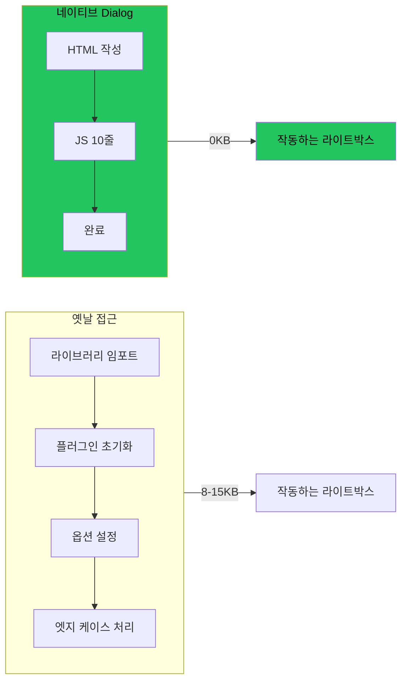

## 옛날 방식: 라이브러리 부풀리기

모든 라이트박스 라이브러리가 무게를 더한다:
- **Lightbox2**: 8KB + jQuery 의존성
- **GLightbox**: 12KB
- **Fancybox**: 15KB

모달에서 이미지를 보여주기 위해. 2026년에.

## 새로운 방식: 네이티브 Dialog

HTML5가 `<dialog>`를 줬다. 모든 최신 브라우저에 내장되어 있다. 라이트박스 라이브러리가 하는 것의 90%를 의존성 없이 한다.



## 완전한 구현

### HTML

```html
<dialog id="lightbox" class="lightbox">
  <button class="lightbox-close" aria-label="닫기">&times;</button>
  
</dialog>

<!-- 라이트박스를 여는 썸네일 -->


```

### JavaScript (10줄)

```javascript
const lightbox = document.getElementById('lightbox');
const lightboxImg = document.getElementById('lightbox-image');

document.querySelectorAll('.thumbnail').forEach(img => {
  img.addEventListener('click', () => {
    lightboxImg.src = img.dataset.full;
    lightbox.showModal();
  });
});

lightbox.addEventListener('click', (e) => {
  if (e.target === lightbox) lightbox.close();
});
```

### CSS

```css
.lightbox {
  border: none;
  padding: 0;
  max-width: 95vw;
  max-height: 95vh;
  background: transparent;
}

.lightbox::backdrop {
  background: rgba(0, 0, 0, 0.95);
}

.lightbox img {
  max-width: 100%;
  max-height: 90vh;
  object-fit: contain;
}

.lightbox-close {
  position: absolute;
  top: 10px;
  right: 10px;
  background: none;
  border: none;
  color: white;
  font-size: 2rem;
  cursor: pointer;
}
```

끝이다. 완전한 라이트박스. 의존성 제로.

## 무료로 얻는 것

### 1. 모달 동작

`showModal()` vs `show()`:
- `showModal()`: 뒤 페이지와 상호작용 차단, 백드롭 표시
- `show()`: 비모달, 백드롭 없음, 페이지는 여전히 상호작용 가능

### 2. 백드롭 스타일링

`::backdrop` 의사 요소가 내장되어 있다:

```css
dialog::backdrop {
  background: rgba(0, 0, 0, 0.95);
  backdrop-filter: blur(5px);  /* 보너스: 블러 효과 */
}
```

### 3. Escape 키 처리

Escape를 누르면 다이얼로그가 자동으로 닫힌다. 이벤트 리스너 필요 없음.

### 4. 포커스 트래핑

`showModal()` 호출 시:
- 포커스가 다이얼로그 안으로 이동
- Tab 키가 다이얼로그 내에서만 순환
- 닫힐 때 포커스가 트리거 요소로 반환

라이브러리에서는 수동으로 구축해야 하는 접근성이다.

### 5. 바깥 클릭으로 닫기

이벤트 리스너 하나:

```javascript
dialog.addEventListener('click', (e) => {
  if (e.target === dialog) dialog.close();
});
```

백드롭(다이얼로그 요소 자체) 클릭이 닫는다. 콘텐츠 클릭은 아니다.

## 브라우저 지원

| 브라우저 | 지원 |
|---------|------|
| Chrome | 37+ (2014) |
| Firefox | 98+ (2022) |
| Safari | 15.4+ (2022) |
| Edge | 79+ (2020) |

**95%+ 글로벌 지원**. 나머지 5%는 폴백이나 폴리필을 받는다.

## 고급: 애니메이션

부드러운 열기/닫기 애니메이션 추가:

```css
.lightbox {
  opacity: 0;
  transform: scale(0.95);
  transition: opacity 0.2s, transform 0.2s;
}

.lightbox[open] {
  opacity: 1;
  transform: scale(1);
}

/* 백드롭 애니메이션 */
.lightbox::backdrop {
  opacity: 0;
  transition: opacity 0.2s;
}

.lightbox[open]::backdrop {
  opacity: 1;
}
```

## 그래도 라이브러리를 쓸 때

네이티브 다이얼로그가 모든 것을 커버하지는 않는다:

- **스와이프가 있는 이미지 갤러리** - 제스처 처리 필요
- **줌과 패닝** - 터치 제스처 라이브러리 필요
- **비디오 라이트박스** - 비디오 플레이어 통합 필요
- **복잡한 애니메이션** - 네이티브 트랜지션은 제한적

기본 이미지 라이트박스? 네이티브 다이얼로그 승리.

## 마이그레이션 가이드

Lightbox2를 쓰고 있다면:

```javascript
// 이전 (Lightbox2)
<a href="full.jpg" data-lightbox="gallery">
  
</a>

// 이후 (네이티브)

```

GLightbox를 쓰고 있다면:

```javascript
// 이전
const lightbox = GLightbox({ selector: '.glightbox' });

// 이후
// 위의 10줄만
```

## 핵심 정리

1. **네이티브 다이얼로그가 모달을 처리한다** - HTML5에 내장
2. **의존성 제로 = 부풀리기 제로** - 로드할 라이브러리 없음
3. **접근성 포함** - 포커스 트랩, 이스케이프 키, 스크린 리더
4. **백드롭 스타일링은 CSS** - `::backdrop` 의사 요소
5. **JS 10줄** - 전체 구현이 그것이다

해결된 문제에 라이브러리 임포트를 멈춰라. 플랫폼이 따라잡았다. 사용하라.

---

*이 패턴은 모바일 사용자에게 모든 킬로바이트가 중요한 청첩장 갤러리에 채택되었다. 네이티브 다이얼로그가 접근성을 개선하면서 JavaScript 번들을 줄였다.*
