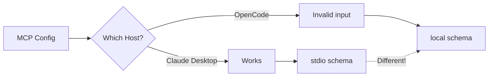
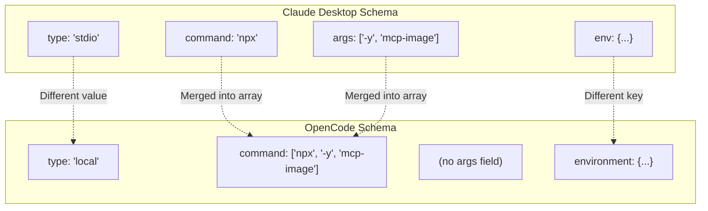
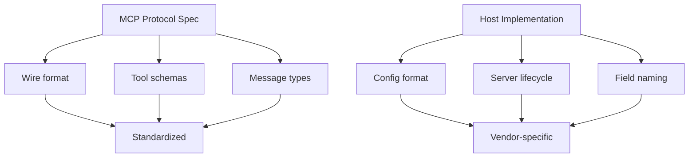

## The Problem

OpenCode config validation failed with a cryptic error:

```
Invalid input mcp.mcp-image
```

The MCP server configuration looked correct. It worked in Claude Desktop. Why not here?



## The Broken Config

This is what Claude Desktop expects:

```json
{
  "mcp-image": {
    "type": "stdio",
    "command": "npx",
    "args": ["-y", "mcp-image"],
    "env": {
      "GEMINI_API_KEY": "...",
      "IMAGE_OUTPUT_DIR": "..."
    }
  }
}
```

Copy-pasting this to OpenCode's config triggers validation errors.

## The Investigation

1. **First attempt**: Added `"type": "stdio"` explicitly - still failed
2. **Second attempt**: Checked if `args` was the issue - still failed
3. **Actual solution**: Fetched OpenCode's official documentation

The docs revealed an entirely different schema.

## The Working Config

OpenCode requires:

```json
{
  "mcp-image": {
    "type": "local",
    "command": ["npx", "-y", "mcp-image"],
    "environment": {
      "GEMINI_API_KEY": "...",
      "IMAGE_OUTPUT_DIR": "..."
    }
  }
}
```

## The Schema Differences



| Field | Claude Desktop | OpenCode |
|-------|----------------|----------|
| Type | `"stdio"` | `"local"` |
| Command | Separate `command` + `args` | Single `command` array |
| Env vars | `env` | `environment` |

## Why This Happens

MCP (Model Context Protocol) defines the **wire protocol** - how servers and clients communicate. It does **not** define:

- How configs are structured
- How servers are launched
- What the host calls various fields

Each MCP host (Claude Desktop, OpenCode, Cursor, etc.) implements its own config schema. They're all "MCP compatible" but not "config compatible."



## Prevention

### 1. Never Assume Schema Compatibility

When setting up MCP in a new host:

```bash
# Wrong approach
cp ~/.claude/claude_desktop_config.json ~/.config/opencode/config.json

# Right approach
# 1. Read the host's documentation
# 2. Find their example config
# 3. Adapt your servers to their schema
```

### 2. Create a Reference Table

For your MCP servers, maintain a translation table:

```yaml
# mcp-servers-reference.yaml
mcp-image:
  claude-desktop:
    type: stdio
    command: npx
    args: ["-y", "mcp-image"]
    env: {GEMINI_API_KEY: "...", IMAGE_OUTPUT_DIR: "..."}
  
  opencode:
    type: local
    command: ["npx", "-y", "mcp-image"]
    environment: {GEMINI_API_KEY: "...", IMAGE_OUTPUT_DIR: "..."}
```

### 3. Check Docs First

When config validation fails, the error message rarely explains the schema mismatch. Go straight to docs:

- OpenCode: `opencode.ai/docs/mcp-servers`
- Claude Desktop: Check their config example in docs
- Cursor: Their MCP setup page

## Key Takeaways

1. **MCP ≠ config compatibility** - Protocol compatibility doesn't mean config compatibility
2. **Check vendor docs** - Each host has its own schema; don't guess
3. **"stdio" vs "local"** - Same concept, different terminology
4. **`env` vs `environment`** - Subtle naming differences break validation
5. **Merged fields** - Some hosts combine `command` + `args`, others separate them

The lesson: when something works in one tool and fails in another, the protocol isn't the problem - the config schema is.
