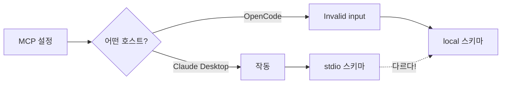
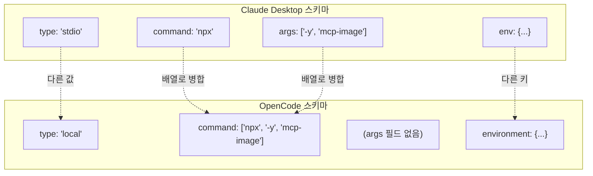
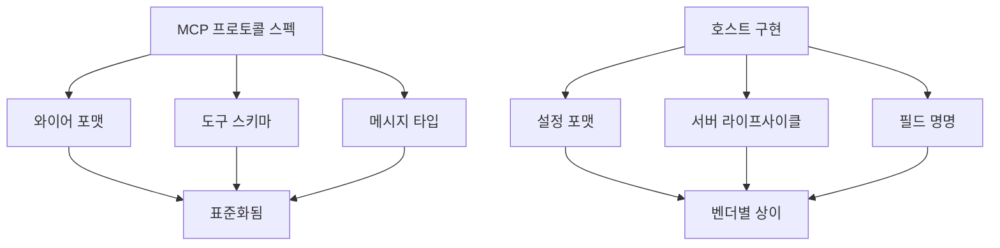

## 문제 상황

OpenCode 설정 검증이 알 수 없는 에러로 실패했다:

```
Invalid input mcp.mcp-image
```

MCP 서버 설정이 올바르게 보였다. Claude Desktop에서는 작동했다. 왜 여기서는 안 될까?



## 문제의 설정

Claude Desktop이 기대하는 형식:

```json
{
  "mcp-image": {
    "type": "stdio",
    "command": "npx",
    "args": ["-y", "mcp-image"],
    "env": {
      "GEMINI_API_KEY": "...",
      "IMAGE_OUTPUT_DIR": "..."
    }
  }
}
```

이걸 OpenCode 설정에 복사-붙여넣기하면 검증 에러가 발생한다.

## 조사 과정

1. **첫 번째 시도**: `"type": "stdio"` 명시적 추가 - 여전히 실패
2. **두 번째 시도**: `args`가 문제인지 확인 - 여전히 실패
3. **실제 해결**: OpenCode 공식 문서 확인

문서에서 완전히 다른 스키마를 발견했다.

## 작동하는 설정

OpenCode가 요구하는 형식:

```json
{
  "mcp-image": {
    "type": "local",
    "command": ["npx", "-y", "mcp-image"],
    "environment": {
      "GEMINI_API_KEY": "...",
      "IMAGE_OUTPUT_DIR": "..."
    }
  }
}
```

## 스키마 차이점



| 필드 | Claude Desktop | OpenCode |
|------|----------------|----------|
| Type | `"stdio"` | `"local"` |
| Command | 분리된 `command` + `args` | 단일 `command` 배열 |
| 환경 변수 | `env` | `environment` |

## 왜 이런 일이 발생하는가

MCP(Model Context Protocol)는 **와이어 프로토콜**을 정의한다 - 서버와 클라이언트가 통신하는 방법. 정의하지 **않는** 것들:

- 설정 구조
- 서버 실행 방법
- 호스트가 각 필드를 뭐라고 부르는지

각 MCP 호스트(Claude Desktop, OpenCode, Cursor 등)는 자체 설정 스키마를 구현한다. 모두 "MCP 호환"이지만 "설정 호환"은 아니다.



## 예방 방법

### 1. 스키마 호환성을 가정하지 말라

새 호스트에서 MCP 설정 시:

```bash
# 잘못된 접근
cp ~/.claude/claude_desktop_config.json ~/.config/opencode/config.json

# 올바른 접근
# 1. 호스트의 문서를 읽는다
# 2. 예제 설정을 찾는다
# 3. 서버를 그들의 스키마에 맞게 조정한다
```

### 2. 참조 테이블 만들기

MCP 서버에 대해 변환 테이블을 유지한다:

```yaml
# mcp-servers-reference.yaml
mcp-image:
  claude-desktop:
    type: stdio
    command: npx
    args: ["-y", "mcp-image"]
    env: {GEMINI_API_KEY: "...", IMAGE_OUTPUT_DIR: "..."}
  
  opencode:
    type: local
    command: ["npx", "-y", "mcp-image"]
    environment: {GEMINI_API_KEY: "...", IMAGE_OUTPUT_DIR: "..."}
```

### 3. 먼저 문서 확인

설정 검증이 실패할 때, 에러 메시지는 스키마 불일치를 거의 설명하지 않는다. 바로 문서로 간다:

- OpenCode: `opencode.ai/docs/mcp-servers`
- Claude Desktop: 문서의 설정 예제 확인
- Cursor: MCP 설정 페이지

## 핵심 교훈

1. **MCP ≠ 설정 호환성** - 프로토콜 호환성이 설정 호환성을 의미하지 않는다
2. **벤더 문서 확인** - 각 호스트는 자체 스키마를 가진다; 추측하지 마라
3. **"stdio" vs "local"** - 같은 개념, 다른 용어
4. **`env` vs `environment`** - 미묘한 명명 차이가 검증을 깨뜨린다
5. **병합된 필드** - 일부 호스트는 `command` + `args`를 결합하고, 다른 것들은 분리한다

교훈: 한 도구에서 작동하고 다른 도구에서 실패할 때, 프로토콜이 문제가 아니다 - 설정 스키마가 문제다.
