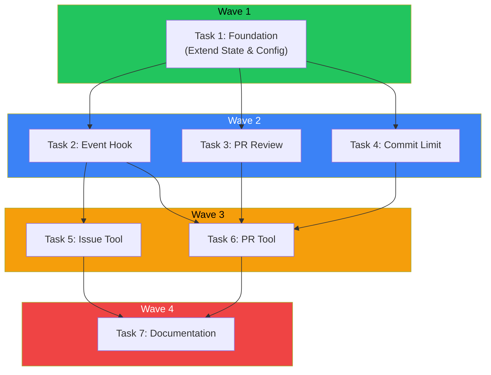
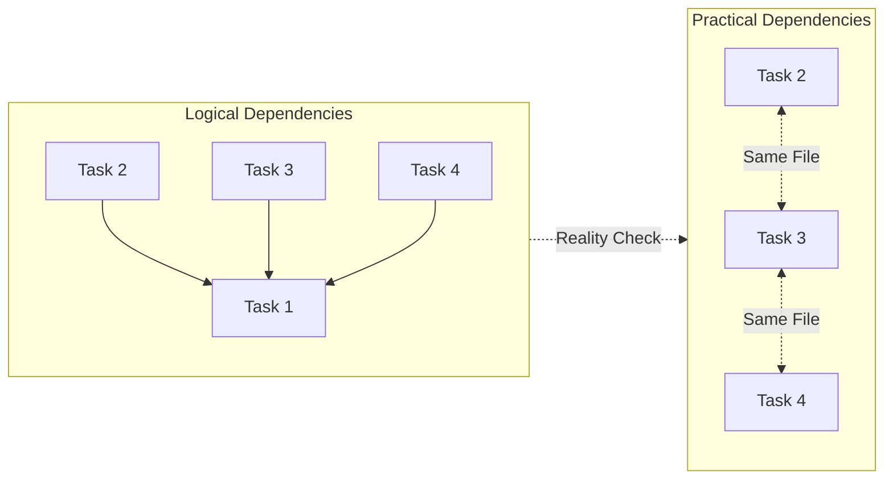

## The Promise of Parallel Execution

You have 7 tasks to complete. Running them sequentially takes 7 time units. But what if tasks 2, 3, and 4 could run simultaneously? Suddenly you're down to 4 time units - a 43% speedup.

This is the promise of wave-based task orchestration. Group tasks by their dependencies, execute each wave in parallel, and watch your throughput soar.

Except it rarely works that cleanly.

## The Wave Pattern



During a git workflow plugin enhancement, the plan agent organized 7 tasks into 4 parallel waves:

**Wave 1** (Start Immediately):
- Task 1: Extend State & Config (foundation)

**Wave 2** (After Wave 1):
- Task 2: Add event hook [depends: 1]
- Task 3: Add PR review checking [depends: 1]
- Task 4: Add commit limit enforcement [depends: 1]

**Wave 3** (After Wave 2):
- Task 5: Enhance issue tool [depends: 2]
- Task 6: Add PR tool [depends: 2, 3, 4]

**Wave 4** (After Wave 3):
- Task 7: Update documentation [depends: 5, 6]

The critical path runs through Task 1 -> Task 2 -> Task 6 -> Task 7. Everything else can theoretically run in parallel with this path.

**Theoretical speedup: ~35% faster than sequential execution.**

## Reality Hits

Here's what actually happened when executing this plan:

Wave 2's tasks (2, 3, 4) all modified the same file: `git-workflow-enforcer.ts`. They couldn't run in parallel without merge conflicts. The "parallel" wave became sequential.

This is the key insight: **Theoretical parallelism does not equal practical parallelism.**

## The Three Types of Conflicts

Even when tasks are logically independent (different features), they may have hidden dependencies:

### 1. File Conflicts

Multiple tasks editing the same file cannot safely run in parallel. Git merge conflicts are the obvious symptom, but subtler issues include:
- Overlapping code sections
- Import statement conflicts
- Shared utility functions being modified

**Detection**: Before executing, scan task specifications for overlapping file paths.

### 2. State Conflicts

Tasks that share runtime state must coordinate:
- Database operations on the same tables
- Cache invalidation sequences
- Shared configuration state

**Detection**: Map data dependencies, not just code dependencies.

### 3. Test Conflicts

Overlapping test coverage can cause false failures:
- Integration tests touching the same endpoints
- Tests that modify shared fixtures
- Port/resource conflicts in parallel test runs

**Detection**: Analyze test file dependencies and resource requirements.

## Practical Wave Planning

Given these constraints, here's how to plan waves effectively:

### Step 1: Map All Dependencies

Don't just map task dependencies. Map:
- File paths each task will modify
- Database tables/collections each task touches
- Shared state (caches, configs, globals)
- Test files that will run

### Step 2: Build the Conflict Graph



The logical view shows Tasks 2, 3, 4 as parallel. The practical view reveals they share a file and must serialize.

### Step 3: Optimize Within Constraints

Sometimes you can restructure to restore parallelism:
- Split large files into smaller modules
- Extract shared code into a separate, pre-completed task
- Reorder operations to minimize conflicts

### Step 4: Communicate the Actual Plan

When presenting the execution plan, distinguish between:
- **Theoretical waves**: What could run in parallel
- **Practical waves**: What will actually run in parallel
- **Serialization points**: Where and why parallelism breaks down

## Measuring Real Speedup

For the git workflow enhancement:

| Approach | Time Units | Notes |
|----------|------------|-------|
| Pure Sequential | 7 | Baseline |
| Theoretical Parallel | 4 | 43% faster (on paper) |
| Practical Parallel | 5 | 29% faster (reality) |

The practical speedup is still meaningful - nearly a third faster. But it's not the dramatic improvement the theory suggested.

## When Waves Work Best

Wave-based orchestration shines when:

1. **Tasks modify different files** - Frontend and backend work, for example
2. **Dependencies are clearly layered** - Schema changes before business logic before UI
3. **Test suites are isolated** - Unit tests for different modules
4. **Teams are separate** - Different people, different codebases

It struggles when:

1. **Monolithic architecture** - Everything touches everything
2. **Shared utility files** - Constants, helpers, types that everyone imports
3. **Integration-heavy testing** - Tests that exercise the whole system
4. **Tight coupling** - Changes ripple across boundaries

## Implementation Tips

### For AI Agent Orchestration

When delegating to multiple AI agents in parallel:

```python
# Bad: Assume logical independence
parallel_execute([task_2, task_3, task_4])

# Good: Check for file conflicts first
files_per_task = analyze_file_touches(tasks)
conflict_groups = find_conflicts(files_per_task)
execution_plan = serialize_conflicts(conflict_groups)
```

### For Human Teams

When planning sprints with multiple developers:
- Assign file ownership explicitly
- Use feature flags to isolate work-in-progress
- Prefer vertical slices (one dev owns full feature) over horizontal (multiple devs touch same layer)

### For CI/CD Pipelines

When parallelizing test and build steps:
- Profile actual resource conflicts, not just logical dependencies
- Use containerization to isolate state
- Implement retry logic for flaky parallel tests

## Key Takeaways

1. **Map practical dependencies, not just logical ones** - File conflicts, state conflicts, and test conflicts all matter
2. **Expect 60-70% of theoretical speedup** - Hidden serialization points are everywhere
3. **Restructure to restore parallelism** - Sometimes splitting files or adding abstraction layers pays off
4. **Document the gap** - When theoretical and practical differ, explain why
5. **Measure and iterate** - Profile actual execution to find hidden bottlenecks

The wave pattern remains valuable even with these constraints. A 29% speedup is still significant. But going in with realistic expectations prevents the frustration of promised parallelism that never materializes.

---

*This pattern emerged from orchestrating AI agents for complex code modifications. The same principles apply to human team coordination, CI/CD optimization, and any domain where parallel execution meets shared resources.*
