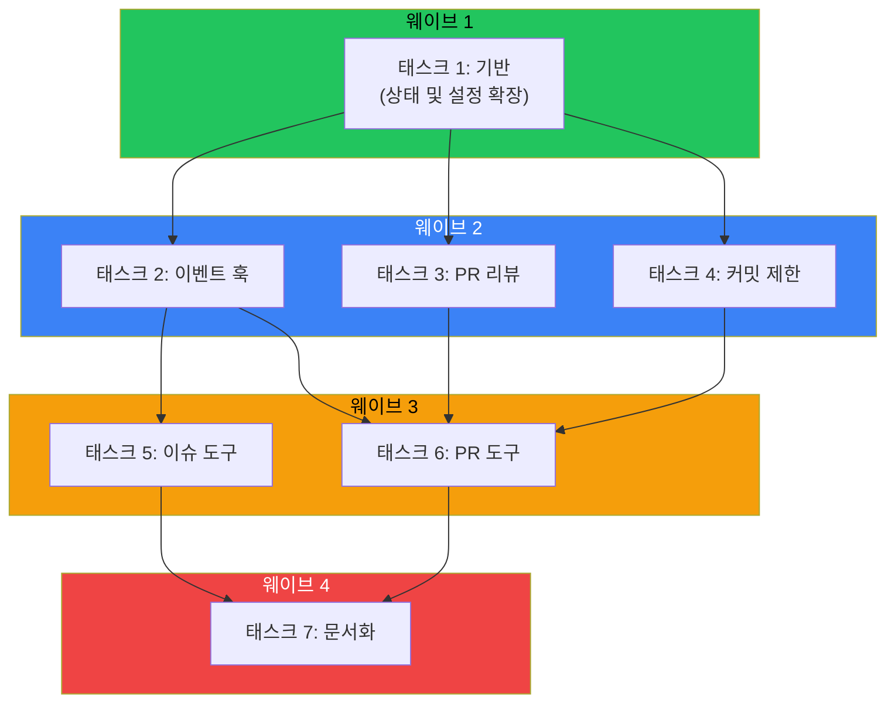
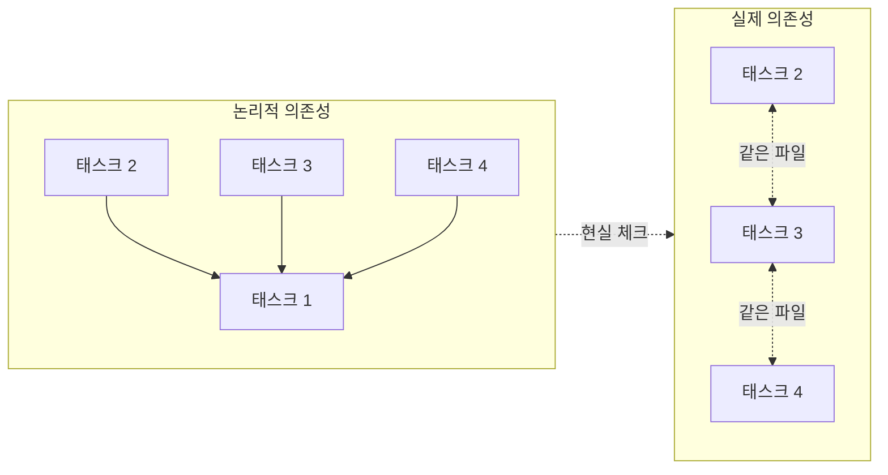

## 병렬 실행의 약속

완료해야 할 태스크가 7개 있다. 순차 실행하면 7 시간 단위가 걸린다. 그런데 태스크 2, 3, 4가 동시에 실행될 수 있다면? 갑자기 4 시간 단위로 줄어든다 - 43% 속도 향상이다.

이것이 웨이브 기반 태스크 오케스트레이션의 약속이다. 의존성에 따라 태스크를 그룹화하고, 각 웨이브를 병렬로 실행하고, 처리량이 치솟는 것을 지켜본다.

그런데 그렇게 깔끔하게 작동하는 경우는 드물다.

## 웨이브 패턴



git 워크플로우 플러그인 개선 작업 중, 플랜 에이전트가 7개 태스크를 4개 병렬 웨이브로 조직했다:

**웨이브 1** (즉시 시작):
- 태스크 1: 상태 및 설정 확장 (기반)

**웨이브 2** (웨이브 1 이후):
- 태스크 2: 이벤트 훅 추가 [의존: 1]
- 태스크 3: PR 리뷰 체크 추가 [의존: 1]
- 태스크 4: 커밋 제한 적용 추가 [의존: 1]

**웨이브 3** (웨이브 2 이후):
- 태스크 5: 이슈 도구 개선 [의존: 2]
- 태스크 6: PR 도구 추가 [의존: 2, 3, 4]

**웨이브 4** (웨이브 3 이후):
- 태스크 7: 문서화 업데이트 [의존: 5, 6]

크리티컬 패스는 태스크 1 -> 태스크 2 -> 태스크 6 -> 태스크 7을 통과한다. 나머지는 이론적으로 이 패스와 병렬로 실행 가능하다.

**이론적 속도 향상: 순차 실행 대비 ~35% 빠름.**

## 현실에 부딪히다

이 플랜을 실행했을 때 실제로 일어난 일이다:

웨이브 2의 태스크(2, 3, 4)가 모두 같은 파일을 수정했다: `git-workflow-enforcer.ts`. 머지 충돌 없이는 병렬 실행이 불가능했다. "병렬" 웨이브가 순차가 되어버렸다.

핵심 통찰이다: **이론적 병렬성은 실제 병렬성과 같지 않다.**

## 세 가지 충돌 유형

태스크가 논리적으로 독립적이더라도(다른 기능) 숨겨진 의존성이 있을 수 있다:

### 1. 파일 충돌

같은 파일을 수정하는 여러 태스크는 안전하게 병렬 실행할 수 없다. Git 머지 충돌이 명백한 증상이지만 더 미묘한 문제도 있다:
- 겹치는 코드 섹션
- import 문 충돌
- 수정되는 공유 유틸리티 함수

**탐지**: 실행 전, 태스크 명세에서 겹치는 파일 경로를 스캔한다.

### 2. 상태 충돌

런타임 상태를 공유하는 태스크는 조율해야 한다:
- 같은 테이블에 대한 데이터베이스 작업
- 캐시 무효화 시퀀스
- 공유 설정 상태

**탐지**: 코드 의존성뿐 아니라 데이터 의존성도 매핑한다.

### 3. 테스트 충돌

겹치는 테스트 커버리지는 거짓 실패를 유발할 수 있다:
- 같은 엔드포인트를 건드리는 통합 테스트
- 공유 픽스처를 수정하는 테스트
- 병렬 테스트 실행의 포트/리소스 충돌

**탐지**: 테스트 파일 의존성과 리소스 요구사항을 분석한다.

## 실용적 웨이브 계획

이런 제약을 감안하여 효과적으로 웨이브를 계획하는 방법이다:

### 1단계: 모든 의존성 매핑

태스크 의존성만 매핑하지 않는다. 다음도 매핑한다:
- 각 태스크가 수정할 파일 경로
- 각 태스크가 건드리는 데이터베이스 테이블/컬렉션
- 공유 상태 (캐시, 설정, 전역)
- 실행될 테스트 파일

### 2단계: 충돌 그래프 구축



논리적 뷰는 태스크 2, 3, 4를 병렬로 보여준다. 실제 뷰는 파일을 공유하므로 직렬화해야 함을 드러낸다.

### 3단계: 제약 내에서 최적화

때로는 병렬성을 복원하기 위해 재구조화할 수 있다:
- 큰 파일을 작은 모듈로 분할
- 공유 코드를 별도의 사전 완료 태스크로 추출
- 충돌을 최소화하도록 작업 순서 변경

### 4단계: 실제 계획 전달

실행 계획을 제시할 때 다음을 구분한다:
- **이론적 웨이브**: 병렬 실행 가능한 것
- **실제 웨이브**: 실제로 병렬 실행될 것
- **직렬화 지점**: 병렬성이 무너지는 위치와 이유

## 실제 속도 향상 측정

git 워크플로우 개선의 경우:

| 접근법 | 시간 단위 | 비고 |
|--------|----------|------|
| 순수 순차 | 7 | 기준선 |
| 이론적 병렬 | 4 | 43% 빠름 (종이 위에서) |
| 실제 병렬 | 5 | 29% 빠름 (현실) |

실제 속도 향상도 여전히 의미 있다 - 거의 3분의 1 빠르다. 하지만 이론이 제시한 극적인 개선은 아니다.

## 웨이브가 가장 잘 작동할 때

웨이브 기반 오케스트레이션이 빛나는 경우:

1. **태스크가 다른 파일을 수정** - 예를 들어 프론트엔드와 백엔드 작업
2. **의존성이 명확히 계층화** - 스키마 변경 후 비즈니스 로직 후 UI
3. **테스트 스위트가 격리** - 다른 모듈의 단위 테스트
4. **팀이 분리** - 다른 사람, 다른 코드베이스

어려운 경우:

1. **모놀리식 아키텍처** - 모든 것이 모든 것을 건드림
2. **공유 유틸리티 파일** - 모두가 import하는 상수, 헬퍼, 타입
3. **통합 중심 테스팅** - 전체 시스템을 실행하는 테스트
4. **긴밀한 결합** - 변경이 경계를 넘어 파급

## 구현 팁

### AI 에이전트 오케스트레이션용

여러 AI 에이전트에 병렬로 위임할 때:

```python
# 나쁨: 논리적 독립성을 가정
parallel_execute([task_2, task_3, task_4])

# 좋음: 먼저 파일 충돌 확인
files_per_task = analyze_file_touches(tasks)
conflict_groups = find_conflicts(files_per_task)
execution_plan = serialize_conflicts(conflict_groups)
```

### 인간 팀용

여러 개발자와 스프린트 계획 시:
- 파일 소유권을 명시적으로 할당
- 진행 중인 작업을 격리하기 위해 피처 플래그 사용
- 수평 분할(여러 개발자가 같은 레이어 건드림)보다 수직 분할(한 개발자가 전체 기능 소유) 선호

### CI/CD 파이프라인용

테스트와 빌드 단계를 병렬화할 때:
- 논리적 의존성뿐 아니라 실제 리소스 충돌 프로파일
- 상태 격리를 위해 컨테이너화 사용
- 불안정한 병렬 테스트를 위한 재시도 로직 구현

## 핵심 정리

1. **논리적 의존성뿐 아니라 실제 의존성을 매핑한다** - 파일 충돌, 상태 충돌, 테스트 충돌 모두 중요하다
2. **이론적 속도 향상의 60-70%를 기대한다** - 숨겨진 직렬화 지점이 어디에나 있다
3. **병렬성 복원을 위해 재구조화한다** - 때로는 파일 분할이나 추상화 레이어 추가가 이득이다
4. **격차를 문서화한다** - 이론과 실제가 다르면 이유를 설명한다
5. **측정하고 반복한다** - 숨겨진 병목을 찾기 위해 실제 실행을 프로파일한다

웨이브 패턴은 이런 제약에도 불구하고 가치가 있다. 29% 속도 향상도 여전히 유의미하다. 하지만 현실적인 기대를 가지고 들어가면 약속된 병렬성이 실현되지 않을 때의 좌절을 방지할 수 있다.

---

*이 패턴은 복잡한 코드 수정을 위해 AI 에이전트를 오케스트레이션하면서 나타났다. 동일한 원칙이 인간 팀 조율, CI/CD 최적화, 그리고 병렬 실행이 공유 리소스를 만나는 모든 영역에 적용된다.*
