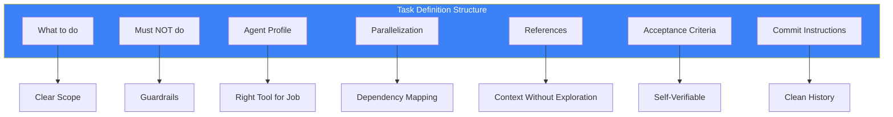

## The Problem: Vague Task Definitions

You delegate to an AI agent: "Add user authentication to the app."

The agent asks:
- "Which authentication method?"
- "Where should I store sessions?"
- "Should I create the UI too?"
- "What about password requirements?"

Every clarification costs context and time. What if the task definition itself answered these questions?

## The Task Template



Here's the complete template:

```markdown
### Task N: [Descriptive Name]

**What to do**:
- Specific action 1
- Specific action 2
- Code examples where helpful

**Must NOT do**:
- Guardrail 1 (prevents scope creep)
- Guardrail 2 (prevents rogue behavior)

**Recommended Agent Profile**:
- **Category**: `quick|visual-engineering|ultrabrain|deep|writing`
- **Skills**: [`skill-1`, `skill-2`]
- **Skills Evaluated but Omitted**: [with reasoning]

**Parallelization**:
- **Can Run In Parallel**: YES/NO
- **Parallel Group**: Wave N
- **Blocks**: Tasks X, Y
- **Blocked By**: Tasks A, B

**References**:
- `src/auth/handler.ts:45-67` - WHY: Existing auth pattern
- `docs/api.md` - WHY: API contract definition
- External: [link] - WHY: Library usage examples

**Acceptance Criteria**:
```bash
# Agent can run these to verify completion
grep -r "AuthProvider" src/ | wc -l  # Expected: > 0
npm run test:auth  # Expected: exit 0
```

**Commit**: YES
- Message: `feat(auth): add JWT authentication handler`
- Files: `src/auth/*.ts`, `tests/auth/*.test.ts`
- Pre-commit: `npm run lint && npm run test`
```

## Why Each Section Matters

### What to Do
Clear, specific actions. Not goals, not outcomes - **actions**.

Bad: "Implement authentication"
Good: "Create `src/auth/jwt-handler.ts` that exports `verifyToken(token: string): Promise<User | null>`"

### Must NOT Do
Guardrails prevent rogue behavior. Anticipate what the agent might do wrong.

```markdown
**Must NOT do**:
- Do NOT modify existing user schema
- Do NOT add new npm dependencies without approval
- Do NOT implement OAuth (out of scope for this task)
- Do NOT change the API response format
```

### Agent Profile
Match task to capability. Different tasks need different agents.

| Category | Best For |
|----------|----------|
| `quick` | Single file changes, typo fixes |
| `visual-engineering` | Frontend, UI/UX, styling |
| `ultrabrain` | Complex logic, algorithms |
| `deep` | Research + implementation |
| `writing` | Documentation, prose |

### Parallelization
Map dependencies explicitly. What can run alongside? What blocks what?

```markdown
**Parallelization**:
- **Can Run In Parallel**: YES
- **Parallel Group**: Wave 2
- **Blocks**: Task 6 (needs auth before PR creation)
- **Blocked By**: Task 1 (needs config schema first)
```

### References
Give context, but explain WHY each reference matters.

Bad: "See `src/auth/`"
Good: "`src/auth/handler.ts:45-67` - WHY: Follow this pattern for new auth methods"

### Acceptance Criteria
Commands the agent can run to verify completion. No ambiguity.

```bash
# Verification commands
grep -q "export.*verifyToken" src/auth/jwt-handler.ts && echo "PASS" || echo "FAIL"
npm run test -- --grep "JWT" --exit-code
```

### Commit Instructions
Specify exactly what to commit and how.

```markdown
**Commit**: YES
- Message: `feat(auth): add JWT verification handler`
- Files to include: `src/auth/jwt-handler.ts`, `tests/auth/jwt.test.ts`
- Files to exclude: `package-lock.json` (no new deps)
- Pre-commit verification: `npm run lint && npm run test`
```

## Real Example

```markdown
### Task 3: Add PR Review Checking

**What to do**:
- Add `checkPRReviewStatus()` function to `src/git-workflow-enforcer.ts`
- Function should call `gh pr view --json reviewDecision`
- Return `approved | changes_requested | review_required | pending`
- Add warning to status display when PR needs review

**Must NOT do**:
- Do NOT block commits based on review status (just warn)
- Do NOT modify the commit hook behavior
- Do NOT add GitHub API calls (use gh CLI only)

**Recommended Agent Profile**:
- **Category**: `quick`
- **Skills**: [`git-master`]
- **Skills Evaluated but Omitted**: None needed

**Parallelization**:
- **Can Run In Parallel**: YES (with Tasks 2, 4)
- **Parallel Group**: Wave 2
- **Blocks**: Task 6
- **Blocked By**: Task 1

**References**:
- `src/git-workflow-enforcer.ts:120-145` - WHY: Existing gh CLI usage pattern
- `gh pr view --help` - WHY: Available JSON fields

**Acceptance Criteria**:
```bash
grep -q "checkPRReviewStatus" src/git-workflow-enforcer.ts
gh pr view --json reviewDecision 2>/dev/null || echo "No PR (OK for test)"
```

**Commit**: YES
- Message: `feat(#5): add PR review status checking`
- Files: `src/git-workflow-enforcer.ts`
```

## Key Takeaways

1. **Actions, not goals** - Tell the agent what to do, not what to achieve
2. **Guardrails prevent disasters** - "Must NOT" is as important as "What to do"
3. **References need WHY** - Context without explanation is useless
4. **Acceptance = commands** - If the agent can't run it, it's not verifiable
5. **Parallelization is explicit** - Don't assume; declare dependencies

The time invested in structured task definitions pays back in reduced clarification cycles and higher-quality autonomous execution.

---

*This template emerged from orchestrating multiple AI agents on complex code changes. Tasks with this structure consistently executed without clarification requests.*
