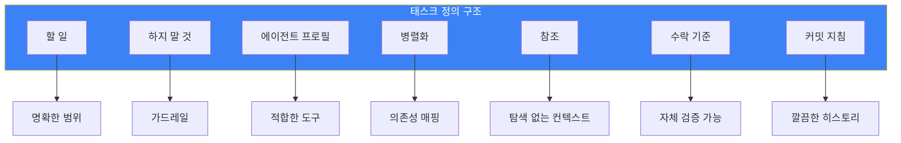

## 문제: 모호한 태스크 정의

AI 에이전트에게 위임한다: "앱에 사용자 인증을 추가해."

에이전트가 묻는다:
- "어떤 인증 방법이요?"
- "세션을 어디에 저장하나요?"
- "UI도 만들어야 하나요?"
- "비밀번호 요구사항은요?"

모든 확인이 컨텍스트와 시간을 소비한다. 태스크 정의 자체가 이 질문에 답한다면?

## 태스크 템플릿



완전한 템플릿이다:

```markdown
### 태스크 N: [설명적 이름]

**할 일**:
- 구체적 행동 1
- 구체적 행동 2
- 도움이 되는 코드 예시

**하지 말 것**:
- 가드레일 1 (범위 확대 방지)
- 가드레일 2 (불량 행동 방지)

**권장 에이전트 프로필**:
- **카테고리**: `quick|visual-engineering|ultrabrain|deep|writing`
- **스킬**: [`skill-1`, `skill-2`]
- **평가했으나 제외한 스킬**: [이유와 함께]

**병렬화**:
- **병렬 실행 가능**: YES/NO
- **병렬 그룹**: Wave N
- **차단**: 태스크 X, Y
- **차단됨**: 태스크 A, B

**참조**:
- `src/auth/handler.ts:45-67` - 이유: 기존 인증 패턴
- `docs/api.md` - 이유: API 계약 정의
- 외부: [링크] - 이유: 라이브러리 사용 예시

**수락 기준**:
```bash
# 에이전트가 완료 확인을 위해 실행할 수 있는 것
grep -r "AuthProvider" src/ | wc -l  # 예상: > 0
npm run test:auth  # 예상: exit 0
```

**커밋**: YES
- 메시지: `feat(auth): add JWT authentication handler`
- 파일: `src/auth/*.ts`, `tests/auth/*.test.ts`
- 사전 커밋: `npm run lint && npm run test`
```

## 각 섹션이 중요한 이유

### 할 일
명확하고 구체적인 행동. 목표가 아니라 결과가 아니라 - **행동**.

나쁨: "인증 구현"
좋음: "`src/auth/jwt-handler.ts`를 생성하여 `verifyToken(token: string): Promise<User | null>` 내보내기"

### 하지 말 것
가드레일이 불량 행동을 방지한다. 에이전트가 무엇을 잘못할 수 있는지 예상한다.

```markdown
**하지 말 것**:
- 기존 사용자 스키마 수정 금지
- 승인 없이 새 npm 의존성 추가 금지
- OAuth 구현 금지 (이 태스크 범위 밖)
- API 응답 형식 변경 금지
```

### 에이전트 프로필
태스크를 능력에 맞춘다. 다른 태스크는 다른 에이전트가 필요하다.

| 카테고리 | 최적 용도 |
|----------|----------|
| `quick` | 단일 파일 변경, 오타 수정 |
| `visual-engineering` | 프론트엔드, UI/UX, 스타일링 |
| `ultrabrain` | 복잡한 로직, 알고리즘 |
| `deep` | 조사 + 구현 |
| `writing` | 문서화, 산문 |

### 병렬화
의존성을 명시적으로 매핑한다. 무엇이 함께 실행될 수 있나? 무엇이 무엇을 차단하나?

```markdown
**병렬화**:
- **병렬 실행 가능**: YES
- **병렬 그룹**: Wave 2
- **차단**: 태스크 6 (PR 생성 전 인증 필요)
- **차단됨**: 태스크 1 (설정 스키마 먼저 필요)
```

### 참조
컨텍스트를 주되, 각 참조가 왜 중요한지 설명한다.

나쁨: "`src/auth/` 참조"
좋음: "`src/auth/handler.ts:45-67` - 이유: 새 인증 메서드에 이 패턴 따르기"

### 수락 기준
에이전트가 완료 확인을 위해 실행할 수 있는 명령. 모호함 없음.

```bash
# 검증 명령
grep -q "export.*verifyToken" src/auth/jwt-handler.ts && echo "PASS" || echo "FAIL"
npm run test -- --grep "JWT" --exit-code
```

### 커밋 지침
무엇을 어떻게 커밋할지 정확히 지정한다.

```markdown
**커밋**: YES
- 메시지: `feat(auth): add JWT verification handler`
- 포함 파일: `src/auth/jwt-handler.ts`, `tests/auth/jwt.test.ts`
- 제외 파일: `package-lock.json` (새 의존성 없음)
- 사전 커밋 검증: `npm run lint && npm run test`
```

## 실제 예시

```markdown
### 태스크 3: PR 리뷰 체크 추가

**할 일**:
- `src/git-workflow-enforcer.ts`에 `checkPRReviewStatus()` 함수 추가
- 함수가 `gh pr view --json reviewDecision` 호출
- `approved | changes_requested | review_required | pending` 반환
- PR이 리뷰 필요할 때 상태 표시에 경고 추가

**하지 말 것**:
- 리뷰 상태에 따라 커밋 차단 금지 (경고만)
- 커밋 훅 동작 수정 금지
- GitHub API 호출 추가 금지 (gh CLI만 사용)

**권장 에이전트 프로필**:
- **카테고리**: `quick`
- **스킬**: [`git-master`]
- **평가했으나 제외한 스킬**: 필요 없음

**병렬화**:
- **병렬 실행 가능**: YES (태스크 2, 4와)
- **병렬 그룹**: Wave 2
- **차단**: 태스크 6
- **차단됨**: 태스크 1

**참조**:
- `src/git-workflow-enforcer.ts:120-145` - 이유: 기존 gh CLI 사용 패턴
- `gh pr view --help` - 이유: 사용 가능한 JSON 필드

**수락 기준**:
```bash
grep -q "checkPRReviewStatus" src/git-workflow-enforcer.ts
gh pr view --json reviewDecision 2>/dev/null || echo "No PR (OK for test)"
```

**커밋**: YES
- 메시지: `feat(#5): add PR review status checking`
- 파일: `src/git-workflow-enforcer.ts`
```

## 핵심 정리

1. **목표가 아닌 행동** - 달성할 것이 아니라 할 것을 에이전트에게 말한다
2. **가드레일이 재앙을 방지** - "하지 말 것"이 "할 일"만큼 중요
3. **참조에 이유가 필요** - 설명 없는 컨텍스트는 쓸모없다
4. **수락 = 명령** - 에이전트가 실행할 수 없으면 검증 불가
5. **병렬화는 명시적** - 가정하지 않는다; 의존성을 선언한다

구조화된 태스크 정의에 투자한 시간이 줄어든 확인 주기와 더 높은 품질의 자율 실행으로 돌아온다.

---

*이 템플릿은 복잡한 코드 변경에서 여러 AI 에이전트를 오케스트레이션하면서 나타났다. 이 구조의 태스크는 확인 요청 없이 일관되게 실행됐다.*
