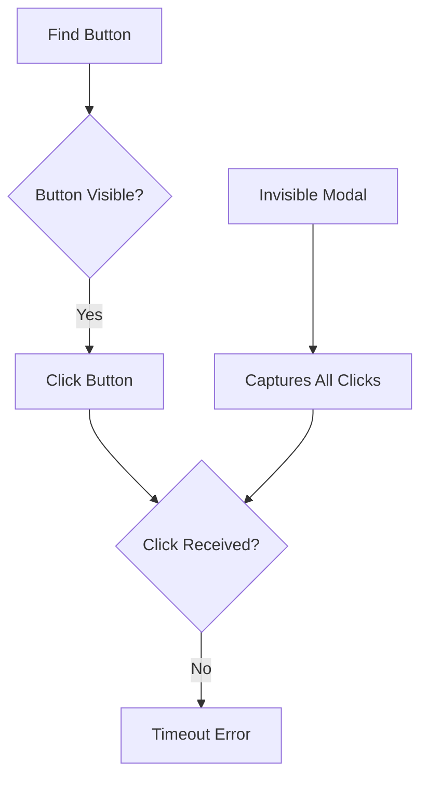
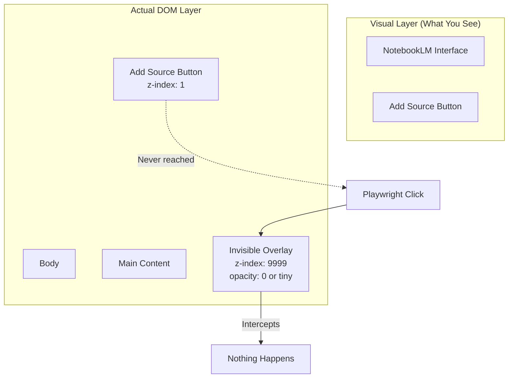
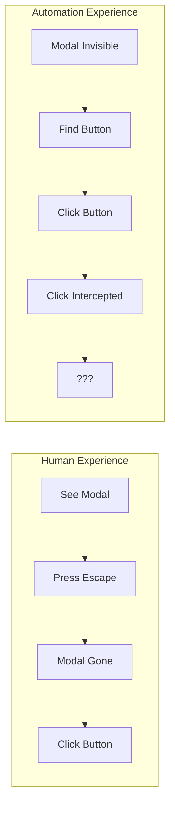

## The Problem

A Playwright automation for NotebookLM uploads failed with:

```
Add source button not clickable
```

Screenshots showed the button. It was visible. The selector found it. But clicks didn't register.



## The Investigation

Taking a debug screenshot before the failure revealed the truth: Google's UI had spawned an invisible modal overlay.

It could have been:
- A search dialog waiting for input
- A promotional popup
- A consent dialog
- An onboarding tooltip

Whatever it was, it sat above the target button with `z-index: 9999` and zero visible styling, silently eating every click.



## The Classic Symptoms

When you see these together, suspect invisible overlays:

| Symptom | What You See |
|---------|--------------|
| Element found | Selector returns the element |
| Element visible | `isVisible()` returns true |
| Click fails | Timeout or no effect |
| Screenshot looks fine | Target element is clearly visible |
| Manual click works | But automation doesn't |

## The Resolution

Created a `dismissOverlays()` utility to clear modals before critical interactions:

```typescript
async function dismissOverlays(page: Page) {
  // Press Escape multiple times to dismiss dialogs
  for (let i = 0; i < 3; i++) {
    await page.keyboard.press("Escape");
    await page.waitForTimeout(200);
  }
  
  // Click a known safe area to dismiss click-away modals
  try {
    await page.click("body", { 
      position: { x: 0, y: 0 }, 
      force: true 
    });
  } catch {
    // Ignore if click fails
  }
}
```

Usage pattern:

```typescript
// Before any critical Google UI interaction
await dismissOverlays(page);
await page.waitForTimeout(500); // Let animations settle
await page.click('button[aria-label="Add source"]');
```

## Why Google UIs Are Special

Google products **love** modals. They use them for:

- Feature announcements
- Account prompts ("Try the new feature!")
- Search shortcuts
- Consent dialogs (GDPR, etc.)
- Keyboard shortcut overlays
- "What's new" tours

These modals are designed to be dismissable for humans (press Escape, click outside) but invisible to automation scripts that only check if the target element exists.



## Prevention Pattern

For any Google UI automation, make this standard practice:

```typescript
async function safeClick(page: Page, selector: string) {
  // Step 1: Dismiss any overlays
  await dismissOverlays(page);
  
  // Step 2: Wait for animations
  await page.waitForTimeout(500);
  
  // Step 3: Wait for element
  await page.waitForSelector(selector, { state: 'visible' });
  
  // Step 4: Click with increased timeout
  await page.click(selector, { timeout: 10000 });
}

// Usage
await safeClick(page, 'button[aria-label="Add source"]');
```

## Debugging Checklist

When clicks fail silently:

1. **Take screenshot** before the failing action
2. **Inspect z-index** - look for high z-index elements
3. **Check for overlays** - search DOM for `role="dialog"` or `aria-modal`
4. **Try Escape key** - often dismisses hidden modals
5. **Use force: true** - last resort, bypasses Playwright's actionability checks

```typescript
// Nuclear option: force click ignores overlays
await page.click(selector, { force: true });
// Warning: May click "through" intended blocking modals
```

## Key Takeaways

1. **Visible ≠ clickable** - An element can be visible but blocked by transparent overlays
2. **Google loves modals** - Expect them on any Google product automation
3. **Escape is your friend** - Multiple Escape presses dismiss most overlays
4. **Screenshot before fail** - Visual evidence reveals what selectors can't
5. **Make dismissOverlays() standard** - Call it before any critical interaction

The element is there. You can see it. But something invisible sits between your click and its target. Welcome to modern web UI automation.
