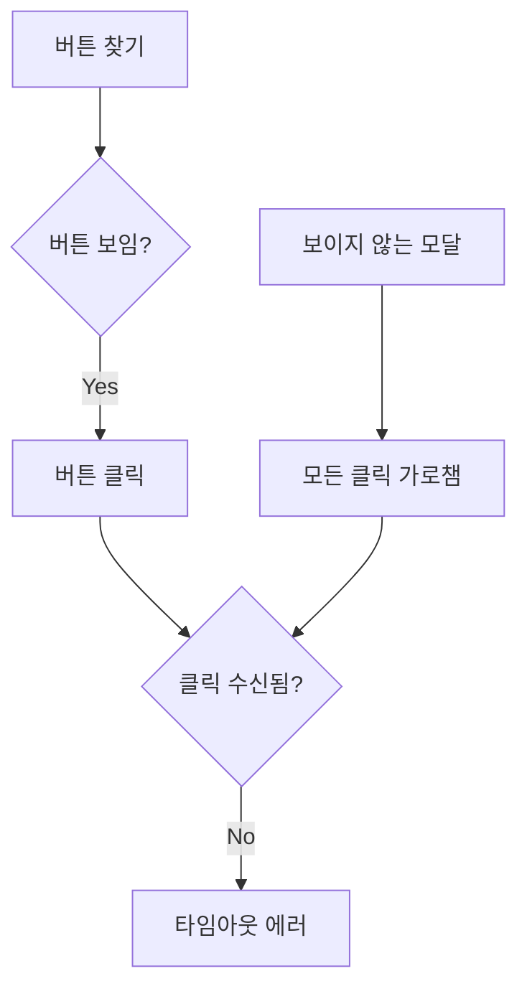
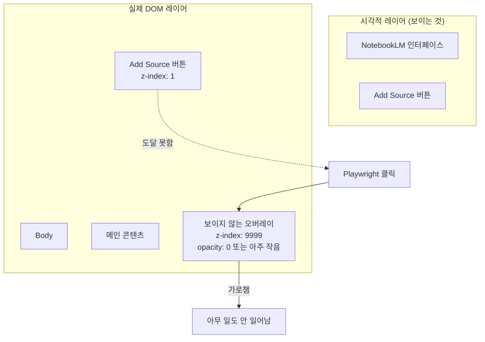
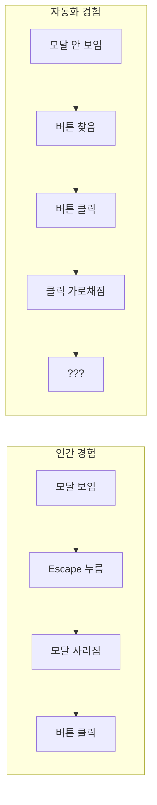

## 문제 상황

NotebookLM 업로드를 위한 Playwright 자동화가 실패했다:

```
Add source button not clickable
```

스크린샷에는 버튼이 보였다. 보이는 상태였다. 셀렉터가 찾았다. 하지만 클릭이 등록되지 않았다.



## 조사 과정

실패 전에 디버그 스크린샷을 찍어보니 진실이 드러났다: Google UI가 보이지 않는 모달 오버레이를 생성해 놓았다.

다음 중 하나였을 수 있다:
- 입력을 기다리는 검색 다이얼로그
- 프로모션 팝업
- 동의 다이얼로그
- 온보딩 툴팁

무엇이든 간에, `z-index: 9999`와 보이지 않는 스타일링으로 타겟 버튼 위에 앉아서 모든 클릭을 조용히 먹어버리고 있었다.



## 전형적인 증상

이것들이 함께 나타나면, 보이지 않는 오버레이를 의심하라:

| 증상 | 보이는 것 |
|------|----------|
| 요소 발견됨 | 셀렉터가 요소를 반환 |
| 요소 보임 | `isVisible()`이 true 반환 |
| 클릭 실패 | 타임아웃 또는 효과 없음 |
| 스크린샷은 정상 | 타겟 요소가 명확히 보임 |
| 수동 클릭은 작동 | 하지만 자동화는 안 됨 |

## 해결 방법

중요한 인터랙션 전에 모달을 제거하는 `dismissOverlays()` 유틸리티를 만들었다:

```typescript
async function dismissOverlays(page: Page) {
  // Escape를 여러 번 눌러 다이얼로그 닫기
  for (let i = 0; i < 3; i++) {
    await page.keyboard.press("Escape");
    await page.waitForTimeout(200);
  }
  
  // 안전한 영역 클릭으로 click-away 모달 닫기
  try {
    await page.click("body", { 
      position: { x: 0, y: 0 }, 
      force: true 
    });
  } catch {
    // 클릭 실패 무시
  }
}
```

사용 패턴:

```typescript
// 모든 중요한 Google UI 인터랙션 전에
await dismissOverlays(page);
await page.waitForTimeout(500); // 애니메이션 안정화
await page.click('button[aria-label="Add source"]');
```

## Google UI가 특별한 이유

Google 제품은 모달을 **사랑한다**. 다음 용도로 사용한다:

- 기능 안내
- 계정 프롬프트 ("새 기능을 사용해 보세요!")
- 검색 바로가기
- 동의 다이얼로그 (GDPR 등)
- 키보드 단축키 오버레이
- "새로운 기능" 투어

이런 모달들은 인간에게는 닫기 쉽게(Escape 누르기, 바깥 클릭) 설계되었지만, 타겟 요소 존재 여부만 확인하는 자동화 스크립트에게는 보이지 않는다.



## 예방 패턴

모든 Google UI 자동화에 이것을 표준 관행으로 만들어라:

```typescript
async function safeClick(page: Page, selector: string) {
  // 1단계: 오버레이 제거
  await dismissOverlays(page);
  
  // 2단계: 애니메이션 대기
  await page.waitForTimeout(500);
  
  // 3단계: 요소 대기
  await page.waitForSelector(selector, { state: 'visible' });
  
  // 4단계: 증가된 타임아웃으로 클릭
  await page.click(selector, { timeout: 10000 });
}

// 사용법
await safeClick(page, 'button[aria-label="Add source"]');
```

## 디버깅 체크리스트

클릭이 조용히 실패할 때:

1. **스크린샷 찍기** - 실패하는 액션 전에
2. **z-index 검사** - 높은 z-index 요소 찾기
3. **오버레이 확인** - DOM에서 `role="dialog"` 또는 `aria-modal` 검색
4. **Escape 키 시도** - 숨겨진 모달을 대부분 닫는다
5. **force: true 사용** - 최후의 수단, Playwright의 actionability 체크 우회

```typescript
// 핵 옵션: force 클릭은 오버레이 무시
await page.click(selector, { force: true });
// 주의: 의도된 차단 모달을 "통과"하여 클릭할 수 있음
```

## 핵심 교훈

1. **보임 ≠ 클릭 가능** - 요소가 보여도 투명한 오버레이에 막힐 수 있다
2. **Google은 모달을 사랑한다** - Google 제품 자동화에서 항상 예상하라
3. **Escape는 친구다** - 여러 번 누르면 대부분의 오버레이가 닫힌다
4. **실패 전 스크린샷** - 시각적 증거가 셀렉터가 못하는 것을 보여준다
5. **dismissOverlays()를 표준으로** - 모든 중요한 인터랙션 전에 호출하라

요소는 거기 있다. 보인다. 하지만 보이지 않는 무언가가 클릭과 타겟 사이에 앉아 있다. 현대 웹 UI 자동화에 온 것을 환영한다.
