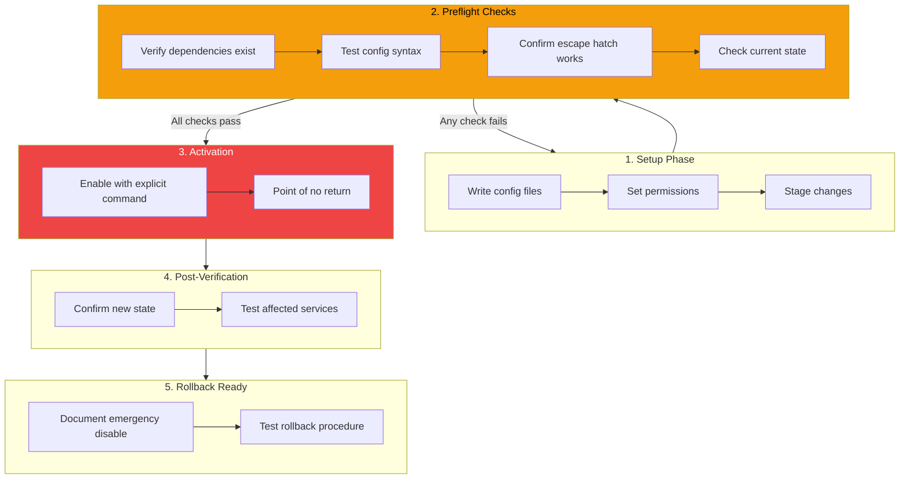

## The Nightmare Scenario

You're configuring firewall rules on a remote Mac Mini. You SSH in over Tailscale, run `pfctl -e` to enable your new rules, and... silence. Your terminal hangs. You've just locked yourself out.

One wrong rule in a firewall configuration can cut off all remote access. The server is still running, but you can't reach it. Time to drive to the data center.

This is preventable with a simple pattern: **preflight verification**.

## The Preflight Pattern



The key insight: **Separate verification from execution.** Make the "check if safe" step explicit and comprehensive before the "do the dangerous thing" step.

## Phase 1: Setup (Non-Destructive)

Create all configuration files without activating them:

```bash
# Write pf.conf rules
cat > /etc/pf.anchors/moltbot << 'EOF'
# Allow Tailscale (100.x.x.x range)
pass in quick on utun+ from 100.64.0.0/10 to any
pass out quick on utun+ from any to 100.64.0.0/10

# Block everything else from outside
block in on en0
EOF

# Set correct permissions
chmod 644 /etc/pf.anchors/moltbot
```

At this point, nothing has changed. The rules exist but aren't active.

## Phase 2: Preflight Checks (Read-Only)

Before enabling anything, verify every assumption:

```bash
#!/bin/bash
# preflight-check.sh - Verify before enabling firewall

ERRORS=0

# Check 1: Tailscale interface exists
echo -n "Checking Tailscale interface... "
if ifconfig | grep -q "utun"; then
    echo "OK (utun+ found)"
else
    echo "FAIL (no utun interface)"
    ((ERRORS++))
fi

# Check 2: Tailscale IP assigned
echo -n "Checking Tailscale IP... "
TAILSCALE_IP=$(ifconfig | grep "inet 100\." | awk '{print $2}')
if [[ -n "$TAILSCALE_IP" ]]; then
    echo "OK ($TAILSCALE_IP)"
else
    echo "FAIL (no 100.x.x.x IP)"
    ((ERRORS++))
fi

# Check 3: Config syntax valid
echo -n "Checking pf.conf syntax... "
if pfctl -n -f /etc/pf.conf 2>/dev/null; then
    echo "OK"
else
    echo "FAIL (syntax error)"
    ((ERRORS++))
fi

# Check 4: Anchor file exists
echo -n "Checking anchor file... "
if [[ -f /etc/pf.anchors/moltbot ]]; then
    echo "OK"
else
    echo "FAIL (missing)"
    ((ERRORS++))
fi

# Check 5: Current SSH session is via Tailscale
echo -n "Checking SSH connection... "
SSH_CLIENT_IP=$(echo $SSH_CLIENT | awk '{print $1}')
if [[ "$SSH_CLIENT_IP" == 100.* ]]; then
    echo "OK (connected via Tailscale: $SSH_CLIENT_IP)"
else
    echo "WARNING (not via Tailscale: $SSH_CLIENT_IP)"
    echo "  If you enable firewall, this session may be cut off!"
    ((ERRORS++))
fi

# Summary
echo ""
if [[ $ERRORS -eq 0 ]]; then
    echo "All checks passed. Safe to proceed."
    exit 0
else
    echo "FAILED: $ERRORS check(s) failed. Do NOT enable firewall."
    exit 1
fi
```

Run the checks:

```bash
$ ./preflight-check.sh
Checking Tailscale interface... OK (utun+ found)
Checking Tailscale IP... OK (100.78.42.15)
Checking pf.conf syntax... OK
Checking anchor file... OK
Checking SSH connection... OK (connected via Tailscale: 100.64.0.2)

All checks passed. Safe to proceed.
```

Only if ALL checks pass do you proceed.

## Phase 3: Activation (Point of No Return)

Now, with confidence, enable the firewall:

```bash
# This is the dangerous command
sudo pfctl -e -f /etc/pf.conf

# Verify it's running
sudo pfctl -s info | grep "Status"
```

Keep this separate from setup. Never put activation in the same script as configuration.

## Phase 4: Post-Verification

Immediately after activation, verify the new state:

```bash
# Check firewall is enabled
sudo pfctl -s info | grep "Status: Enabled"

# Test Tailscale connectivity (from another device)
ping 100.78.42.15

# Verify rules are loaded
sudo pfctl -s rules | grep "pass in quick on utun+"
```

## Phase 5: Rollback Ready

Before you ever enable, document how to disable:

```bash
# Emergency disable command (save this!)
sudo pfctl -d

# Or with launchctl for persistent changes
sudo launchctl unload /System/Library/LaunchDaemons/com.apple.pfctl.plist
```

Test the rollback procedure BEFORE you need it. In a crisis, you won't have time to figure it out.

## The Complete Workflow

```bash
# 1. Setup (safe)
sudo ./setup-firewall-config.sh

# 2. Preflight (safe)
./preflight-check.sh || exit 1

# 3. Activate (dangerous)
echo "Enabling firewall in 5 seconds. Press Ctrl+C to abort."
sleep 5
sudo pfctl -e -f /etc/pf.conf

# 4. Verify (safe)
./post-verify.sh

# 5. Document rollback
echo "To disable: sudo pfctl -d"
```

## When to Use This Pattern

Any operation that is:
- **Remote**: You can't physically access the machine if something goes wrong
- **Irreversible**: Or at least hard to reverse without access
- **Network-affecting**: Firewalls, routing tables, interface configuration
- **Auth-affecting**: SSH keys, PAM configuration, user permissions

Examples:
- Firewall rule changes
- SSH configuration changes
- Network interface modifications
- DNS server changes on headless machines
- Automated deployment scripts

## Key Takeaways

1. **Never combine config and activation** - Write files in one step, enable in another
2. **Verify escape hatches first** - Confirm your connection method survives the change
3. **Test config syntax before applying** - Most tools have a dry-run mode
4. **Document rollback before you need it** - In a crisis, you won't have time to research
5. **Automate the checks** - A script catches what tired humans miss

The few minutes spent on preflight checks can save hours of recovery time. More importantly, they save the stress of realizing you've locked yourself out of a remote server at 11 PM on a Friday.

---

*This pattern emerged from configuring pf firewall rules on a remote Mac Mini over SSH via Tailscale. One wrong rule would have required physical access to recover. The preflight checks prevented that.*
