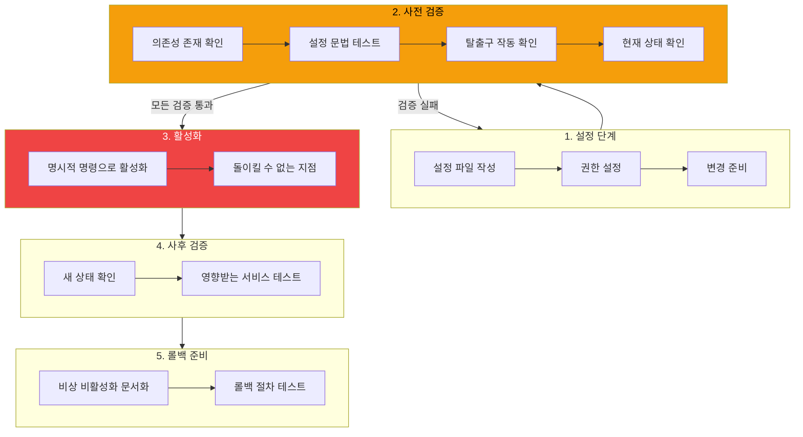

## 악몽 시나리오

원격 Mac Mini에서 방화벽 규칙을 설정 중이다. Tailscale을 통해 SSH로 접속하고, 새 규칙을 활성화하기 위해 `pfctl -e`를 실행하고... 침묵. 터미널이 멈춘다. 방금 스스로 잠겼다.

방화벽 설정에서 하나의 잘못된 규칙이 모든 원격 접근을 차단할 수 있다. 서버는 여전히 실행 중이지만 접근할 수 없다. 데이터 센터까지 운전해야 할 시간이다.

간단한 패턴으로 이것을 예방할 수 있다: **사전 검증**.

## 사전 검증 패턴



핵심 통찰: **검증과 실행을 분리한다.** "안전한지 확인" 단계를 "위험한 것 실행" 단계 전에 명시적이고 포괄적으로 만든다.

## 1단계: 설정 (비파괴적)

활성화하지 않고 모든 설정 파일을 생성한다:

```bash
# pf.conf 규칙 작성
cat > /etc/pf.anchors/moltbot << 'EOF'
# Tailscale 허용 (100.x.x.x 범위)
pass in quick on utun+ from 100.64.0.0/10 to any
pass out quick on utun+ from any to 100.64.0.0/10

# 외부에서 나머지 모두 차단
block in on en0
EOF

# 올바른 권한 설정
chmod 644 /etc/pf.anchors/moltbot
```

이 시점에서 아무것도 변경되지 않았다. 규칙은 존재하지만 활성화되지 않았다.

## 2단계: 사전 검증 (읽기 전용)

활성화 전 모든 가정을 검증한다:

```bash
#!/bin/bash
# preflight-check.sh - 방화벽 활성화 전 검증

ERRORS=0

# 검증 1: Tailscale 인터페이스 존재
echo -n "Tailscale 인터페이스 확인 중... "
if ifconfig | grep -q "utun"; then
    echo "OK (utun+ 발견)"
else
    echo "실패 (utun 인터페이스 없음)"
    ((ERRORS++))
fi

# 검증 2: Tailscale IP 할당됨
echo -n "Tailscale IP 확인 중... "
TAILSCALE_IP=$(ifconfig | grep "inet 100\." | awk '{print $2}')
if [[ -n "$TAILSCALE_IP" ]]; then
    echo "OK ($TAILSCALE_IP)"
else
    echo "실패 (100.x.x.x IP 없음)"
    ((ERRORS++))
fi

# 검증 3: 설정 문법 유효
echo -n "pf.conf 문법 확인 중... "
if pfctl -n -f /etc/pf.conf 2>/dev/null; then
    echo "OK"
else
    echo "실패 (문법 오류)"
    ((ERRORS++))
fi

# 검증 4: 앵커 파일 존재
echo -n "앵커 파일 확인 중... "
if [[ -f /etc/pf.anchors/moltbot ]]; then
    echo "OK"
else
    echo "실패 (누락)"
    ((ERRORS++))
fi

# 검증 5: 현재 SSH 세션이 Tailscale을 통함
echo -n "SSH 연결 확인 중... "
SSH_CLIENT_IP=$(echo $SSH_CLIENT | awk '{print $1}')
if [[ "$SSH_CLIENT_IP" == 100.* ]]; then
    echo "OK (Tailscale을 통해 연결됨: $SSH_CLIENT_IP)"
else
    echo "경고 (Tailscale이 아님: $SSH_CLIENT_IP)"
    echo "  방화벽 활성화 시 이 세션이 끊길 수 있음!"
    ((ERRORS++))
fi

# 요약
echo ""
if [[ $ERRORS -eq 0 ]]; then
    echo "모든 검증 통과. 진행해도 안전함."
    exit 0
else
    echo "실패: $ERRORS개 검증 실패. 방화벽 활성화 금지."
    exit 1
fi
```

검증 실행:

```bash
$ ./preflight-check.sh
Tailscale 인터페이스 확인 중... OK (utun+ 발견)
Tailscale IP 확인 중... OK (100.78.42.15)
pf.conf 문법 확인 중... OK
앵커 파일 확인 중... OK
SSH 연결 확인 중... OK (Tailscale을 통해 연결됨: 100.64.0.2)

모든 검증 통과. 진행해도 안전함.
```

모든 검증이 통과해야만 진행한다.

## 3단계: 활성화 (돌이킬 수 없는 지점)

이제 확신을 가지고 방화벽을 활성화한다:

```bash
# 위험한 명령
sudo pfctl -e -f /etc/pf.conf

# 실행 중인지 확인
sudo pfctl -s info | grep "Status"
```

설정과 분리해서 유지한다. 설정과 같은 스크립트에 활성화를 넣지 않는다.

## 4단계: 사후 검증

활성화 직후 새 상태를 검증한다:

```bash
# 방화벽 활성화됨 확인
sudo pfctl -s info | grep "Status: Enabled"

# Tailscale 연결 테스트 (다른 기기에서)
ping 100.78.42.15

# 규칙 로드됨 확인
sudo pfctl -s rules | grep "pass in quick on utun+"
```

## 5단계: 롤백 준비

활성화 전에 비활성화 방법을 문서화한다:

```bash
# 비상 비활성화 명령 (저장해두라!)
sudo pfctl -d

# 또는 영구 변경을 위해 launchctl 사용
sudo launchctl unload /System/Library/LaunchDaemons/com.apple.pfctl.plist
```

롤백 절차를 필요하기 전에 테스트한다. 위기 상황에서는 알아낼 시간이 없다.

## 완전한 워크플로우

```bash
# 1. 설정 (안전)
sudo ./setup-firewall-config.sh

# 2. 사전 검증 (안전)
./preflight-check.sh || exit 1

# 3. 활성화 (위험)
echo "5초 후 방화벽 활성화. 중단하려면 Ctrl+C."
sleep 5
sudo pfctl -e -f /etc/pf.conf

# 4. 검증 (안전)
./post-verify.sh

# 5. 롤백 문서화
echo "비활성화하려면: sudo pfctl -d"
```

## 이 패턴을 사용할 때

다음과 같은 작업:
- **원격**: 문제 발생 시 물리적 접근 불가
- **되돌릴 수 없음**: 또는 접근 없이는 되돌리기 어려움
- **네트워크 영향**: 방화벽, 라우팅 테이블, 인터페이스 설정
- **인증 영향**: SSH 키, PAM 설정, 사용자 권한

예시:
- 방화벽 규칙 변경
- SSH 설정 변경
- 네트워크 인터페이스 수정
- 헤드리스 머신의 DNS 서버 변경
- 자동화된 배포 스크립트

## 핵심 정리

1. **설정과 활성화를 절대 결합하지 않는다** - 파일 작성과 활성화를 별도 단계로
2. **탈출구를 먼저 검증한다** - 연결 방법이 변경 후에도 유지되는지 확인
3. **적용 전 설정 문법 테스트** - 대부분의 도구에 dry-run 모드가 있다
4. **필요 전에 롤백을 문서화한다** - 위기 상황에서는 조사할 시간이 없다
5. **검증을 자동화한다** - 스크립트가 피곤한 인간이 놓치는 것을 잡아낸다

사전 검증에 쓰는 몇 분이 복구에 쓰는 몇 시간을 절약할 수 있다. 더 중요하게, 금요일 밤 11시에 원격 서버에서 잠겼다는 것을 깨닫는 스트레스를 절약한다.

---

*이 패턴은 Tailscale을 통해 SSH로 원격 Mac Mini에서 pf 방화벽 규칙을 설정하면서 나타났다. 하나의 잘못된 규칙이 물리적 접근을 요구했을 것이다. 사전 검증이 그것을 방지했다.*
