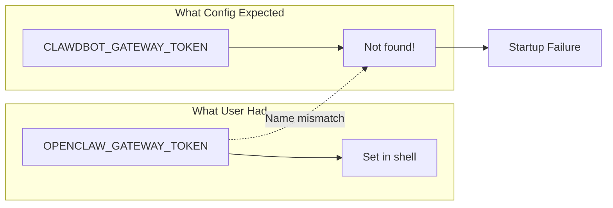
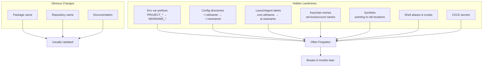

## The Problem

A gateway service refused to start with a cryptic error:

```
MissingEnvVarError: Missing env var "CLAWDBOT_GATEWAY_TOKEN" 
referenced at config path: gateway.auth.token
```

The token existed. It was correctly set. But under a different name.



## The Investigation

The project had been renamed twice:

```
clawdbot → moltbot → openclaw
```

But the config file at `~/.clawdbot/moltbot.json` (yes, that path alone shows the problem) still referenced the original prefix:

```json
{
  "gateway": {
    "auth": {
      "token": "${CLAWDBOT_GATEWAY_TOKEN}"
    }
  }
}
```

Meanwhile, documentation and new setups all used `OPENCLAW_*` variables.

## The Archaeology of a Rename

When you rename a project, you're not just changing one string. You're fighting an entire ecosystem of hardcoded references:



## The Resolution

1. **Immediate fix**: Updated config to use `${OPENCLAW_GATEWAY_TOKEN}`
2. **Renamed artifacts**: Updated Keychain entries and wrapper scripts
3. **Added migration warnings**: Doctor command now detects deprecated vars:

```bash
$ openclaw doctor
- Deprecated legacy environment variables detected (ignored).
- Use OPENCLAW_* equivalents instead:
  CLAWDBOT_GATEWAY_TOKEN -> OPENCLAW_GATEWAY_TOKEN
```

## A Proper Migration Strategy

For any project rename, implement these safeguards:

### 1. Backwards Compatibility Window

Keep old names working for 2-3 versions with deprecation warnings:

```python
def get_token():
    # New name takes priority
    token = os.environ.get('OPENCLAW_GATEWAY_TOKEN')
    
    # Fall back to legacy with warning
    if not token:
        token = os.environ.get('CLAWDBOT_GATEWAY_TOKEN')
        if token:
            warn("CLAWDBOT_GATEWAY_TOKEN is deprecated. Use OPENCLAW_GATEWAY_TOKEN")
    
    return token
```

### 2. Migration Documentation

Create a dedicated migration guide listing every artifact:

```markdown
## Migration Checklist: clawdbot → openclaw

### Environment Variables
| Old | New |
|-----|-----|
| CLAWDBOT_GATEWAY_TOKEN | OPENCLAW_GATEWAY_TOKEN |
| CLAWDBOT_API_KEY | OPENCLAW_API_KEY |

### File Locations
| Old | New |
|-----|-----|
| ~/.clawdbot/ | ~/.openclaw/ |
| /var/log/clawdbot/ | /var/log/openclaw/ |
```

### 3. Automated Detection

Build detection into your CLI:

```bash
$ openclaw migrate --check
Found legacy artifacts:
  - ~/.clawdbot/config.json (should be ~/.openclaw/config.json)
  - CLAWDBOT_GATEWAY_TOKEN in environment
  - LaunchAgent com.clawdbot.gateway still registered

Run 'openclaw migrate --apply' to fix automatically.
```

## Key Takeaways

1. **Renaming is refactoring** - It touches far more than you think
2. **Users have long memories** - Their configs and scripts remember old names forever
3. **Fail gracefully** - Log warnings for deprecated names instead of crashing
4. **Automate migration** - Provide tooling to find and fix legacy references
5. **Document exhaustively** - Create a migration checklist covering every artifact type

The project rename that "only takes an hour" is a lie we tell ourselves. Budget for the archaeology expedition that follows.
