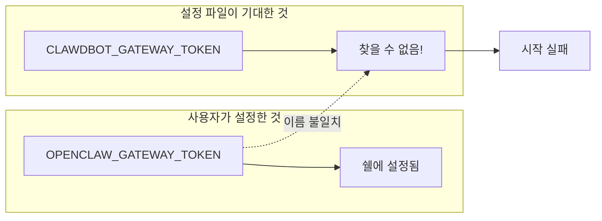
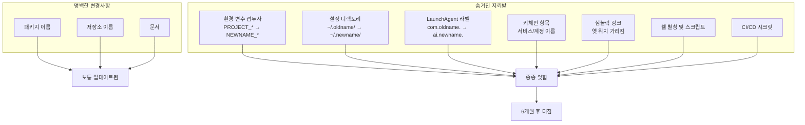

## 문제 상황

게이트웨이 서비스가 알 수 없는 에러와 함께 시작을 거부했다:

```
MissingEnvVarError: Missing env var "CLAWDBOT_GATEWAY_TOKEN" 
referenced at config path: gateway.auth.token
```

토큰은 존재했다. 정확히 설정되어 있었다. 다만 다른 이름으로.



## 조사 과정

프로젝트가 두 번 이름이 바뀌었다:

```
clawdbot → moltbot → openclaw
```

하지만 `~/.clawdbot/moltbot.json` 경로의 설정 파일은 (그렇다, 이 경로 자체가 문제를 보여준다) 여전히 원래 접두사를 참조하고 있었다:

```json
{
  "gateway": {
    "auth": {
      "token": "${CLAWDBOT_GATEWAY_TOKEN}"
    }
  }
}
```

한편 문서와 새로운 설정은 모두 `OPENCLAW_*` 변수를 사용하고 있었다.

## 이름 변경의 고고학

프로젝트 이름을 바꿀 때, 단순히 문자열 하나를 바꾸는 게 아니다. 하드코딩된 참조로 가득한 전체 생태계와 싸우는 것이다:



## 해결 방법

1. **즉각적 수정**: 설정을 `${OPENCLAW_GATEWAY_TOKEN}` 사용하도록 변경
2. **아티팩트 이름 변경**: 키체인 항목과 래퍼 스크립트 업데이트
3. **마이그레이션 경고 추가**: Doctor 명령이 이제 deprecated 변수를 감지:

```bash
$ openclaw doctor
- Deprecated legacy environment variables detected (ignored).
- Use OPENCLAW_* equivalents instead:
  CLAWDBOT_GATEWAY_TOKEN -> OPENCLAW_GATEWAY_TOKEN
```

## 적절한 마이그레이션 전략

프로젝트 이름 변경 시 다음 안전장치를 구현해야 한다:

### 1. 하위 호환성 유지 기간

2-3 버전 동안 옛 이름이 deprecation 경고와 함께 작동하도록 유지한다:

```python
def get_token():
    # 새 이름 우선
    token = os.environ.get('OPENCLAW_GATEWAY_TOKEN')
    
    # 경고와 함께 레거시로 폴백
    if not token:
        token = os.environ.get('CLAWDBOT_GATEWAY_TOKEN')
        if token:
            warn("CLAWDBOT_GATEWAY_TOKEN is deprecated. Use OPENCLAW_GATEWAY_TOKEN")
    
    return token
```

### 2. 마이그레이션 문서화

모든 아티팩트를 나열한 전용 마이그레이션 가이드를 만든다:

```markdown
## 마이그레이션 체크리스트: clawdbot → openclaw

### 환경 변수
| 이전 | 이후 |
|-----|-----|
| CLAWDBOT_GATEWAY_TOKEN | OPENCLAW_GATEWAY_TOKEN |
| CLAWDBOT_API_KEY | OPENCLAW_API_KEY |

### 파일 위치
| 이전 | 이후 |
|-----|-----|
| ~/.clawdbot/ | ~/.openclaw/ |
| /var/log/clawdbot/ | /var/log/openclaw/ |
```

### 3. 자동 감지

CLI에 감지 기능을 내장한다:

```bash
$ openclaw migrate --check
Found legacy artifacts:
  - ~/.clawdbot/config.json (should be ~/.openclaw/config.json)
  - CLAWDBOT_GATEWAY_TOKEN in environment
  - LaunchAgent com.clawdbot.gateway still registered

Run 'openclaw migrate --apply' to fix automatically.
```

## 핵심 교훈

1. **이름 변경은 리팩토링이다** - 생각보다 훨씬 많은 것에 영향을 미친다
2. **사용자는 기억력이 길다** - 그들의 설정과 스크립트는 옛 이름을 영원히 기억한다
3. **우아하게 실패하라** - deprecated 이름에 대해 크래시 대신 경고를 로그하라
4. **마이그레이션을 자동화하라** - 레거시 참조를 찾고 수정하는 도구를 제공하라
5. **철저하게 문서화하라** - 모든 아티팩트 유형을 다루는 마이그레이션 체크리스트를 만들어라

"한 시간이면 되는" 프로젝트 이름 변경은 우리가 스스로에게 하는 거짓말이다. 그 뒤에 따라올 고고학 탐험을 위한 시간을 확보해 두어라.
