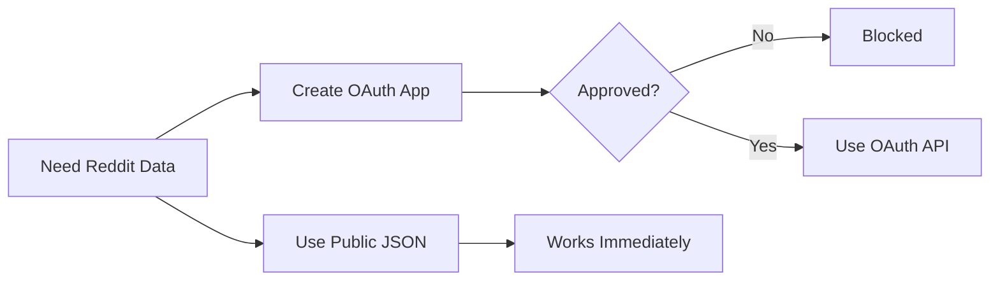
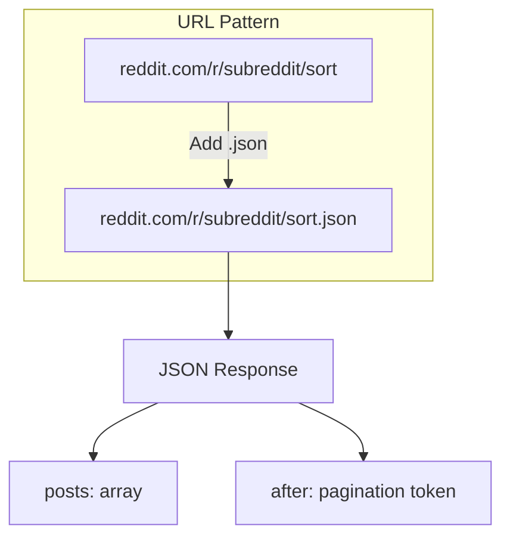
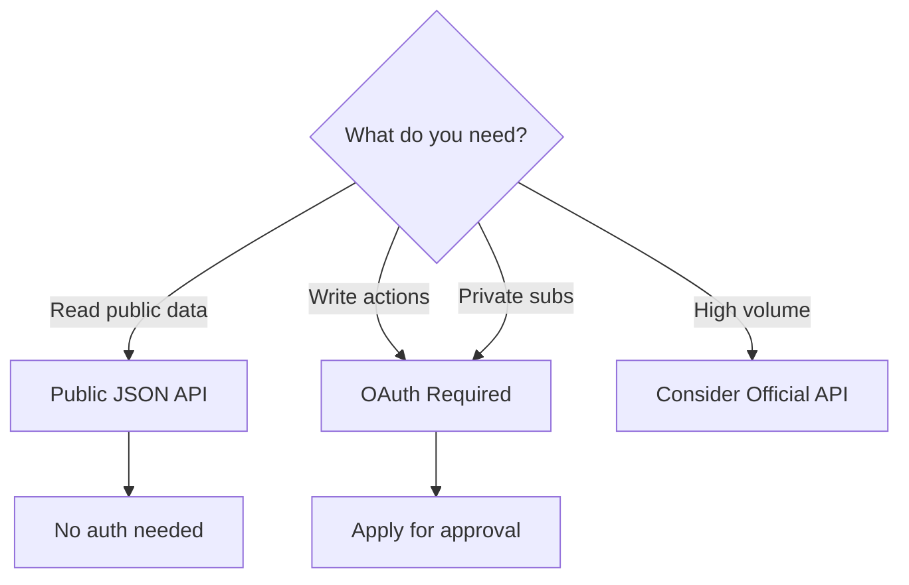

## The Problem

Creating a Reddit OAuth app at `reddit.com/prefs/apps` was blocked. The "Create App" button didn't work. Account restrictions kicked in.

Reddit's 2023 "Responsible Builder Policy" tightened API access, requiring application approval for new OAuth apps.



## The Investigation

### Dead Ends

1. **Official OAuth flow**: Blocked by policy
2. **Devvit (Reddit's dev platform)**: Built for apps running ON Reddit, not external tools
3. **Devvit limitations**: Can't download files locally - wrong use case entirely

### The Discovery

Reddit has a **public JSON API** that requires no authentication:

```bash
# Just add .json to any Reddit URL
curl "https://www.reddit.com/r/memes/hot.json?limit=10" \
  -H "User-Agent: MemeCollector/1.0"
```

That's it. No OAuth. No API keys. Just a User-Agent header.

## How It Works

Almost any Reddit page has a JSON endpoint:

| Page Type | JSON URL |
|-----------|----------|
| Subreddit hot | `reddit.com/r/memes/hot.json` |
| Subreddit new | `reddit.com/r/memes/new.json` |
| Subreddit top | `reddit.com/r/memes/top.json?t=week` |
| Post comments | `reddit.com/r/memes/comments/abc123.json` |
| User posts | `reddit.com/user/username/submitted.json` |



## The Implementation

```typescript
async function fetchRedditPosts(subreddit: string, sort: string, limit: number) {
  const url = `https://www.reddit.com/r/${subreddit}/${sort}.json?limit=${limit}`;
  
  const response = await fetch(url, {
    headers: {
      // User-Agent is REQUIRED - Reddit blocks requests without it
      'User-Agent': 'MemeCollector/1.0 (personal project)'
    }
  });
  
  if (!response.ok) {
    throw new Error(`Reddit API error: ${response.status}`);
  }
  
  const data = await response.json();
  return data.data.children.map(child => child.data);
}

// Usage
const memes = await fetchRedditPosts('memes', 'hot', 25);
```

## Rate Limits Comparison

| Access Method | Rate Limit | Auth Required |
|---------------|------------|---------------|
| OAuth API | 60 requests/minute | Yes (OAuth2) |
| Public JSON | ~30 requests/minute | No |
| Too aggressive | 429 errors | - |

The public API is rate-limited but sufficient for personal tools, bots, and scrapers.

## Caveats

### What Works
- Public subreddit listings
- Post content and metadata
- Comments on public posts
- User public submissions

### What Doesn't Work
- Private subreddits (need OAuth)
- Voting/posting actions (need OAuth)
- User-specific data (need OAuth)
- High-volume scraping (will get blocked)



## Best Practices

### 1. Always Set User-Agent

```typescript
// Bad - will be blocked
fetch('https://www.reddit.com/r/memes.json')

// Good - identifies your tool
fetch('https://www.reddit.com/r/memes.json', {
  headers: { 'User-Agent': 'MyTool/1.0' }
})
```

### 2. Respect Rate Limits

```typescript
// Add delay between requests
await new Promise(resolve => setTimeout(resolve, 2000));
```

### 3. Handle 429 Gracefully

```typescript
if (response.status === 429) {
  // Wait and retry
  await new Promise(resolve => setTimeout(resolve, 60000));
  return fetchRedditPosts(subreddit, sort, limit);
}
```

## Key Takeaways

1. **OAuth isn't always required** - Public JSON endpoints exist for many services
2. **Check for .json URLs** - Reddit, Hacker News, and others have them
3. **User-Agent is mandatory** - Reddit blocks requests without it
4. **Rate limits are real** - Respect them or get blocked
5. **Know your scope** - Public API for reads, OAuth for writes

When the official door closes, sometimes there's a simpler side entrance that was there all along.
