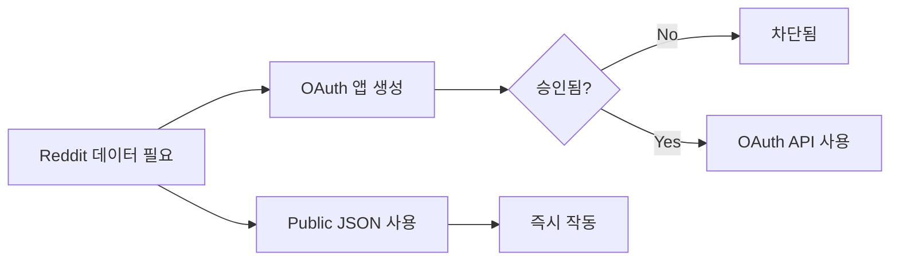
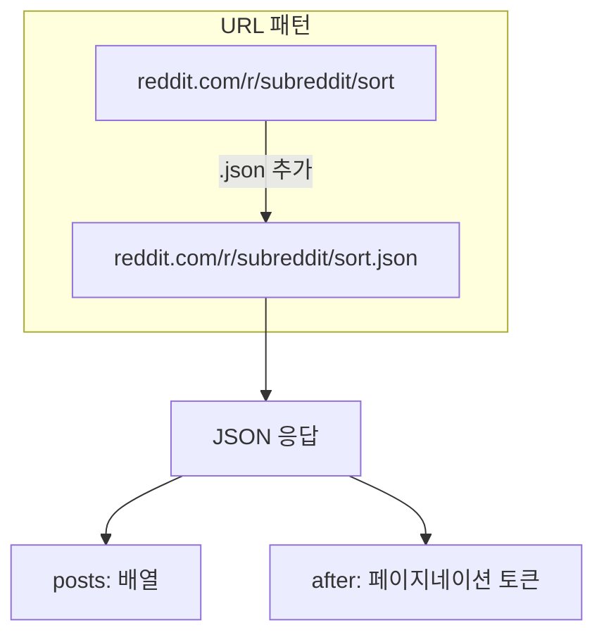
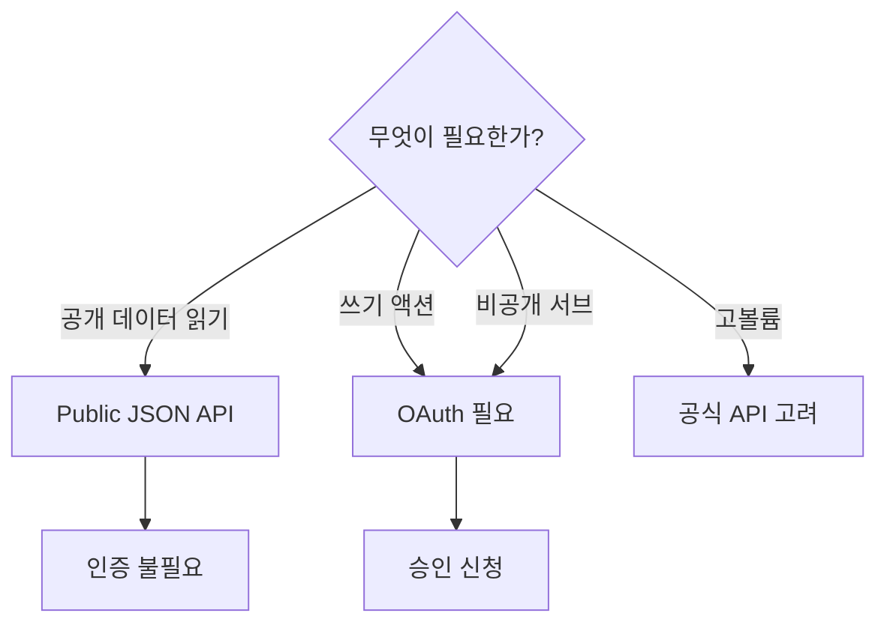

## 문제 상황

`reddit.com/prefs/apps`에서 Reddit OAuth 앱 생성이 차단되었다. "Create App" 버튼이 작동하지 않았다. 계정 제한이 적용되었다.

Reddit의 2023년 "Responsible Builder Policy"가 API 접근을 제한하여, 새 OAuth 앱에 대한 승인이 필요하게 되었다.



## 조사 과정

### 막다른 길들

1. **공식 OAuth 플로우**: 정책에 의해 차단
2. **Devvit (Reddit의 개발 플랫폼)**: Reddit 위에서 실행되는 앱용, 외부 도구용 아님
3. **Devvit 제한**: 로컬로 파일 다운로드 불가 - 완전히 다른 유스케이스

### 발견

Reddit에 인증이 필요 없는 **public JSON API**가 있었다:

```bash
# Reddit URL에 .json만 추가하면 됨
curl "https://www.reddit.com/r/memes/hot.json?limit=10" \
  -H "User-Agent: MemeCollector/1.0"
```

끝이다. OAuth 없음. API 키 없음. User-Agent 헤더만.

## 작동 방식

거의 모든 Reddit 페이지에 JSON 엔드포인트가 있다:

| 페이지 타입 | JSON URL |
|------------|----------|
| 서브레딧 hot | `reddit.com/r/memes/hot.json` |
| 서브레딧 new | `reddit.com/r/memes/new.json` |
| 서브레딧 top | `reddit.com/r/memes/top.json?t=week` |
| 포스트 댓글 | `reddit.com/r/memes/comments/abc123.json` |
| 유저 포스트 | `reddit.com/user/username/submitted.json` |



## 구현

```typescript
async function fetchRedditPosts(subreddit: string, sort: string, limit: number) {
  const url = `https://www.reddit.com/r/${subreddit}/${sort}.json?limit=${limit}`;
  
  const response = await fetch(url, {
    headers: {
      // User-Agent 필수 - Reddit이 없으면 요청 차단
      'User-Agent': 'MemeCollector/1.0 (personal project)'
    }
  });
  
  if (!response.ok) {
    throw new Error(`Reddit API error: ${response.status}`);
  }
  
  const data = await response.json();
  return data.data.children.map(child => child.data);
}

// 사용법
const memes = await fetchRedditPosts('memes', 'hot', 25);
```

## Rate Limit 비교

| 접근 방법 | Rate Limit | 인증 필요 |
|----------|------------|----------|
| OAuth API | 60 요청/분 | Yes (OAuth2) |
| Public JSON | ~30 요청/분 | No |
| 너무 공격적 | 429 에러 | - |

Public API는 rate limit이 있지만 개인 도구, 봇, 스크레이퍼에 충분하다.

## 주의사항

### 작동하는 것
- 공개 서브레딧 목록
- 포스트 콘텐츠 및 메타데이터
- 공개 포스트의 댓글
- 유저 공개 게시물

### 작동하지 않는 것
- 비공개 서브레딧 (OAuth 필요)
- 투표/포스팅 액션 (OAuth 필요)
- 유저 특정 데이터 (OAuth 필요)
- 고볼륨 스크래핑 (차단됨)



## 모범 사례

### 1. 항상 User-Agent 설정

```typescript
// 나쁨 - 차단됨
fetch('https://www.reddit.com/r/memes.json')

// 좋음 - 도구 식별
fetch('https://www.reddit.com/r/memes.json', {
  headers: { 'User-Agent': 'MyTool/1.0' }
})
```

### 2. Rate Limit 준수

```typescript
// 요청 사이에 딜레이 추가
await new Promise(resolve => setTimeout(resolve, 2000));
```

### 3. 429 우아하게 처리

```typescript
if (response.status === 429) {
  // 대기 후 재시도
  await new Promise(resolve => setTimeout(resolve, 60000));
  return fetchRedditPosts(subreddit, sort, limit);
}
```

## 핵심 교훈

1. **OAuth가 항상 필요한 건 아니다** - 많은 서비스에 public JSON 엔드포인트가 존재한다
2. **.json URL 확인** - Reddit, Hacker News 등이 가지고 있다
3. **User-Agent는 필수** - Reddit이 없으면 요청을 차단한다
4. **Rate limit은 실제다** - 준수하거나 차단당한다
5. **범위를 파악하라** - 읽기는 public API, 쓰기는 OAuth

공식 문이 닫힐 때, 가끔 줄곧 거기 있던 더 간단한 옆문이 있다.
