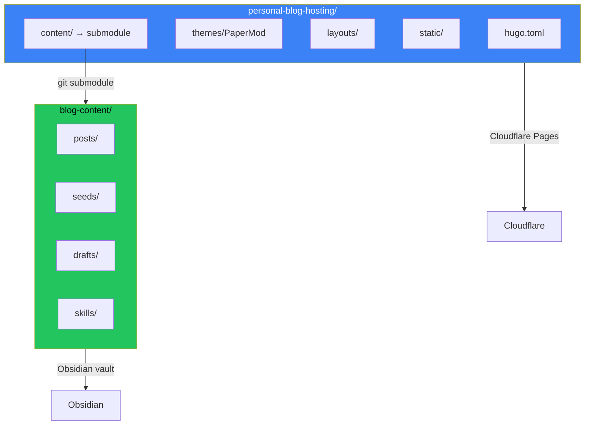

## The Monorepo Problem

Original setup: everything in one repo.

```
personal-blog/
├── hugo.toml
├── themes/PaperMod/
├── layouts/
├── static/
└── content/
    ├── posts/
    ├── seeds/
    └── drafts/
```

Problems emerged:
- Obsidian synced Hugo config files it didn't need
- Content changes required pushing the infrastructure repo
- Git history mixed theme updates with blog posts
- Different concerns, same commit log

## The Two-Repo Architecture



Two repositories:
1. **personal-blog-hosting**: Hugo infrastructure, theme, layouts
2. **blog-content**: Posts, seeds, drafts - also an Obsidian vault

The content repo is linked as a git submodule.

## Why This Separation Matters

### For Obsidian Users

Your Obsidian vault IS your content repo:
- Write in Obsidian → auto-synced
- No Hugo configs polluting your vault
- Clean file list, just content

### For Deployment

Cloudflare Pages builds from the hosting repo:
- Pulls submodule automatically
- Content updates trigger rebuilds
- Infrastructure changes are separate

### For Git History

```bash
# Content repo history
feat: add post about AI agents
fix: typo in kubernetes post
feat: new seed from debugging session

# Hosting repo history  
chore: update PaperMod theme
feat: add custom shortcode for diagrams
fix: mobile nav breakpoint
```

Clean, focused histories for each concern.

## Setup Guide

### Step 1: Create Content Repo

```bash
# Create new repo for content
mkdir blog-content
cd blog-content
git init

# Move content from monorepo
mv ../personal-blog/content/posts .
mv ../personal-blog/content/seeds .
mv ../personal-blog/content/drafts .

git add .
git commit -m "initial: migrate content from monorepo"
git remote add origin git@github.com:user/blog-content.git
git push -u origin main
```

### Step 2: Add as Submodule

```bash
# In hosting repo
cd personal-blog-hosting
rm -rf content  # Remove old content directory

# Add content repo as submodule
git submodule add git@github.com:user/blog-content.git content
git commit -m "feat: add content as submodule"
```

### Step 3: Configure Obsidian

Open `blog-content/` as your Obsidian vault:
- Posts are directly editable
- No Hugo configs visible
- Standard Obsidian workflow

### Step 4: Configure Cloudflare Pages

In Cloudflare Pages settings:
- Repository: `personal-blog-hosting`
- Build command: `hugo --gc --minify`
- Enable "Include submodules" in build settings

## Daily Workflow

### Writing Content

```bash
# In Obsidian (or directly)
cd blog-content
# Write your post...
git add posts/new-post.md
git commit -m "feat: add new post"
git push
```

### Updating Infrastructure

```bash
cd personal-blog-hosting
# Make theme/layout changes...
git add .
git commit -m "feat: update theme"
git push
```

### Updating Submodule Reference

When content repo has new commits:

```bash
cd personal-blog-hosting
git submodule update --remote content
git add content
git commit -m "chore: update content submodule"
git push
```

## Gotchas

### Cloudflare Submodule Builds

Ensure "Include submodules" is enabled in build settings. Without it, the content directory will be empty.

### Local Development

After cloning the hosting repo:

```bash
git clone --recurse-submodules git@github.com:user/personal-blog-hosting.git
# Or if already cloned:
git submodule update --init --recursive
```

### Obsidian Git Plugin

If using Obsidian Git plugin, point it at the content repo only. Don't try to manage the hosting repo from Obsidian.

## Alternative: Symlinks

If submodules feel too complex, use symlinks:

```bash
# In hosting repo
ln -s ../blog-content content
```

Downside: Cloudflare can't follow symlinks. You'd need a build script to copy content.

## Key Takeaways

1. **Separate concerns, separate repos** - Infrastructure and content have different change patterns
2. **Obsidian vault = content repo** - Clean writing environment
3. **Submodules link them** - Hosting repo references content repo
4. **Deploy from hosting** - Cloudflare pulls both during build
5. **Clean git histories** - Each repo tells its own story

The initial setup takes an hour. The ongoing clarity is worth it, especially if you're using Obsidian as your writing environment.

---

*This architecture emerged from the frustration of seeing hugo.toml in my Obsidian file list. Separation made both the writing and development workflows cleaner.*
