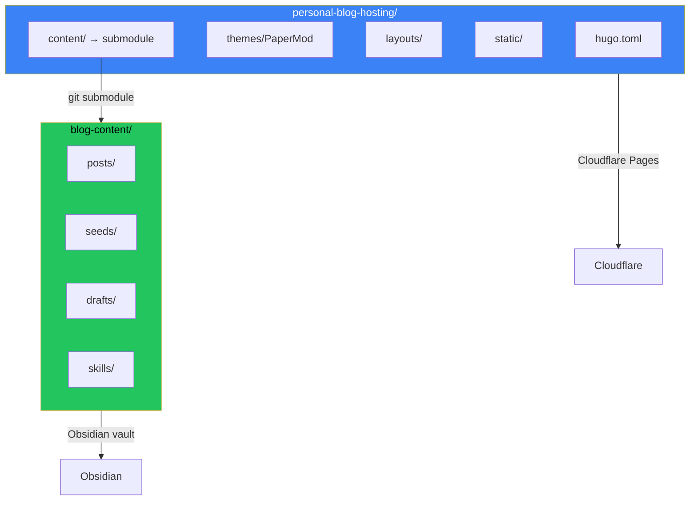

## 모노레포 문제

원래 설정: 모든 것이 하나의 저장소에.

```
personal-blog/
├── hugo.toml
├── themes/PaperMod/
├── layouts/
├── static/
└── content/
    ├── posts/
    ├── seeds/
    └── drafts/
```

문제가 나타났다:
- Obsidian이 필요 없는 Hugo 설정 파일을 동기화
- 콘텐츠 변경에 인프라 저장소 푸시 필요
- Git 히스토리가 테마 업데이트와 블로그 포스트를 혼합
- 다른 관심사, 같은 커밋 로그

## 두 개의 저장소 아키텍처



두 개의 저장소:
1. **personal-blog-hosting**: Hugo 인프라, 테마, 레이아웃
2. **blog-content**: 포스트, 시드, 드래프트 - Obsidian 볼트이기도 함

콘텐츠 저장소가 git 서브모듈로 연결된다.

## 이 분리가 중요한 이유

### Obsidian 사용자를 위해

Obsidian 볼트가 콘텐츠 저장소다:
- Obsidian에서 작성 → 자동 동기화
- Hugo 설정이 볼트를 오염시키지 않음
- 깔끔한 파일 목록, 콘텐츠만

### 배포를 위해

Cloudflare Pages가 호스팅 저장소에서 빌드:
- 서브모듈을 자동으로 가져옴
- 콘텐츠 업데이트가 리빌드 트리거
- 인프라 변경은 별도

### Git 히스토리를 위해

```bash
# 콘텐츠 저장소 히스토리
feat: AI 에이전트에 대한 포스트 추가
fix: 쿠버네티스 포스트 오타
feat: 디버깅 세션에서 새 시드

# 호스팅 저장소 히스토리  
chore: PaperMod 테마 업데이트
feat: 다이어그램용 커스텀 숏코드 추가
fix: 모바일 내비 브레이크포인트
```

각 관심사에 대해 깔끔하고 집중된 히스토리.

## 설정 가이드

### 1단계: 콘텐츠 저장소 생성

```bash
# 콘텐츠용 새 저장소 생성
mkdir blog-content
cd blog-content
git init

# 모노레포에서 콘텐츠 이동
mv ../personal-blog/content/posts .
mv ../personal-blog/content/seeds .
mv ../personal-blog/content/drafts .

git add .
git commit -m "initial: migrate content from monorepo"
git remote add origin git@github.com:user/blog-content.git
git push -u origin main
```

### 2단계: 서브모듈로 추가

```bash
# 호스팅 저장소에서
cd personal-blog-hosting
rm -rf content  # 기존 콘텐츠 디렉토리 제거

# 콘텐츠 저장소를 서브모듈로 추가
git submodule add git@github.com:user/blog-content.git content
git commit -m "feat: add content as submodule"
```

### 3단계: Obsidian 설정

`blog-content/`를 Obsidian 볼트로 열기:
- 포스트가 직접 편집 가능
- Hugo 설정 안 보임
- 표준 Obsidian 워크플로우

### 4단계: Cloudflare Pages 설정

Cloudflare Pages 설정에서:
- 저장소: `personal-blog-hosting`
- 빌드 명령: `hugo --gc --minify`
- 빌드 설정에서 "Include submodules" 활성화

## 일상 워크플로우

### 콘텐츠 작성

```bash
# Obsidian에서 (또는 직접)
cd blog-content
# 포스트 작성...
git add posts/new-post.md
git commit -m "feat: add new post"
git push
```

### 인프라 업데이트

```bash
cd personal-blog-hosting
# 테마/레이아웃 변경...
git add .
git commit -m "feat: update theme"
git push
```

### 서브모듈 참조 업데이트

콘텐츠 저장소에 새 커밋이 있을 때:

```bash
cd personal-blog-hosting
git submodule update --remote content
git add content
git commit -m "chore: update content submodule"
git push
```

## 주의점

### Cloudflare 서브모듈 빌드

빌드 설정에서 "Include submodules" 활성화 확인. 없으면 콘텐츠 디렉토리가 비어 있다.

### 로컬 개발

호스팅 저장소 클론 후:

```bash
git clone --recurse-submodules git@github.com:user/personal-blog-hosting.git
# 또는 이미 클론했으면:
git submodule update --init --recursive
```

### Obsidian Git 플러그인

Obsidian Git 플러그인 사용 시 콘텐츠 저장소만 가리킨다. Obsidian에서 호스팅 저장소 관리 시도하지 않는다.

## 대안: 심볼릭 링크

서브모듈이 너무 복잡하면 심볼릭 링크 사용:

```bash
# 호스팅 저장소에서
ln -s ../blog-content content
```

단점: Cloudflare가 심볼릭 링크를 따라갈 수 없다. 콘텐츠를 복사하는 빌드 스크립트가 필요하다.

## 핵심 정리

1. **관심사 분리, 저장소 분리** - 인프라와 콘텐츠는 다른 변경 패턴을 가짐
2. **Obsidian 볼트 = 콘텐츠 저장소** - 깔끔한 작성 환경
3. **서브모듈이 연결** - 호스팅 저장소가 콘텐츠 저장소 참조
4. **호스팅에서 배포** - Cloudflare가 빌드 중 둘 다 가져옴
5. **깔끔한 git 히스토리** - 각 저장소가 자신의 이야기를 말함

초기 설정에 한 시간이 걸린다. 지속적인 명확함은 그만한 가치가 있다. 특히 Obsidian을 작성 환경으로 사용한다면.

---

*이 아키텍처는 Obsidian 파일 목록에서 hugo.toml을 보는 좌절에서 나타났다. 분리가 작성과 개발 워크플로우 둘 다 깔끔하게 만들었다.*
