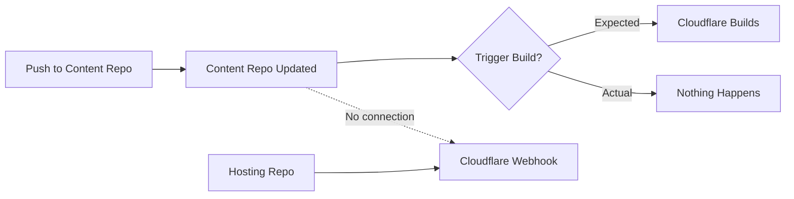
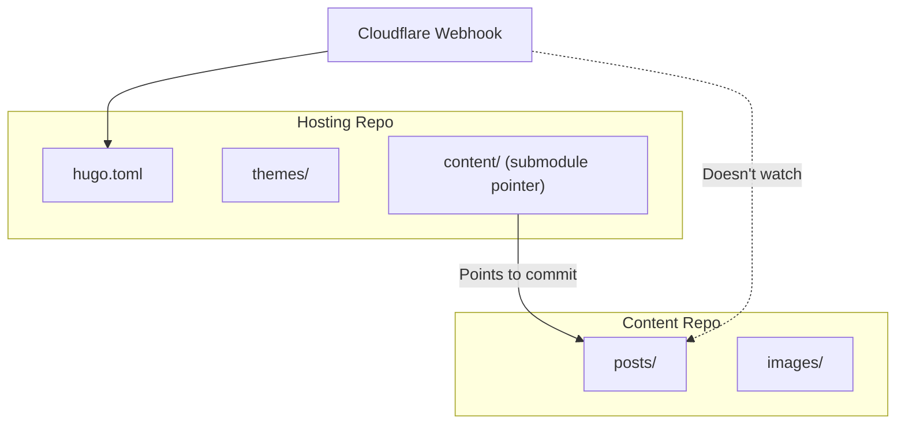
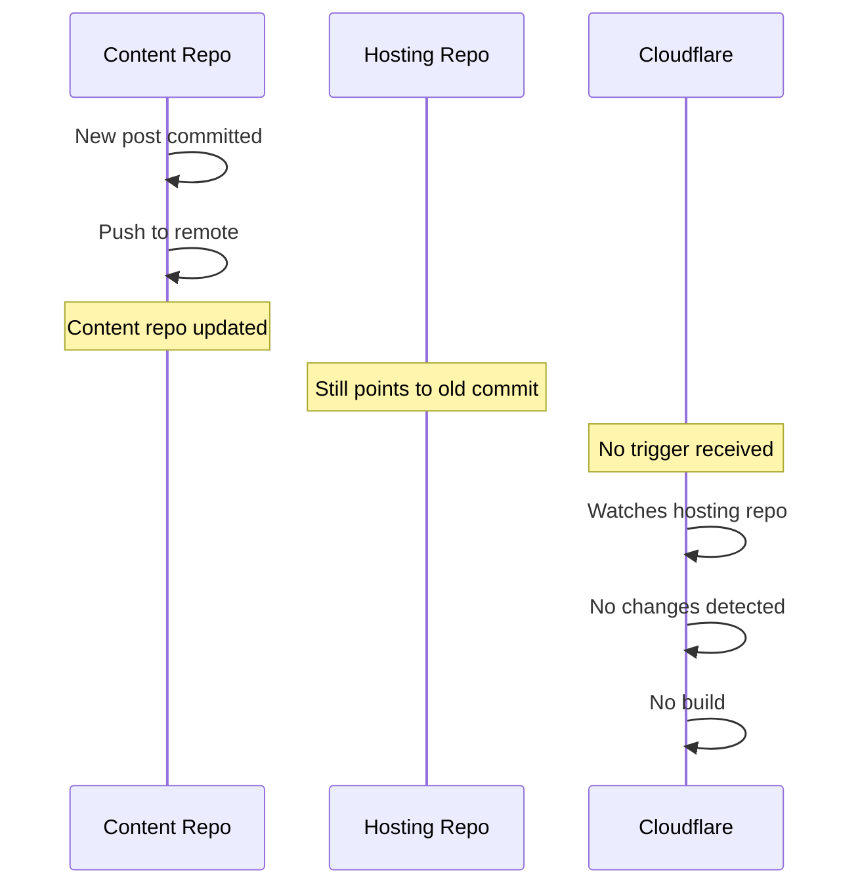
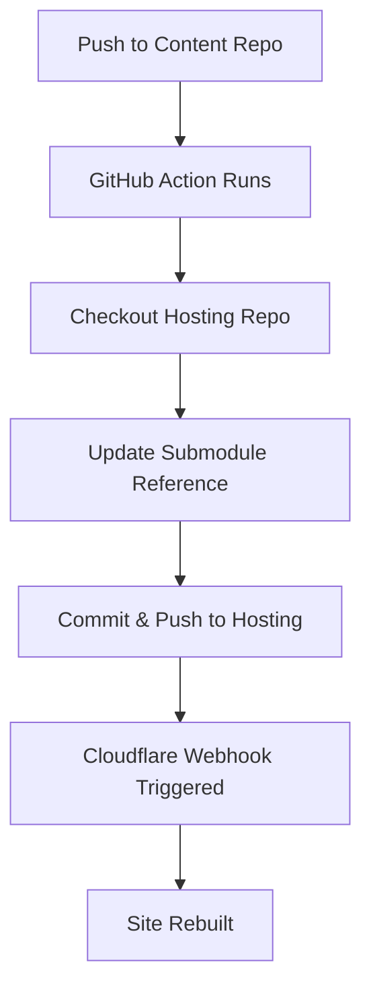

## The Problem

Content updates pushed to the blog-content repository weren't triggering builds. The site stayed stale. New posts existed in the repo but never appeared on the live site.



## The Architecture

The setup used git submodules:

```
personal-blog-hosting/       <- Cloudflare watches this
├── hugo.toml
├── themes/
└── content/                 <- Submodule pointing to content repo
    └── (submodule reference)
```



## Why It Doesn't Work

A git submodule is a **pointer** to a specific commit in another repository. When you update the content repo:

1. Content repo gets new commits
2. Content repo's remote is updated
3. **But** the hosting repo still points to the old commit
4. Hosting repo hasn't changed → no webhook trigger



## The Resolution

### Manual Trigger

After pushing content changes, update the submodule reference:

```bash
# In the hosting repo
cd personal-blog-hosting

# Update submodule to latest
git submodule update --remote content

# Commit the new pointer
git add content
git commit -m "chore: update content submodule"

# Push - THIS triggers Cloudflare
git push
```

### Force Trigger (Quick & Dirty)

If you just need to trigger a build without real changes:

```bash
git commit --allow-empty -m "chore: trigger rebuild"
git push
```

### Automated Trigger (GitHub Actions)

Set up automation in the **content** repo to update the hosting repo:

```yaml
# .github/workflows/update-hosting.yml (in content repo)
name: Update Hosting Repo

on:
  push:
    branches: [main]

jobs:
  update-submodule:
    runs-on: ubuntu-latest
    steps:
      - uses: actions/checkout@v4
        with:
          repository: user/personal-blog-hosting
          token: ${{ secrets.HOSTING_REPO_TOKEN }}
          submodules: true
      
      - name: Update submodule
        run: |
          git submodule update --remote content
          git config user.name "GitHub Actions"
          git config user.email "actions@github.com"
          git add content
          git diff --staged --quiet || git commit -m "chore: update content submodule"
          git push
```



## Design Considerations

### When Submodules Work

- Different release cycles for content vs. infrastructure
- Multiple sites sharing the same content
- Explicit control over which content version is deployed

### When Submodules Cause Pain

- Frequent content updates expecting immediate deployment
- Single-person projects (extra steps add friction)
- CI/CD that watches only parent repo

### Alternatives

| Approach | Trigger Behavior | Complexity |
|----------|------------------|------------|
| Submodule | Manual or automated | Medium |
| Monorepo | Automatic on any push | Low |
| Separate repos + API | Webhook from content repo | High |

## Key Takeaways

1. **Submodule = pointer, not content** - CI sees a hash, not file changes
2. **Webhooks watch repos, not submodules** - Changes in submodule repo don't trigger parent
3. **Explicit update required** - Must commit new submodule reference to trigger
4. **Automate or accept manual** - Either add GitHub Action or document the workflow
5. **Consider your deployment frequency** - High-frequency updates may not suit submodule architecture

The submodule does exactly what it's designed to do: isolate changes. That's a feature - until it's your deployment bottleneck.
