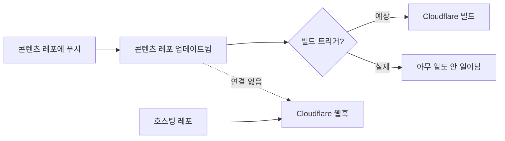
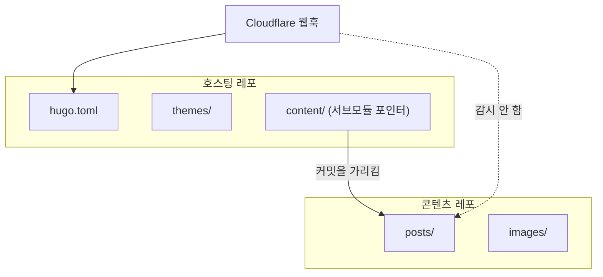
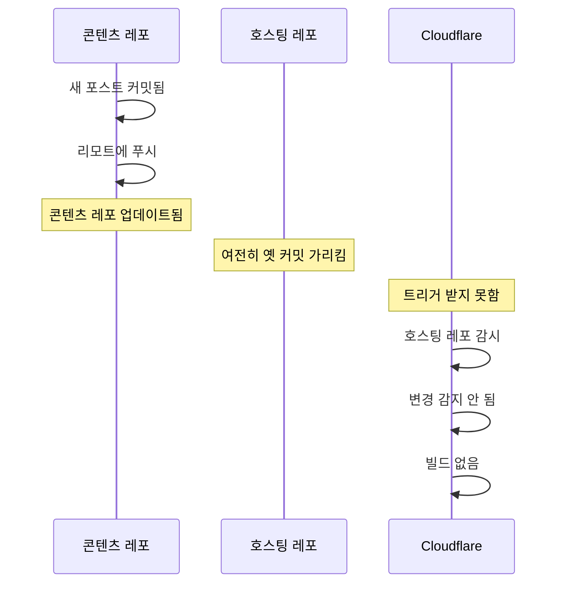
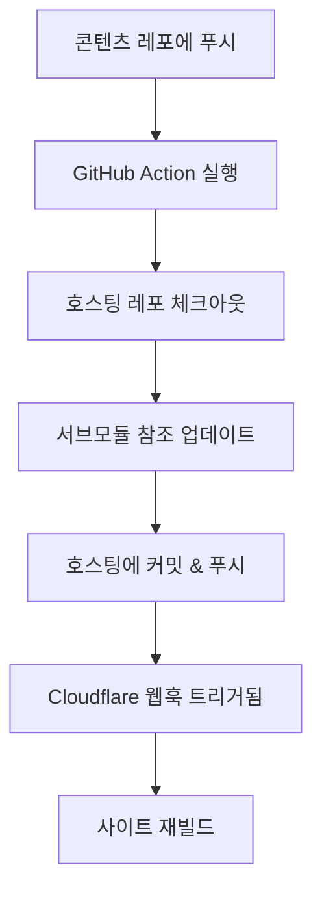

## 문제 상황

블로그 콘텐츠 저장소에 푸시된 업데이트가 빌드를 트리거하지 않았다. 사이트는 정체되어 있었다. 새 포스트가 레포에 존재했지만 라이브 사이트에는 나타나지 않았다.



## 아키텍처

설정이 git 서브모듈을 사용했다:

```
personal-blog-hosting/       <- Cloudflare가 감시
├── hugo.toml
├── themes/
└── content/                 <- 콘텐츠 레포를 가리키는 서브모듈
    └── (submodule reference)
```



## 왜 작동하지 않는가

Git 서브모듈은 다른 저장소의 특정 커밋에 대한 **포인터**다. 콘텐츠 레포를 업데이트하면:

1. 콘텐츠 레포가 새 커밋을 받음
2. 콘텐츠 레포의 리모트가 업데이트됨
3. **하지만** 호스팅 레포는 여전히 옛 커밋을 가리킴
4. 호스팅 레포가 변경되지 않음 → 웹훅 트리거 없음



## 해결 방법

### 수동 트리거

콘텐츠 변경을 푸시한 후, 서브모듈 참조를 업데이트한다:

```bash
# 호스팅 레포에서
cd personal-blog-hosting

# 서브모듈을 최신으로 업데이트
git submodule update --remote content

# 새 포인터 커밋
git add content
git commit -m "chore: update content submodule"

# 푸시 - 이게 Cloudflare를 트리거함
git push
```

### 강제 트리거 (빠르고 더러운 방법)

실제 변경 없이 빌드만 트리거해야 할 때:

```bash
git commit --allow-empty -m "chore: trigger rebuild"
git push
```

### 자동화된 트리거 (GitHub Actions)

**콘텐츠** 레포에서 호스팅 레포를 업데이트하는 자동화 설정:

```yaml
# .github/workflows/update-hosting.yml (콘텐츠 레포에)
name: Update Hosting Repo

on:
  push:
    branches: [main]

jobs:
  update-submodule:
    runs-on: ubuntu-latest
    steps:
      - uses: actions/checkout@v4
        with:
          repository: user/personal-blog-hosting
          token: ${{ secrets.HOSTING_REPO_TOKEN }}
          submodules: true
      
      - name: Update submodule
        run: |
          git submodule update --remote content
          git config user.name "GitHub Actions"
          git config user.email "actions@github.com"
          git add content
          git diff --staged --quiet || git commit -m "chore: update content submodule"
          git push
```



## 설계 고려사항

### 서브모듈이 잘 작동하는 경우

- 콘텐츠와 인프라의 릴리스 주기가 다름
- 여러 사이트가 같은 콘텐츠 공유
- 어떤 콘텐츠 버전이 배포되는지 명시적 제어

### 서브모듈이 고통인 경우

- 즉각적인 배포를 기대하는 빈번한 콘텐츠 업데이트
- 1인 프로젝트 (추가 단계가 마찰 추가)
- 부모 레포만 감시하는 CI/CD

### 대안

| 접근법 | 트리거 동작 | 복잡도 |
|--------|------------|-------|
| 서브모듈 | 수동 또는 자동화 | 중간 |
| 모노레포 | 모든 푸시에 자동 | 낮음 |
| 분리 레포 + API | 콘텐츠 레포에서 웹훅 | 높음 |

## 핵심 교훈

1. **서브모듈 = 포인터, 콘텐츠 아님** - CI는 해시를 보지 파일 변경을 보지 않는다
2. **웹훅은 레포를 감시, 서브모듈 아님** - 서브모듈 레포의 변경은 부모를 트리거하지 않는다
3. **명시적 업데이트 필요** - 트리거하려면 새 서브모듈 참조를 커밋해야 한다
4. **자동화하거나 수동 수용** - GitHub Action을 추가하거나 워크플로우를 문서화하라
5. **배포 빈도 고려** - 고빈도 업데이트는 서브모듈 아키텍처에 적합하지 않을 수 있다

서브모듈은 설계된 대로 정확히 작동한다: 변경을 격리한다. 그것은 기능이다 - 배포 병목이 되기 전까지는.
