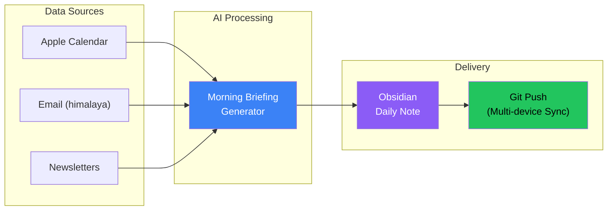
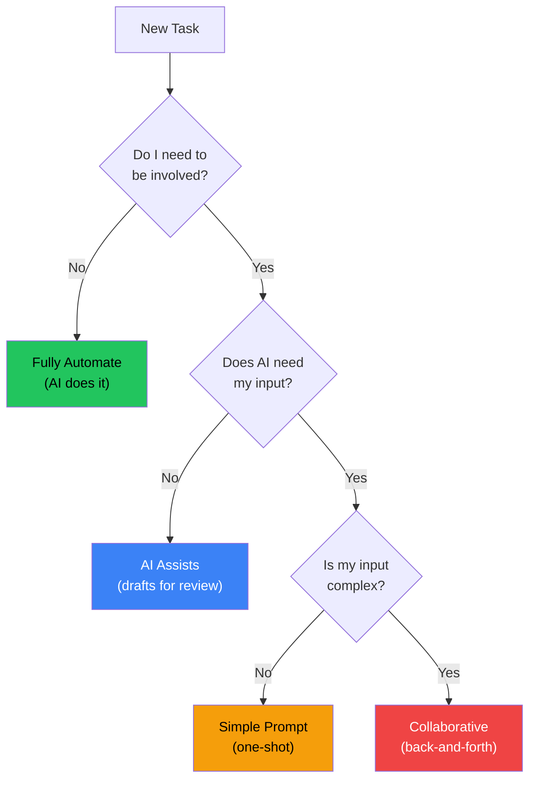

## The Teresa Torres Inspiration

Teresa Torres is a product coach, not a developer. Yet she built her own `/today` command using Claude Code - a single command that prepares her daily briefing.

The key insight from her approach:

> "When I have a task, do I need to be involved? Can Claude just do it? Or does it need my input?"

This question reframes how we think about personal automation. Instead of asking "what can AI do?", ask "what should I actually be doing myself?"

## The Vision: A Personal AI Pipeline



The goal: One command that produces a localized, personalized daily briefing in your knowledge management system, automatically synced across all your devices.

## What Makes This Different

Most AI assistant setups are chat-first: you talk to a bot, it responds in a chat interface. The Teresa Torres approach is document-first:

| Aspect | Chat-First | Document-First |
|--------|------------|----------------|
| Output | Ephemeral messages | Permanent documents |
| Location | Chat app | Knowledge base |
| Sync | Single device | Multi-device via git |
| Integration | Standalone | Part of existing workflow |
| Language | Usually English | Localized to preference |

The document-first approach means your AI output becomes part of your knowledge system, not a separate silo.

## Architecture Components

### 1. Data Aggregation Layer

Each data source needs an adapter that can fetch and normalize data:

**Calendar (Apple Calendar via icalBuddy or CalendarKit)**
```bash
# Fetch today's events
icalBuddy -f eventsToday
```

**Email (via himalaya CLI)**
```bash
# Fetch recent unread emails
himalaya list --folder INBOX --filter unread --max 10
```

**Newsletters (via saved folder or RSS)**
```bash
# Fetch from newsletters folder
himalaya list --folder Newsletters --filter recent --max 5
```

### 2. AI Processing Layer

The AI takes structured input and produces a formatted briefing:

```markdown
## Today's Schedule
- 9:00 AM: Team standup
- 2:00 PM: 1:1 with manager
- 4:00 PM: Code review session

## Email Highlights
- **[Action Required]** Contract renewal from vendor
- **[FYI]** Q4 planning document shared
- **[Low Priority]** Newsletter digest

## Reading Queue
- "State of AI 2026" - worth 15 min read
- "New TypeScript features" - skim for relevance
```

### 3. Output Layer

The briefing lands in Obsidian as a daily note:

```markdown
---
date: 2026-02-03
type: daily-briefing
generated: true
---

# Morning Briefing - February 3, 2026

[Generated content here]

---
*Generated by /today at 7:00 AM*
```

### 4. Sync Layer

After generating, push to git for multi-device access:

```bash
cd ~/Obsidian/Vault
git add Daily/2026-02-03.md
git commit -m "daily: morning briefing 2026-02-03"
git push
```

## Implementation Sketch

A `/today` command implementation:

```bash
#!/bin/bash
# /today - Generate morning briefing

DATE=$(date +%Y-%m-%d)
OUTPUT="$HOME/Obsidian/Vault/Daily/$DATE.md"

# 1. Gather data
CALENDAR=$(icalBuddy -f eventsToday 2>/dev/null || echo "No calendar access")
EMAILS=$(himalaya list --folder INBOX --filter unread --max 10 --format json 2>/dev/null || echo "[]")
NEWSLETTERS=$(himalaya list --folder Newsletters --max 5 --format json 2>/dev/null || echo "[]")

# 2. Generate briefing via AI
PROMPT="Generate a morning briefing in Korean (해라체 style) for $DATE.
Calendar: $CALENDAR
Unread emails: $EMAILS  
Newsletters: $NEWSLETTERS

Format as Obsidian markdown with sections for schedule, email highlights, and reading queue."

BRIEFING=$(echo "$PROMPT" | claude --print)

# 3. Write to Obsidian
cat > "$OUTPUT" << EOF
---
date: $DATE
type: daily-briefing
generated: true
---

$BRIEFING

---
*Generated by /today at $(date +%H:%M)*
EOF

# 4. Sync
cd ~/Obsidian/Vault
git add "Daily/$DATE.md"
git commit -m "daily: morning briefing $DATE"
git push

echo "Briefing ready: $OUTPUT"
```

## The Task Delegation Framework

Teresa Torres' framework for deciding what to automate:



For the morning briefing:
- **Calendar summary**: Fully automate (AI formats it)
- **Email triage**: AI assists (flags important, I decide actions)
- **Reading prioritization**: AI assists (suggests priority, I confirm)

## Localization Matters

The original implementation outputs in Korean using 해라체 style. This isn't just translation - it's native output in the user's preferred language and tone.

Why this matters:
- Faster comprehension in native language
- Consistent with other notes in the vault
- No mental context-switching
- Feels like your own writing, not AI output

## Extending the Pattern

The `/today` command is just the start. The same pattern works for:

**Weekly Review (`/week`)**
- Aggregate completed tasks
- Summarize meeting notes
- Generate reflection prompts

**Project Briefs (`/brief [project]`)**
- Pull recent commits
- Summarize open issues
- List pending decisions

**Reading Digests (`/digest`)**
- Process saved articles
- Generate summaries
- Create reading list

## Key Takeaways

1. **Document-first beats chat-first** - Output should live in your knowledge system
2. **Git sync enables multi-device** - Work from any machine, always current
3. **Localization is native, not translated** - Generate in your preferred language from the start
4. **The framework matters** - "Do I need to be involved?" guides what to automate
5. **Start simple, extend later** - `/today` is one command; build the ecosystem over time

Teresa Torres built this as a non-developer. The barrier isn't technical skill - it's asking the right questions about your workflow and being willing to experiment.

---

*Inspired by Teresa Torres' approach to personal AI automation. The specific implementation uses tools available on macOS (icalBuddy, himalaya, Obsidian) but the pattern adapts to any platform.*
