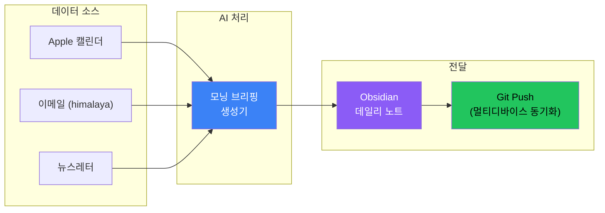
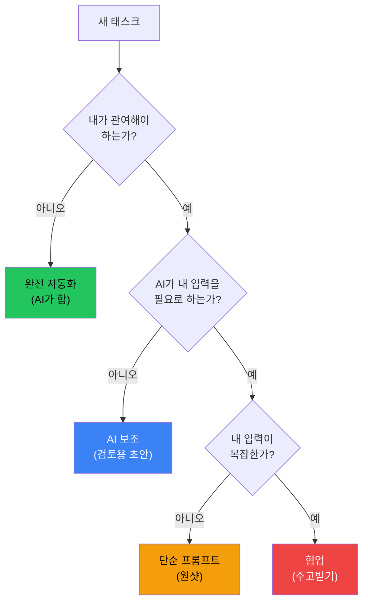

## Teresa Torres의 영감

Teresa Torres는 제품 코치다. 개발자가 아니다. 그런데도 Claude Code를 사용하여 자신만의 `/today` 명령어를 만들었다 - 일일 브리핑을 준비하는 단일 명령어다.

그녀의 접근법에서 핵심 통찰:

> "태스크가 있을 때, 내가 관여해야 하나? Claude가 그냥 할 수 있나? 아니면 내 입력이 필요한가?"

이 질문은 개인 자동화에 대한 사고방식을 재구성한다. "AI가 무엇을 할 수 있나?"가 아니라 "내가 직접 해야 할 것이 무엇인가?"를 묻는다.

## 비전: 개인 AI 파이프라인



목표: 지식 관리 시스템에 현지화된 개인화된 일일 브리핑을 생성하는 하나의 명령어. 모든 기기에서 자동 동기화.

## 무엇이 다른가

대부분의 AI 어시스턴트 설정은 채팅 우선이다: 봇과 대화하고 채팅 인터페이스에서 응답받는다. Teresa Torres 접근법은 문서 우선이다:

| 측면 | 채팅 우선 | 문서 우선 |
|------|----------|----------|
| 출력 | 휘발성 메시지 | 영구 문서 |
| 위치 | 채팅 앱 | 지식 베이스 |
| 동기화 | 단일 기기 | git을 통한 멀티 기기 |
| 통합 | 독립형 | 기존 워크플로우의 일부 |
| 언어 | 보통 영어 | 선호에 맞게 현지화 |

문서 우선 접근법은 AI 출력이 별도의 사일로가 아니라 지식 시스템의 일부가 된다는 것을 의미한다.

## 아키텍처 컴포넌트

### 1. 데이터 집계 레이어

각 데이터 소스에는 데이터를 가져와 정규화하는 어댑터가 필요하다:

**캘린더 (icalBuddy 또는 CalendarKit을 통한 Apple 캘린더)**
```bash
# 오늘 일정 가져오기
icalBuddy -f eventsToday
```

**이메일 (himalaya CLI를 통해)**
```bash
# 최근 읽지 않은 이메일 가져오기
himalaya list --folder INBOX --filter unread --max 10
```

**뉴스레터 (저장된 폴더 또는 RSS를 통해)**
```bash
# 뉴스레터 폴더에서 가져오기
himalaya list --folder Newsletters --filter recent --max 5
```

### 2. AI 처리 레이어

AI가 구조화된 입력을 받아 포맷된 브리핑을 생성한다:

```markdown
## 오늘 일정
- 오전 9시: 팀 스탠드업
- 오후 2시: 매니저와 1:1
- 오후 4시: 코드 리뷰 세션

## 이메일 하이라이트
- **[조치 필요]** 벤더 계약 갱신
- **[참고]** Q4 기획 문서 공유됨
- **[낮은 우선순위]** 뉴스레터 다이제스트

## 읽기 큐
- "AI 현황 2026" - 15분 읽을 가치 있음
- "새 TypeScript 기능" - 관련성 훑어보기
```

### 3. 출력 레이어

브리핑이 Obsidian 데일리 노트로 도착한다:

```markdown
---
date: 2026-02-03
type: daily-briefing
generated: true
---

# 모닝 브리핑 - 2026년 2월 3일

[생성된 콘텐츠]

---
*오전 7시에 /today로 생성됨*
```

### 4. 동기화 레이어

생성 후 멀티 기기 접근을 위해 git으로 푸시:

```bash
cd ~/Obsidian/Vault
git add Daily/2026-02-03.md
git commit -m "daily: morning briefing 2026-02-03"
git push
```

## 구현 스케치

`/today` 명령어 구현:

```bash
#!/bin/bash
# /today - 모닝 브리핑 생성

DATE=$(date +%Y-%m-%d)
OUTPUT="$HOME/Obsidian/Vault/Daily/$DATE.md"

# 1. 데이터 수집
CALENDAR=$(icalBuddy -f eventsToday 2>/dev/null || echo "캘린더 접근 없음")
EMAILS=$(himalaya list --folder INBOX --filter unread --max 10 --format json 2>/dev/null || echo "[]")
NEWSLETTERS=$(himalaya list --folder Newsletters --max 5 --format json 2>/dev/null || echo "[]")

# 2. AI를 통해 브리핑 생성
PROMPT="$DATE의 모닝 브리핑을 한국어(해라체 스타일)로 생성하라.
캘린더: $CALENDAR
읽지 않은 이메일: $EMAILS  
뉴스레터: $NEWSLETTERS

일정, 이메일 하이라이트, 읽기 큐 섹션이 있는 Obsidian 마크다운으로 포맷하라."

BRIEFING=$(echo "$PROMPT" | claude --print)

# 3. Obsidian에 쓰기
cat > "$OUTPUT" << EOF
---
date: $DATE
type: daily-briefing
generated: true
---

$BRIEFING

---
*$(date +%H:%M)에 /today로 생성됨*
EOF

# 4. 동기화
cd ~/Obsidian/Vault
git add "Daily/$DATE.md"
git commit -m "daily: morning briefing $DATE"
git push

echo "브리핑 준비됨: $OUTPUT"
```

## 태스크 위임 프레임워크

자동화 대상 결정을 위한 Teresa Torres의 프레임워크:



모닝 브리핑의 경우:
- **캘린더 요약**: 완전 자동화 (AI가 포맷)
- **이메일 분류**: AI 보조 (중요한 것 표시, 조치는 내가 결정)
- **읽기 우선순위**: AI 보조 (우선순위 제안, 내가 확인)

## 현지화가 중요하다

원래 구현은 해라체 스타일로 한국어 출력한다. 이것은 단순 번역이 아니다 - 사용자가 선호하는 언어와 어조로 네이티브 출력하는 것이다.

이것이 중요한 이유:
- 모국어로 더 빠른 이해
- 볼트의 다른 노트와 일관성
- 정신적 컨텍스트 전환 없음
- AI 출력이 아닌 자신의 글처럼 느껴짐

## 패턴 확장

`/today` 명령어는 시작일 뿐이다. 같은 패턴이 다음에도 적용된다:

**주간 리뷰 (`/week`)**
- 완료된 태스크 집계
- 회의 노트 요약
- 회고 프롬프트 생성

**프로젝트 브리프 (`/brief [project]`)**
- 최근 커밋 가져오기
- 열린 이슈 요약
- 대기 중인 결정 나열

**읽기 다이제스트 (`/digest`)**
- 저장된 아티클 처리
- 요약 생성
- 읽기 목록 생성

## 핵심 정리

1. **문서 우선이 채팅 우선을 이긴다** - 출력은 지식 시스템에 있어야 한다
2. **Git 동기화가 멀티 기기를 가능하게 한다** - 어떤 기기에서든 작업, 항상 최신
3. **현지화는 번역이 아닌 네이티브다** - 처음부터 선호 언어로 생성
4. **프레임워크가 중요하다** - "내가 관여해야 하는가?"가 자동화 대상을 안내한다
5. **단순하게 시작하고 나중에 확장한다** - `/today`는 하나의 명령어; 시간을 두고 생태계를 구축

Teresa Torres는 비개발자로서 이것을 만들었다. 장벽은 기술적 역량이 아니다 - 워크플로우에 대한 올바른 질문을 던지고 실험 의지를 갖는 것이다.

---

*Teresa Torres의 개인 AI 자동화 접근법에서 영감을 받았다. 구체적 구현은 macOS에서 사용 가능한 도구(icalBuddy, himalaya, Obsidian)를 사용하지만 패턴은 어느 플랫폼에나 적응 가능하다.*
